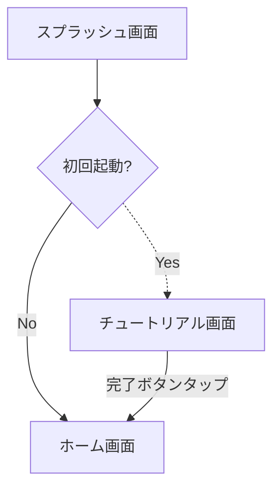
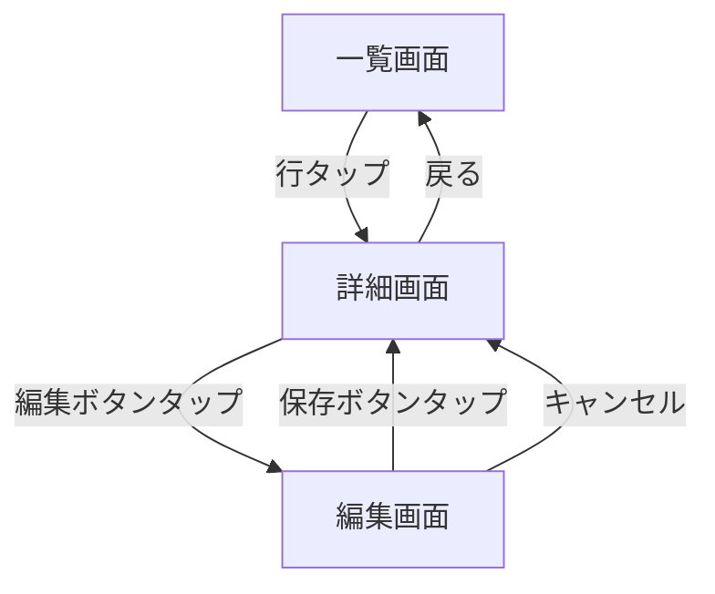
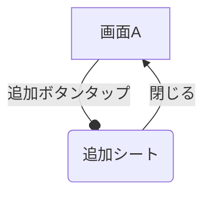

# 目的

以下の「画面遷移図 共通ルール」に従い、Mermaid（flowchart）で画面遷移図を作成してください。

# 入力

* 対象範囲: $ARGUMENTS
  * 空の場合は、アプリ全体を対象とする
* 参照する情報源（存在するものをすべて確認する）
  * `docs/design/02_screens.md`
  * `docs/requirements/requirements.md`
  * リポジトリ内のView実装

情報源の間で食い違いがある場合は、要件定義書 → 設計書 → コードの順で優先する。食い違いは、出力ファイル末尾の「未解決事項」に記載する。

# 出力

* 出力先: `docs/design/navigation_flow.md`
* 既にファイルが存在する場合は、差分を反映して更新する。全体を作り直さない
* 上記以外のファイルは作成・変更しない

出力ファイルの構成:

1. 対象範囲
2. 画面遷移図（Mermaid）
   * 図が大きくなる場合は、機能単位で複数の図に分割する
3. 画面一覧（画面名 / View名 / 種別）
4. 未解決事項（ある場合のみ）

---

# 画面遷移図 共通ルール

## 1. 基本方針

* 遷移方向は上から下（`flowchart TD`）で統一する
* 機能単位でグルーピングする
* 画面構造と遷移を、一貫したルールで表現する
* 例外遷移（エラー・キャンセルなど）は明示する
* 戻る遷移を省略しない

## 2. ノード（画面）

### 2.1 形状

| 種別 | Mermaid表記 | 用途 |
|---|---|---|
| 通常画面 | `ID[画面名]` | 一般画面 |
| モーダル | `ID(画面名)` | シート・ポップアップ |
| 外部遷移 | `ID[[画面名]]` | 外部アプリ・Web・設定アプリ |
| 分岐 | `ID{条件}` | ログイン判定・フラグ判定など |

### 2.2 命名

* ノードIDは、View名と一致させる（例: `HomeView`）
* 表示名は「画面名 + 役割」で統一する（例: ホーム画面、商品詳細画面）
* View名は、実際のコードに存在する名前を使用する
  * コードが未実装の場合は、設計書の名前を使い、画面一覧でその旨を明記する
* 曖昧な名前（例: 詳細1、画面A）は使わない

### 2.3 補足情報

補足がある場合は、改行して括弧書きで記載する。

```
ItemDetailView["商品詳細画面<br>（未ログイン時は購入不可）"]
```

## 3. エッジ（遷移）

### 3.1 矢印

| 記号 | 意味 |
|---|---|
| `-->` | 通常遷移 |
| `-.->` | 条件付き遷移 |
| `--o` | モーダル表示 |
| `-->` ＋ ラベル「戻る」または「閉じる」 | 戻る / 閉じる（戻り先へ向けて書く） |

### 3.2 ラベル

すべての矢印に、トリガーをラベルとして記載する。

```
HomeView -->|ログインボタンタップ| LoginView
```

## 4. レイアウト

### 4.1 配置

* 上: 起動（スプラッシュ・オンボーディングなど）
* 中央: メインフロー
* 下: サブ機能（設定など）

### 4.2 グルーピング

機能単位で `subgraph` に分割する。

```
subgraph Home["ホーム系"]
  ...
end
```

### 4.3 線の交差回避

* 交差が多い場合は、図を機能単位で分割する
* 無理に1枚にまとめない

## 5. 状態による分岐

ログイン状態・初回起動・チュートリアル・権限許可などの状態による分岐は、分岐ノードで明示する。



## 6. テンプレート

### 6.1 CRUDフロー



### 6.2 モーダル



## 7. 色

色は `classDef`（ノード）と `linkStyle`（矢印）で適用する。

| 色 | 意味 |
|---|---|
| 青 | 通常遷移 |
| 赤 | エラー |
| 緑 | 成功 |
| グレー | 補助（外部遷移・戻るなど） |

```
classDef error stroke:#d32f2f,color:#d32f2f
classDef success stroke:#388e3c,color:#388e3c
classDef aux stroke:#9e9e9e,color:#757575
linkStyle 3 stroke:#d32f2f
```

* `linkStyle` の番号は、矢印の記述順（0始まり）で指定する
* 遷移を追加・削除したら、番号のずれを必ず確認する

## 8. アンチパターン（禁止）

* 矢印にトリガーのラベルがない
* 命名が曖昧（例: 詳細1）
* ノードIDとView名が一致していない
* 同じ意味の遷移に、異なる表現を使っている
* 戻る / 閉じる遷移が記載されていない
* Mermaidとして描画できない記法を使っている

# セルフチェック

出力前に、以下を確認する。

* すべての矢印にラベルがあるか
* すべての画面に、戻る / 閉じる経路があるか（ルート画面を除く）
* ノードIDが、コードまたは設計書のView名と一致しているか
* 画面一覧と、図中のノードが一致しているか
* Mermaidの構文として正しいか