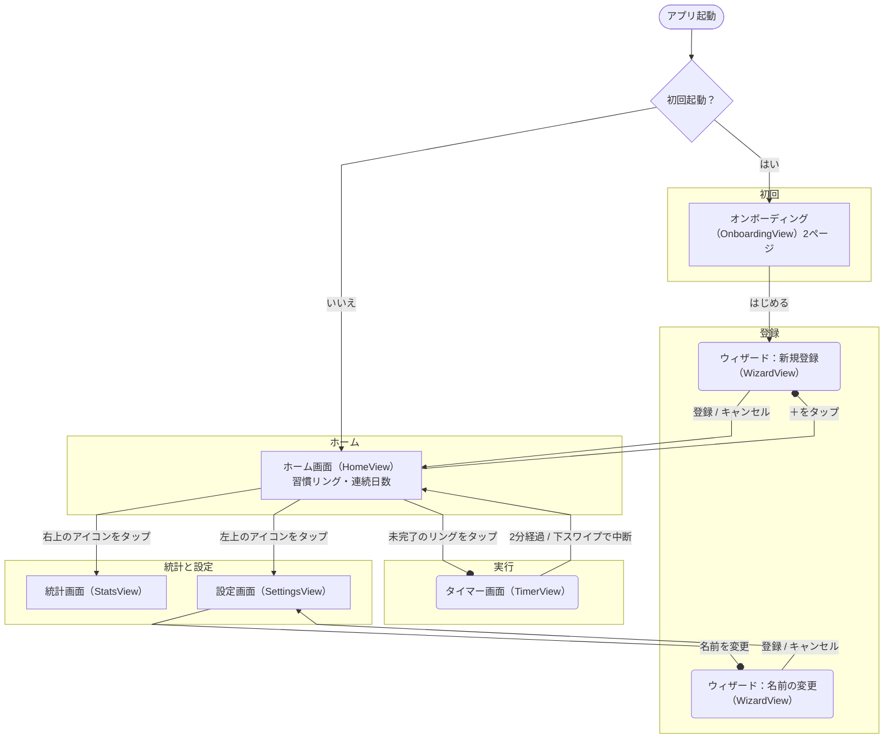

# OneTwenty

2分だけやる。やった分だけ記録される、習慣化タイマーのiOSアプリです。

> 現在は v1.0 のリリース準備中です（App Store 未公開）。

---

## どんなアプリ？

習慣化アプリを入れたものの、いつの間にか「やった」にチェックを付けるだけになっていた。気合いを入れて大きな目標を立てたのに、3日で止まってしまった……そんな経験はありませんか？

**OneTwenty** は、「やった」と自分で記録するボタンがない習慣化アプリです。記録が付くのは、タイマーを回して2分（120秒＝One Twenty）を走り切ったときだけ。記録するためのアプリではなく、実行するためのアプリです。

考え方の下敷きは、「新しい習慣は、2分で終わる大きさまで小さくする」という2分ルール（James Clear『Atomic Habits』）です。「読書を続けたい」は「本を開く」に、「運動したい」は「運動靴を履く」に。登録するときに、やりたいことを必ず2分の行動に分解します。そして2分たったら、そこで終わりです。延長はできません。

デザインはモノクロを基調に、アクセントは藍の1色だけ。連続記録が途切れても警告の色や煽る言葉は出さず、完了しても大げさに褒めません。開いて、2分やって、閉じる。それだけのアプリを目指しています。

---

## できること

### やりたいことを「2分の行動」に分解して登録する

習慣は、必ずウィザードを通して登録します。1問ずつ答えていくと、やりたいことが「今から2分で終わる最初の1アクション」になります。

- **やりたいことを入力** - 「読書」「運動」など、思いついた言葉でかまいません
- **よくある始め方から選ぶ** - 読書・運動・掃除・語学・瞑想などは、「本を開く」「運動靴を履く」といった例を提示します
- **「それは今から2分で終わりますか？」** - 「いいえ」なら「その最初の1アクションは何ですか？」と、もう一段小さくします
- **3回で決まらなければ型から選ぶ** - 「道具を用意する」「その場所に行く」「最小単位を1つやる」の3つの型に当てはめます
- **目標の言い回しに気づく** - 「〜を続ける」「〜を頑張る」は行動ではなく目標なので、分解し直します。「毎日」「必ず」のような頻度の言葉は、外した文を提案します（頻度はアプリが管理します）

登録できる習慣は**3件まで**です。習慣名は日本語30文字・英語60文字までの1文にします。

### 2分タイマーを回す

ホーム画面のリングをタップすると、確認なしですぐにタイマーが始まります。画面にあるのは、リングと残り秒数だけです。

- **止められるのは中断だけ** - 一時停止・延長・スキップはありません。やめるときは下にスワイプします
- **中断は記録に残らない** - 途中でやめた分は記録されません。同じ日なら、何度でも0秒からやり直せます
- **2分たったら終わり** - 音と振動、それと毎回変わる短い一言で、終わったことを伝えます
- **アプリを閉じても進む** - ロック画面と Dynamic Island に残り時間が出ます（Live Activity）。2分たつと通知でも知らせます
- **1つの習慣は1日1回** - 終えた習慣は、その日はもう始められません。3件すべて終えても、1日に使うのは最大6分です

### 続いている様子を見る

ホーム画面のリングの脇に、その習慣が何日続いているかが出ます。登録した習慣をすべて終えた日は、リングがすべて満ちて短い1行が添えられます。

統計画面は、あえて1画面だけにしています。

- **ヒートマップ** - 直近12週間を1枚で表示。その日に終えた割合が色の濃さになります
- **3つの数字** - 現在の連続日数 / 最長連続日数 / 通算完了回数

### リマインダーを受け取る

1日1回、決めた時刻に「2分だけ」という通知が届きます（初期設定は 8:00）。

- その日の分をすべて終えていれば、通知は届きません
- 通知に、習慣名や残り件数は出しません（「やらなければ」という圧をかけないため）
- リマインダーをオフにしても、タイマーの完了通知は届きます

### 習慣を見直す

設定画面で、登録した習慣を管理できます。

- **名前を変更** - もう一度ウィザードを通ります。履歴と連続日数は引き継がれます
- **並び替え** - ホーム画面に並ぶ順番を変えられます
- **アーカイブ** - 習慣をやめて、3件の枠を空けます。元には戻せませんが、それまでの記録は統計に残ります

あわせて、通知時刻・リマインダーのオン/オフ・テーマ（ライト / ダーク / 端末に合わせる）を変えられます。

### あえて作っていないもの

- **手動のチェックイン** - 「やった」と自分で記録する手段はありません
- **タイマーの延長・一時停止** - 2分を超えて続けさせません
- **完了時のメモや感想** - 終わったら、何も書かずに閉じられます
- **共有・ランキング** - 人と比べる機能はありません
- **アカウント・サーバー** - データは端末の中だけにあり、外部には送りません

---

## 画面遷移



---

## 技術情報

- **プラットフォーム**: iOS 26.0+（iPhone）
- **言語**: Swift / SwiftUI
- **データ保存**: SwiftData（習慣と実行の記録）、UserDefaults（設定）。端末内のみ、外部サーバーへの送信なし
- **通知**: UserNotifications（ローカル通知のみ）
- **Live Activity**: ActivityKit / WidgetKit
- **テスト**: Swift Testing
- **対応言語**: 日本語 / 英語
- **外部依存**: なし（Apple 標準フレームワークのみ使用）

### ドキュメント

要件と設計は `docs/` にまとめています。

- [要件定義書](docs/01_要件定義/requirements.md) / [検出語リスト](docs/01_要件定義/detection-terms.md)
- 設計書: [全体構成](docs/02_設計/01_architecture.md) / [画面](docs/02_設計/02_screens.md) / [データ](docs/02_設計/03_data_model.md) / [モジュール](docs/02_設計/04_modules.md) / [エラー処理](docs/02_設計/05_error_handling.md) / [タスク分解](docs/02_設計/06_task_breakdown.md)

---

### 今後の予定

#### リリースまで
- [ ] 実機での表示・アクセシビリティの確認（VoiceOver、文字サイズの拡大、ライト / ダーク）
- [ ] 性能の計測（起動時間、タイマーの描画）
- [ ] 通知・強制終了・日またぎのシナリオ確認
- [ ] App Store 提出の準備
- [ ] この README に画面の画像を追加（実機確認で見た目が確定してから）

#### v1.1
- [ ] ホーム画面ウィジェット（今日の進み具合の表示と、タップでタイマー開始）
- [ ] 端末内のAIによる分解の提案（希望した人だけが使う形で）

#### v1.2以降
- [ ] Apple Watch 対応

---

## セットアップ

```
1. リポジトリをクローン
2. OneTwenty.xcodeproj を Xcode で開く（Xcode 26 以降）
3. ターゲットデバイスを選択してビルド・実行
```
