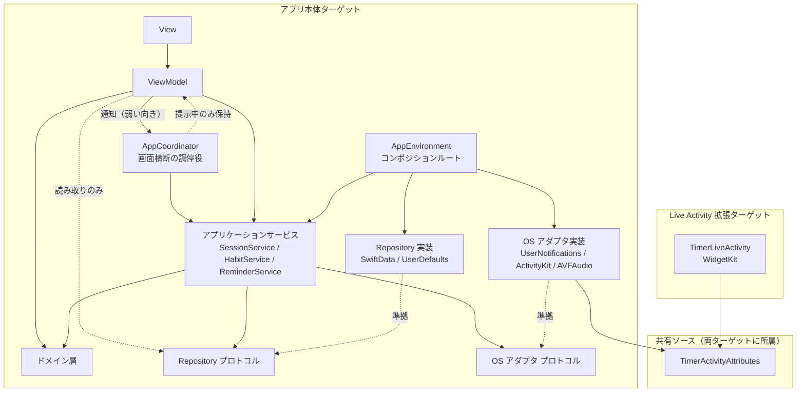

# 01 アーキテクチャ設計 — OneTwenty

| 項目             | 内容                                                                                                                               |
| ---------------- | ---------------------------------------------------------------------------------------------------------------------------------- |
| 入力要件         | [docs/01_要件定義/requirements.md](../01_要件定義/requirements.md) v1.20 / [detection-terms.md](../01_要件定義/detection-terms.md) |
| 既存設計         | なし（本書が初版）                                                                                                                 |
| 既存コード       | Xcode テンプレートのみ（`OneTwentyApp.swift` / `ContentView.swift`）                                                               |
| 情報源の優先順位 | 要件定義書 ＞ 既存設計書 ＞ 既存コード                                                                                             |
| 作成段階         | Step 4 完了（01〜06 を作成済み）                                                                                                   |

本書は設計全体の起点であり、末尾に「要件→設計対応表」「仮定一覧」「未解決事項」「提案」を集約する。他の設計書はこれらを持たず、本書を参照する。

---

## 1. 採用アーキテクチャ

### AR-01 MVVM ＋ Repository ＋ ドメイン層 ＋ サービス層

| 項目     | 内容                                                                                                                                                                                                                          |
| -------- | ----------------------------------------------------------------------------------------------------------------------------------------------------------------------------------------------------------------------------- |
| 対応要件 | TR-2 / TR-3 / §7 技術要件（MVVM・`@Observable`・SwiftData・Swift Testing）                                                                                                                                                    |
| 設計     | 5層に分ける。**View**（SwiftUI）→ **ViewModel**（`@Observable`）→ **サービス層**（アプリケーションサービスとOSアダプタ）/ **ドメイン層**（純粋なSwift型）/ **Repository層**（永続化）。依存は上位から下位への一方向のみとする |
| 理由     | 要件が MVVM を指定し、TR-2（TimerEngine を SwiftUI / SwiftData から分離）と TR-3（ViewModel を SwiftData 非依存でテスト可能に）を必須としている。この2つを満たす最小構成がこの5層である                                       |
| 代替案   | **TCA**：状態遷移の記述力は高いが、外部パッケージ依存が増え要件の「MVVM」指定から外れるため却下。**View から `@Query` を直接使う素の SwiftUI 構成**：TR-3 が明示的に禁止しているため却下                                      |

### AR-02 状態遷移をドメイン層の純粋な型に閉じ込める

| 項目     | 内容                                                                                                                                                                                                                                            |
| -------- | ----------------------------------------------------------------------------------------------------------------------------------------------------------------------------------------------------------------------------------------------- |
| 対応要件 | TR-2 / FR-1 注記（状態遷移図の3点）                                                                                                                                                                                                             |
| 設計     | タイマー・ウィザード・起動時の復元・通知予約の判定を、入力（イベント＋現在時刻＋データのスナップショット）から出力（次の状態＋実行すべき副作用の指示）を返す純粋な型として実装する。副作用（保存・通知・Live Activity）の実行はサービス層が担う |
| 理由     | 本アプリは状態遷移が要件の中心であり（日跨ぎ・強制終了・24時間ルール・再分解カウンタ等）、これらを OS や永続化なしにユニットテストで網羅するため                                                                                                |
| 代替案   | **ViewModel に状態遷移を直接書く**：画面単位でテストはできるが、復元処理（起動時）とタイマー画面で同じ判定が重複するため却下                                                                                                                    |

---

## 2. レイヤー責務

| レイヤー                       | 責務                                                                                                                     | 置くもの                                                                          | 依存してよいもの                                           | 禁止事項                                                               |
| ------------------------------ | ------------------------------------------------------------------------------------------------------------------------ | --------------------------------------------------------------------------------- | ---------------------------------------------------------- | ---------------------------------------------------------------------- |
| View                           | 描画、ジェスチャ、アクセシビリティ属性、アニメーション                                                                   | SwiftUI の View                                                                   | ViewModel                                                  | Repository・Service・`ModelContext`・`@Query` への直接アクセス（TR-3） |
| ViewModel                      | 画面状態の保持、ユーザー操作をサービス／ドメインへ橋渡し。**画面横断の調停役（`AppCoordinator`）もこの層に含む** | `@Observable` `@MainActor` のクラス（各画面の ViewModel と `AppCoordinator`）     | サービス層、ドメイン層、Repository プロトコル（**読み取りのみ**）、**同じ層の `AppCoordinator`（画面横断の調停役）への通知**（下記の但し書きに従う） | SwiftData・ActivityKit・UserNotifications の直接 import。**各画面の ViewModel 同士の直接参照**（調停は必ず `AppCoordinator` を経由する）。**Repository への書き込み**（§3 の担当表に従いアプリケーションサービス経由。例外はテーマとオンボーディング完了フラグのみ） |
| サービス層（アプリケーション） | 複数の Repository / OS アダプタにまたがる手続きの調停（例：完了時に保存→通知取消→Live Activity 終了→リマインダー再計算）。**永続データへの書き込みはすべてこの層を通す** | `SessionService` / `HabitService` / `ReminderService`                             | ドメイン層、Repository プロトコル、OS アダプタのプロトコル | View への依存                                                          |
| サービス層（OS アダプタ）      | OS フレームワークの薄いラッパー                                                                                          | `NotificationClient` / `LiveActivityClient` / `FeedbackPlayer` / `ContentLoader`  | OS フレームワーク                                          | ビジネス判定を持つこと                                                 |
| ドメイン層                     | 状態遷移・判定・集計の純粋ロジック                                                                                       | `TimerEngine` 等（§4）                                                            | Foundation のみ                                            | SwiftUI・SwiftData・OS フレームワークの import（TR-2）                 |
| Repository層                   | 永続化の読み書き。`@Model` をドメイン用の値型に変換して返す                                                              | `HabitRepository` / `SessionRepository` / `SettingsStore` / `RunningSessionStore` | SwiftData / UserDefaults                                   | 判定ロジックを持つこと                                                 |

---

## 3. 依存方向



- 依存は上から下のみ。ドメイン層は他のどの層にも依存しない
- **`AppCoordinator` と各画面の ViewModel は同じ層にあり、参照の向きを次のように定める**（04 MD-50）。保持するのは `AppCoordinator` 側だけで、提示中の `presentedTimer` / `presentedWizard` がそれにあたる。各画面の ViewModel は `AppCoordinator` を**強参照しない**：通知はクロージャ（`onCompleted` 等）または弱参照で受け取る形にし、`presentedTimer` / `presentedWizard` が `nil` になった時点で ViewModel が解放されるようにする。これにより参照の循環を作らない
- ViewModel から Repository へは**読み取りのみ**。書き込みは次の表の担当サービスを必ず通す。書き込みに付随する副作用（リマインダーの再計算、通知許可の要求等）の呼び忘れを構造的に防ぐため

| 書き込み対象 | 担当 | 付随する副作用 |
| ------------ | ---- | -------------- |
| 習慣の登録・編集・並び替え・アーカイブ（`HabitRepository`） | `HabitService` | リマインダーの再計算（FR-5.4.1）、初回登録後の通知許可要求（FR-5.6） |
| Session の保存・実行中マーカー・**保存待ち**（`SessionRepository` / `RunningSessionStore`） | `SessionService` | 完了通知の予約・取消、Live Activity、当日分リマインダーの取消（TR-5）、保存失敗時の保存待ちへの退避と再試行（05 EH-02b） |
| 通知時刻・リマインダーのオン/オフ（`SettingsStore`） | `ReminderService` | 予約の組み直し（TR-5） |
| テーマ・オンボーディング完了フラグ（`SettingsStore`） | ViewModel が直接書いてよい | なし（**唯一の例外**。副作用がないため） |
- 実装（SwiftData・OS フレームワーク）はプロトコルの背後に置き、`AppEnvironment` だけが具象型を組み立てる
- 拡張ターゲットはアプリ本体のコードに依存せず、共有ソースの `TimerActivityAttributes` のみを参照する

---

## 4. 主要コンポーネント

詳細なインターフェース・所有状態・状態遷移は `04_modules.md` で設計する。ここでは配置と責務の境界のみを確定する。

### 4.1 ドメイン層

| コンポーネント            | 責務                                                                                        | 主な関連要件                           |
| ------------------------- | ------------------------------------------------------------------------------------------- | -------------------------------------- |
| `WallClock`（プロトコル） | 現在時刻の取得。本番は `SystemClock`、テストは固定・進行可能な時計に差し替える              | TR-2                                   |
| `TimerEngine`             | `startedAt` と現在時刻の差分から経過・残り・完了を算出する。tick を積算しない               | TR-1 / TR-2 / FR-2.2 / FR-2.10         |
| `SessionRecoveryResolver` | 起動・復帰時に、実行中マーカー・残存 Live Activity の一覧・現在時刻から、①マーカーの扱い（完了として記録／破棄／実行継続）②終了させる Live Activity の集合、を**1回の呼び出しで**判定する（120秒・24時間ルール。掃除の条件は AR-12 ⑤） | FR-2.15 / FR-2.15.1 / FR-2.11.2        |
| `WizardStateMachine`      | 新規登録フローと編集フローの状態遷移。再分解カウンタの累積、戻る・キャンセル                | FR-1.3〜FR-1.10.5 / FR-6.4.2〜FR-6.4.5 |
| `TitleValidator`          | 言語別の文字数上限を `String.count` で判定する                                              | FR-1.4.1 / FR-1.4.2 / FR-1.4.3         |
| `PhraseDetector`          | 検出語リストとの部分一致、頻度副詞の除去案の生成                                            | FR-1.5.1〜FR-1.5.1.4                   |
| `TemplateMatcher`         | 自由入力と分解テンプレートの対応付け                                                        | FR-1.6 / FR-1.7                        |
| `DayKey`                  | ローカルタイムゾーンでの日付キー（日付帰属の単位）                                          | FR-3.10 / FR-4.4                       |
| `DailyStatusResolver`     | 表示日における各習慣の完了状態、全習慣完了の判定                                            | FR-4.1〜FR-4.5.1                       |
| `StreakCalculator`        | 習慣ごと・全体の連続日数、最長連続日数、通算完了回数                                        | FR-3.5〜FR-3.5.4 / FR-3.9              |
| `HeatmapCalculator`       | 直近84日の日別達成率                                                                        | FR-3.8 / FR-3.8.1 / FR-3.12            |
| `ReminderPlanner`         | 予約すべきリマインダーの日付集合を算出する（60日・当日完了・0件・許可状態）                 | TR-5 / FR-5.4〜FR-5.8.4                |
| `LanguageResolver`        | 「表示言語が日本語なら日本語、それ以外は英語」の判定                                        | NFR-6.1                                |
| `CompletionMessagePicker` | 完了文言の一覧から、直前と同じにならないように1つを選ぶ                                     | FR-2.9                                 |

### 4.2 Repository層

| コンポーネント        | 保存先       | 責務                                                                  | 主な関連要件             |
| --------------------- | ------------ | --------------------------------------------------------------------- | ------------------------ |
| `HabitRepository`     | SwiftData    | 習慣の登録・編集・並び替え・アーカイブ、アクティブ習慣の取得          | FR-1.9 / FR-6.3 / TR-3   |
| `SessionRepository`   | SwiftData    | 完了 Session の保存と期間指定の取得                                   | FR-3.3 / FR-3.10 / TR-3  |
| `SettingsStore`       | UserDefaults | 通知時刻・リマインダーのオン/オフ・テーマ・オンボーディング完了フラグ | FR-5.1 / FR-6.1 / FR-7.4 |
| `RunningSessionStore` | UserDefaults | **実行中マーカー**（`sessionID`・習慣ID・`startedAt`。強制終了からの復元と Live Activity との対応付けに使う）と、**保存待ちの一覧**（保存に失敗した完了を再試行するまで保持する）を扱う。両者は別のキーに分ける（03 DM-10） | FR-2.15 / FR-2.11.2 / 05 EH-02b |

### 4.3 サービス層

| コンポーネント       | 種別             | 責務                                                                                                           | 主な関連要件                           |
| -------------------- | ---------------- | -------------------------------------------------------------------------------------------------------------- | -------------------------------------- |
| `SessionService`     | アプリケーション | タイマーの開始・完了・中断・起動時復元の手続き全体を調停する。完了時は `ReminderService` に当日分の取消を依頼する | FR-2.1 / FR-2.5 / FR-2.13 / FR-2.15    |
| `HabitService`       | アプリケーション | 習慣の登録・編集・並び替え・アーカイブを調停する。3件制限の判定（FR-1.9）、書き込み後の `ReminderService` 呼び出し（0件になれば全取消、0件から1件以上になれば再予約。FR-5.4.1）、初回登録直後の通知許可要求（FR-5.6）を受け持つ | FR-1.9 / FR-5.4.1 / FR-5.6 / FR-6.3 / FR-6.4 |
| `ReminderService`    | アプリケーション | `ReminderPlanner` の結果を予約に反映する。**自分で変化を監視せず、呼び出し元が明示的に呼ぶ**。呼び出し元は `HabitService`（習慣数の変化）・`SessionService`（完了）・自身の設定変更操作（通知時刻・オン/オフ）・`AppCoordinator`（アクティブ化時の補充と許可状態の再取得） | TR-5 / FR-5.x                          |
| `NotificationClient` | OS アダプタ      | `UNUserNotificationCenter` のラッパー。許可取得、identifier 接頭辞単位の予約・取消、フォアグラウンド表示の抑止 | TR-5 / FR-2.13 / FR-5.6                |
| `LiveActivityClient` | OS アダプタ      | ActivityKit のラッパー。開始・即時終了・残存 Activity の掃除                                                   | FR-2.11〜FR-2.11.2                     |
| `FeedbackPlayer`     | OS アダプタ      | 完了音（`AVAudioSession` `.ambient`）とハプティクス（UIKit の `UINotificationFeedbackGenerator`）を**同じ呼び出しで**鳴らす。発火はフォアグラウンドでの完了時に `SessionService` からのみ行う | FR-2.7〜FR-2.8                         |
| `ContentLoader`      | OS アダプタ      | 言語別の同梱データ（テンプレート・検出語・完了文言）の読み込み                                                 | NFR-6.1 / FR-1.5.1.1 / FR-1.6 / FR-2.9 |

### 4.4 プロトコル化の方針

テストで差し替える必要があるものだけをプロトコルにする。

| プロトコル化する                        | 理由                                                                                                |
| --------------------------------------- | --------------------------------------------------------------------------------------------------- |
| `WallClock`                             | 日跨ぎ・120秒・24時間の境界を実時間を待たずに検証するため（TR-2）                                   |
| `HabitRepository` / `SessionRepository` | ViewModel とサービスを SwiftData 非依存でテストするため（TR-3）                                     |
| `SettingsStore` / `RunningSessionStore` | オンボーディングと強制終了復元を、UserDefaults を汚さずに検証するため                               |
| `NotificationClient`                    | 予約・取消を実際の通知センターなしで検証するため（TR-5「`UNUserNotificationCenter` に依存しない」） |
| `LiveActivityClient` / `FeedbackPlayer` | 開始・終了・再生が正しい契機で呼ばれることを検証するため                                            |

| プロトコル化しない                   | 理由                                                                                         |
| ------------------------------------ | -------------------------------------------------------------------------------------------- |
| ドメイン層の型                       | 純粋な値計算であり、本物をそのままテストできる                                               |
| `SessionService` / `HabitService` / `ReminderService` | 下位をすべてフェイクに差し替えれば本物のままテストできる。プロトコルを重ねても得るものがない |
| `ContentLoader`                      | ドメイン層は読み込み済みの値だけを受け取る。ローダー単体はテストバンドルで検証する           |

---

## 5. 状態管理方針

### AR-03 状態の置き場所

| 項目     | 内容                                      |
| -------- | ----------------------------------------- |
| 対応要件 | TR-3 / FR-4.5 / FR-6.1 / FR-7.4 / FR-2.15 |
| 設計     | 次の4種類に分けて置く                     |

| 状態の種類                   | 置き場所                                             | 例                                                                    |
| ---------------------------- | ---------------------------------------------------- | --------------------------------------------------------------------- |
| 永続する業務データ           | SwiftData（`Habit` / `Session` の2エンティティのみ） | 習慣、完了した Session                                                |
| 永続するユーザー設定・フラグ | UserDefaults（`SettingsStore`）                      | 通知時刻、リマインダーのオン/オフ、テーマ、オンボーディング完了フラグ |
| 永続する一時状態             | UserDefaults（`RunningSessionStore`）                | 実行中タイマーのマーカー、保存待ちの完了（05 EH-02b）                 |
| 揮発する画面状態             | 各 ViewModel（`@Observable`）                        | ウィザードの途中入力、ドラッグ量、表示中の日付                        |

| 項目   | 内容                                                                                                                                          |
| ------ | --------------------------------------------------------------------------------------------------------------------------------------------- |
| 理由   | 設定値は単一のスカラー値で、SwiftData に入れるとスキーマ変更の影響範囲が広がる。ウィザードの途中入力は FR-1.10.1 で永続化しないと決まっている |
| 代替案 | **設定も SwiftData に置く**：単一行のエンティティを作ることになり、マイグレーション対象が増えるだけなので却下                                 |

### AR-04 アプリ全体の状態とルーティング

| 項目     | 内容                                                                                                                                                                                                                                                                                          |
| -------- | --------------------------------------------------------------------------------------------------------------------------------------------------------------------------------------------------------------------------------------------------------------------------------------------- |
| 対応要件 | FR-4.5 / FR-7.1 / FR-7.6 / FR-2.15 / FR-5.8.4                                                                                                                                                                                                                                                 |
| 設計     | `AppCoordinator`（`@Observable`）を1つ置き、①ルート（オンボーディング／ホーム。**ストアを開けない場合は `AppCoordinator` を生成せず、`AppEnvironment` がエラー画面を出す**。04 MD-51 / 05 EH-01）②表示日（FR-4.5 の契機で更新）③シーンのアクティブ化時処理 ④**全画面で提示する画面の状態（タイマー・ウィザード）**、を所有する。④は、提示も終了もこの型だけが行う（`TimerViewModel` / `WizardViewModel` は自分で画面を閉じず、終了を通知する。04 MD-50 の2つの経路表）。各画面の ViewModel は `AppCoordinator` から表示日を受け取る。③は次の**順序で逐次実行**する：(1) **`SessionService.recoverOnActivation(launch:)` を呼ぶ**（この中で判定・記録／破棄・対象 Live Activity の終了までを行う。AR-12 ⑤） → (2) 表示日の更新（`displayDay = DayKey(now)`。**保留しない**） → (3) 通知許可状態の再取得（FR-5.8.4） → (4) リマインダーの補充（TR-5）。**`AppCoordinator` は ViewModel 層であり、OS アダプタ（`LiveActivityClient` 等）を直接呼ばない**（§2） |
| FR-4.5.1 の扱い | **保留の仕組みを持たない**（要件 v1.20 が「フィードバック表示中はホーム画面の習慣リングが見えない状態にする／帰属日を保持する仕組みは設けない」と明文化したため、仮定ではなく設計の前提として扱う）。**これを成立させている機構は、タイマー画面を `fullScreenCover` で全画面提示してホームを覆うこと**である（02 SC-01。提示方式をシート等に変えるとこの要件が破れるため、SC-01 の「主な要件」にも FR-4.5.1 を挙げている）。完了フィードバック（FR-2.9 の文言）はタイマー画面に表示され、その間ホーム画面はタイマー画面に覆われて見えない（02 SC-33）。したがって FR-4.5.1 が避けようとした「完了した瞬間に習慣リングが満ちて即座に未完了へ戻る表示」は構造的に発生せず、要件を満たす。フィードバックが終わってホームへ戻った時点では FR-4.5 の規則どおり当日基準で描く（日跨ぎ完了の場合、その習慣は当日未完了として表示される）。開始可否の判定（FR-4.2）は `displayDay` ではなく実際の現在日で行う（04 MD-40 / MD-53） |
| 理由     | シーンのアクティブ化で行う処理が複数の画面とサービスにまたがるため、起点を1か所に集約する                                                                                                                                                                                                     |
| 代替案   | **各 ViewModel が個別に `scenePhase` を監視する**：処理順序（復元→表示日更新→リマインダー補充）が保証できないため却下。**Live Activity の掃除を復元と別の型で判定する**：復元でマーカーを消した後の状態を掃除側が知る必要があり、2つの判定の間で状態がずれうるため却下（1回の呼び出しで両方を返す） |

### AR-05 並行性

| 項目     | 内容                                                                                                                                                                                                                                                         |
| -------- | ------------------------------------------------------------------------------------------------------------------------------------------------------------------------------------------------------------------------------------------------------------ |
| 対応要件 | §7 技術要件（async/await）                                                                                                                                                                                                                                   |
| 設計     | ViewModel・サービス・Repository は `@MainActor` で動かす（既存プロジェクト設定の `SWIFT_DEFAULT_ACTOR_ISOLATION = MainActor` を踏襲）。OS API の非同期呼び出し（通知許可・予約・ActivityKit）は async/await で扱う。ドメイン層の型は `Sendable` な値型とする |
| 理由     | データ量が小さく（習慣3件・Session 数千件規模）、バックグラウンドスレッドで SwiftData を扱う利点がない。単一アクターにすることでデータ競合を構造的に排除する                                                                                                 |
| 代替案   | **SwiftData を `@ModelActor` で別アクターに置く**：NFR-9 の200ms は Session 1,000件ならメインアクターで十分満たせる見込みのため、現時点では却下。計測で超過した場合に再検討する                                                                              |

### AR-14 完了フィードバックの発火点と終了判定

| 項目     | 内容 |
| -------- | ---- |
| 対応要件 | FR-2.7 / FR-2.7.2 / FR-2.9 / FR-4.5.1 |
| 設計     | ①**発火点は1か所**：フォアグラウンドで120秒に到達したとき、`SessionService` が `FeedbackPlayer` を呼び、音とハプティクスを同時に鳴らす。View からは鳴らさない ②`SessionService` は完了イベントを返し、`TimerViewModel` はそれを受けて完了文言（FR-2.9）を表示する状態に遷移する ③**フィードバックの終了は `TimerViewModel` が判定する**：完了文言の表示時間（音とハプティクスより長い。具体値は 02 で定義）が過ぎた時点を「フィードバック終了」とし、`AppCoordinator` に通知する ④`AppCoordinator` はこの通知を受けて、`SessionService.flushPendingCompletion()`（05 EH-02b）を実行してからタイマー画面を閉じる。**表示日の保留は行わない**（FR-4.5.1 の扱いは AR-04。04 MD-50） |
| 理由     | 音・ハプティクス・文言の3つのうち最も長く続くのは文言であり、FR-4.5.1 の「フィードバックの表示が終わるまで」の終点は文言の表示終了と一致させるのが自然。発火点をサービス層に置くことで、フェイクの `FeedbackPlayer` で「フォアグラウンド完了時のみ鳴る」（FR-2.7 / 仮定 A-11）を検証できる |
| 代替案   | **ハプティクスを View の `sensoryFeedback` で鳴らす**：View の modifier はサービス層から発火できず、音（サービス層）とハプティクス（View）で発火点が2か所に割れるため却下 |

---

## 6. ターゲット構成

### AR-06 ターゲット

| ターゲット              | 種別                       | 役割                                                               | Bundle ID                            | 最低OS   | 関連要件           |
| ----------------------- | -------------------------- | ------------------------------------------------------------------ | ------------------------------------ | -------- | ------------------ |
| `OneTwenty`             | iOS アプリ                 | 本体                                                               | `com.yagishi.onetwenty`              | iOS 26.0 | 全般               |
| `OneTwentyLiveActivity` | Widget Extension           | Live Activity の表示のみ（ホーム画面ウィジェットは含めない）       | `com.yagishi.onetwenty.LiveActivity` | iOS 26.0 | FR-2.11〜FR-2.11.2 |
| `OneTwentyTests`        | Unit Test（Swift Testing） | ドメイン層・サービス層・Repository・ViewModel のテスト             | `com.yagishi.onetwenty.tests`        | iOS 26.0 | §7 テスト対象      |
| `OneTwentyUITests`      | UI Test                    | 既存ターゲットを残す。v1.0 の受け入れ条件には使わない（仮定 A-13） | 既存のまま                           | iOS 26.0 | —                  |

| 項目   | 内容                                                                                                                                                                                                                               |
| ------ | ---------------------------------------------------------------------------------------------------------------------------------------------------------------------------------------------------------------------------------- |
| 理由   | Live Activity の UI（`ActivityConfiguration`）は Widget Extension にしか置けない。ホーム画面ウィジェットは v1.1（§3）なので含めない                                                                                                |
| App Group | **設定しない**。v1.0 では Live Activity 拡張がストアを読まないため不要（表示内容は ActivityKit の属性で受け取る）。SwiftData のストアは既定の保存場所に置く（03 DM-01）。v1.1 でホーム画面ウィジェット（要件 §5.1）を作る場合は、そのときに App Group の追加とストアの移行を設計する |
| 代替案 | **v1.0 から App Group を設定し、ストアを共有コンテナに置く**：v1.1 でストアを移す処理が不要になるが、v1.0 に使わない設定（entitlements・グループ登録）を持ち込むことになるため却下。今回必要なものだけを入れる方針とした（ユーザー判断。2026-10-01） |

---

## 7. ディレクトリ構成

```
OneTwenty/                          ← アプリ本体ターゲット
├── App/
│   ├── OneTwentyApp.swift           エントリポイント
│   ├── AppEnvironment.swift         コンポジションルート（具象型の組み立て）
│   └── AppCoordinator.swift         ルート・表示日・アクティブ化時処理
├── Features/                        View ＋ ViewModel（画面単位）
│   ├── Onboarding/
│   ├── Home/
│   ├── Timer/
│   ├── Wizard/
│   ├── Stats/
│   └── Settings/
├── Domain/                          純粋ロジック（Foundation のみ）
│   ├── Clock/                       WallClock
│   ├── Timer/                       TimerEngine / SessionRecoveryResolver / CompletionMessagePicker
│   ├── Wizard/                      WizardStateMachine / TitleValidator / PhraseDetector / TemplateMatcher
│   ├── Daily/                       DayKey / DailyStatusResolver
│   ├── Stats/                       StreakCalculator / HeatmapCalculator
│   ├── Reminder/                    ReminderPlanner
│   └── Language/                    LanguageResolver
├── Data/
│   ├── Models/                      Habit / Session（@Model）
│   ├── Repositories/                HabitRepository / SessionRepository（プロトコル＋SwiftData 実装）
│   └── Stores/                      SettingsStore / RunningSessionStore（プロトコル＋UserDefaults 実装）
├── Services/
│   ├── Session/                     SessionService
│   ├── Habit/                       HabitService
│   ├── Reminder/                    ReminderService
│   ├── Notifications/               NotificationClient
│   ├── LiveActivity/                LiveActivityClient
│   ├── Feedback/                    FeedbackPlayer
│   └── Content/                     ContentLoader
└── Resources/
    ├── Content/                     言語はファイル名に含める（AR-09）
    │   ├── templates.ja.json / templates.en.json
    │   ├── detection-terms.ja.json / detection-terms.en.json
    │   └── completion-messages.ja.json / completion-messages.en.json
    ├── Sounds/                      完了音（TODO 4）
    ├── Localizable.xcstrings        UI 文言（String Catalog）
    ├── Assets.xcassets              AccentColor（TODO 3）/ AppIcon
    └── PrivacyInfo.xcprivacy        プライバシーマニフェスト（§9.6）。リソースとしてバンドルに入れる必要があるので同期フォルダ内に置く

Config/                              ← どのターゲットにも所属させない（同期フォルダの外）
├── OneTwenty-Info.plist             本体の INFOPLIST_FILE。ビルド設定で表せないキーのみ（AR-11）

Shared/                              ← 両ターゲットに所属
└── TimerActivityAttributes.swift    Live Activity の属性とコンテンツ状態

OneTwentyLiveActivity/               ← Live Activity 拡張ターゲット
├── OneTwentyLiveActivityBundle.swift
├── TimerLiveActivity.swift          ロック画面・Dynamic Island の表示
└── Info.plist                       NSExtension（WidgetKit）。Xcode のターゲット作成時に生成される同期フォルダの除外設定をそのまま維持する

OneTwentyTests/                      ← Swift Testing
├── Domain/
├── Services/
├── Data/                            インメモリ ModelContainer を使う
├── Features/                        ViewModel のテスト
└── Support/                         フェイク（Clock・Repository・Client）

OneTwentyUITests/                    ← 既存のまま
```

| 項目     | 内容                                                                                                                                                                                                                 |
| -------- | -------------------------------------------------------------------------------------------------------------------------------------------------------------------------------------------------------------------- |
| 対応要件 | TR-2 / TR-3 / NFR-6.1 / FR-2.11                                                                                                                                                                                      |
| 理由     | レイヤーとディレクトリを一致させ、ドメイン層に SwiftUI / SwiftData を import したら構成から逸脱が見える状態にする。言語別データは `Resources/Content/` にファイル名で言語を区別して置き、NFR-6.1 の明示的な切り替えをファイル名で表す。本体ターゲットは同期フォルダ（`PBXFileSystemSynchronizedRootGroup`）で `OneTwenty/` を取り込んでおり、サブフォルダ内のリソースはバンドル直下に平坦化されてコピーされるため、この前提で配置を決めた |
| 代替案   | **機能単位（Feature ごとに Domain・Data を内包）の構成**：画面数が6と少なく、集計ロジックを統計とホームで共有するため、機能単位に分けると共有部分の置き場が曖昧になるので却下                                        |

---

## 8. 主要技術・外部依存

### AR-07 技術スタック

| 領域          | 採用                                                        | 対応要件              |
| ------------- | ----------------------------------------------------------- | --------------------- |
| UI            | SwiftUI                                                     | §7                    |
| 状態管理      | Observation（`@Observable`）                                | §7                    |
| 永続化        | SwiftData（ローカルストアのみ。CloudKit 連携なし）          | §7 / TR-4 / §10       |
| 設定値        | UserDefaults                                                | 仮定 A-15             |
| 非同期        | Swift Concurrency（async/await）                            | §7                    |
| 通知          | UserNotifications（ローカル通知のみ）                       | FR-2.13 / FR-5 / TR-5 |
| Live Activity | ActivityKit（アプリ本体）＋ WidgetKit（拡張）               | FR-2.11               |
| サウンド      | AVFAudio（`AVAudioSession` `.ambient` ＋ `AVAudioPlayer`）  | FR-2.7.1              |
| ハプティクス  | UIKit の `UINotificationFeedbackGenerator`（`FeedbackPlayer` 内で使用） | FR-2.7.2              |
| テスト        | Swift Testing                                               | §7                    |
| ローカライズ  | String Catalog（UI 文言）＋ 言語別 JSON（コンテンツデータ） | NFR-6 / NFR-6.1       |

### AR-08 外部依存を持たない

| 項目     | 内容                                                                                                                                                                                                            |
| -------- | --------------------------------------------------------------------------------------------------------------------------------------------------------------------------------------------------------------- |
| 対応要件 | TR-4 / NFR-2 / NFR-3                                                                                                                                                                                            |
| 設計     | Swift Package を含む外部ライブラリを一切導入しない。ネットワーク通信を行う Apple フレームワーク（URLSession、CloudKit、ActivityKit のプッシュ更新 等）も使用しない。Live Activity は `pushType: nil` で開始する |
| 理由     | 完全オフラインと「データを収集しない」宣言を、依存関係の側から保証するため。サードパーティ SDK は解析・通信を内包しうる                                                                                         |
| 代替案   | なし                                                                                                                                                                                                            |

### AR-09 コンテンツデータの外部依存

設計は形式と配置のみを確定し、中身は要件定義書 §9 の TODO で作成される。

**言語別データはファイル名に言語コードを含める**（`<名前>.<ja|en>.json`）。本体ターゲットは同期フォルダで取り込まれており、サブフォルダのリソースはバンドル直下に平坦化してコピーされる。`ja/templates.json` と `en/templates.json` のように同名のファイルを置くと「Multiple commands produce」のビルドエラーになるためである。`ContentLoader` は `LanguageResolver` の結果（`ja` / `en`）から `Bundle.main.url(forResource: "<名前>.<言語>", withExtension: "json")` で読み込む。**リソースの自動言語選択（`.lproj`）には頼らない**（NFR-6.1「リソースの自動フォールバックに任せず明示的に解決する」）。

| データ                                                       | ファイル                                                                                                           | 作成元 TODO   | 関連要件                                |
| ------------------------------------------------------------ | ------------------------------------------------------------------------------------------------------------------ | ------------- | --------------------------------------- |
| 分解テンプレート                                             | `Resources/Content/templates.ja.json` / `templates.en.json`                                                        | TODO 2        | FR-1.6                                  |
| 検出語リスト                                                 | `Resources/Content/detection-terms.ja.json` / `detection-terms.en.json`（[detection-terms.md](../01_要件定義/detection-terms.md) を変換） | TODO 10       | FR-1.5.1.1 / FR-1.5.1.4                 |
| 完了時の文言                                                 | `Resources/Content/completion-messages.ja.json` / `completion-messages.en.json`                                    | TODO 1        | FR-2.9                                  |
| その他の固定文言（オンボーディング・通知・確認ダイアログ等） | `Localizable.xcstrings`                                                                                            | TODO 1.1〜1.7 | FR-2.14 / FR-5.2 / FR-6.3.1 / FR-7.1 等 |
| 完了音                                                       | `Resources/Sounds/`                                                                                                | TODO 4        | FR-2.8                                  |
| アクセント色                                                 | `Assets.xcassets/AccentColor`（ライト・ダーク）                                                                    | TODO 3        | NFR-4.1 / §5.2                          |

---

## 9. プラットフォーム・Xcode 設定

### 9.1 対象・対象外の整理

| 項目                       | 判定                           | 根拠                                |
| -------------------------- | ------------------------------ | ----------------------------------- |
| Deployment Target          | **対象**                       | 要件で iOS 26.0 指定                |
| Swift / Xcode の前提       | **対象**                       | 既存設定の扱いを決める必要がある    |
| Framework / Package 依存   | **対象**                       | AR-07 / AR-08                       |
| ターゲット構成             | **対象**                       | Live Activity に拡張が必要（AR-06） |
| Xcode Capability           | 対象外（追加する Capability なし） | 下記 9.3                            |
| Entitlements               | 対象外（ファイルを作らない）   | 下記 9.3                            |
| App Groups                 | 対象外                         | v1.0 では拡張とデータを共有しない（AR-06） |
| Info.plist                 | **対象**                       | AR-10 / AR-11                       |
| ActivityKit                | **対象**                       | FR-2.11                             |
| WidgetKit                  | **対象（Live Activity のみ）** | ホーム画面ウィジェットは v1.1       |
| Live Activity              | **対象**                       | FR-2.11〜FR-2.11.2                  |
| Dynamic Island             | **対象**                       | FR-2.11 / FR-2.11.0                 |
| 通知権限                   | **対象**                       | FR-5.6 / FR-5.8                     |
| Background 関連設定        | **対象（追加なし）**           | 下記 9.3                            |
| App Store 提出に必要な設定 | **対象**                       | 下記 9.6                            |

### AR-10 ビルド設定

| 設定                                                    | 値                                    | 対象ターゲット | 目的                                                              | 関連要件         |
| ------------------------------------------------------- | ------------------------------------- | -------------- | ----------------------------------------------------------------- | ---------------- |
| `IPHONEOS_DEPLOYMENT_TARGET`                            | `26.0`                                | 全ターゲット   | 要件の最低OS。既存の `26.5` から変更する                          | §0 / §7          |
| `PRODUCT_BUNDLE_IDENTIFIER`                             | `com.yagishi.onetwenty`（本体）       | 本体           | 要件の Bundle ID。既存の `com.yagishi.OneTwenty` から変更する     | §0               |
| `TARGETED_DEVICE_FAMILY`                                | `1`（iPhone のみ）                    | 本体・拡張     | 要件のプラットフォームが iPhone。既存の `1,2` から変更する        | §0               |
| `INFOPLIST_KEY_UISupportedInterfaceOrientations_iPhone` | `UIInterfaceOrientationPortrait` のみ | 本体           | 縦向き固定（仮定 A-4）                                            | FR-3.7 / NFR-4.3 |
| `developmentRegion`                                     | `en`                                  | プロジェクト   | 開発言語を英語にする（既存設定のまま）                            | NFR-6            |
| `knownRegions`                                          | `en`, `ja`, `Base`                    | プロジェクト   | 日本語を追加する（既存は `en`, `Base` のみ）                      | NFR-6            |
| `SWIFT_VERSION`                                         | `5.0`（既存のまま）                   | 全ターゲット   | 要件に言語モードの指定がないため既存を維持（仮定 A-14。提案 P-1） | —                |
| `SWIFT_DEFAULT_ACTOR_ISOLATION`                         | `MainActor`（既存のまま）             | 本体           | AR-05 の単一アクター方針と一致                                    | §7               |
| `LOCALIZATION_PREFERS_STRING_CATALOGS`                  | `YES`（既存のまま）                   | 本体           | UI 文言を String Catalog で管理                                   | NFR-6            |
| `GENERATE_INFOPLIST_FILE`                               | `YES`（既存のまま）                   | 全ターゲット   | Info.plist の大半をビルド設定から生成する                         | —                |
| `INFOPLIST_KEY_NSSupportsLiveActivities`                | `YES`                                 | 本体           | Live Activity の開始を許可する（AR-11）                           | FR-2.11          |
| `INFOPLIST_KEY_ITSAppUsesNonExemptEncryption`           | `NO`                                  | 本体           | 暗号化の申告（AR-11）                                             | §11.4            |
| `INFOPLIST_FILE`                                        | `Config/OneTwenty-Info.plist`         | 本体           | ビルド設定で表せないキーを生成結果に合成する（AR-11）             | NFR-8            |

### 9.3 Capability・Entitlements・Background

| 項目                  | 設定           | 理由                                                                                                                                            |
| --------------------- | -------------- | ----------------------------------------------------------------------------------------------------------------------------------------------- |
| Push Notifications    | **追加しない** | ローカル通知のみで、APNs を使わない（TR-4）                                                                                                     |
| Background Modes      | **追加しない** | 経過時間は `startedAt` との差分で算出するため（TR-1）、バックグラウンドで実行し続ける必要がない。音声のバックグラウンド再生も行わない（FR-2.7） |
| App Groups            | **追加しない** | v1.0 では拡張がストアを読まない。v1.1 のホーム画面ウィジェットで必要になった時点で追加する（AR-06） |
| iCloud / CloudKit     | **追加しない** | §3 で対象外                                                                                                                                     |
| Entitlements ファイル | **作成しない** | 追加する Capability がないため |

### AR-11 Info.plist

`GENERATE_INFOPLIST_FILE = YES`（既存）を維持する。キーは**ビルド設定（`INFOPLIST_KEY_*`）で表せるものはビルド設定に書き**、表せないものだけを `INFOPLIST_FILE` のファイルに書いて生成結果に合成する。

| キー                                         | 値                              | ターゲット | 設定方法 | 目的                                                                                                                          | 関連要件 |
| -------------------------------------------- | ------------------------------- | ---------- | -------- | ----------------------------------------------------------------------------------------------------------------------------- | -------- |
| `NSSupportsLiveActivities`                   | `YES`                           | 本体       | ビルド設定 `INFOPLIST_KEY_NSSupportsLiveActivities` | Live Activity を開始できるようにする。これがないと ActivityKit の開始要求が失敗する                                           | FR-2.11  |
| `ITSAppUsesNonExemptEncryption`              | `NO`                            | 本体       | ビルド設定 `INFOPLIST_KEY_ITSAppUsesNonExemptEncryption` | 独自の暗号化を使わないことを申告し、提出時の輸出規制の質問を省く                                                              | §11.4    |
| `CADisableMinimumFrameDurationOnPhone`       | `YES`                           | 本体       | `Config/OneTwenty-Info.plist`（**T-01 で確認済み**：ビルド設定 `INFOPLIST_KEY_CADisableMinimumFrameDurationOnPhone` を置いても生成された Info.plist に出力されない。Xcode 26.6） | iPhone の ProMotion 搭載機で 60Hz を超える描画を許可する。これがないとアプリは 60fps に制限され、NFR-8 の 120fps を満たせない | NFR-8    |
| `NSExtension` › `NSExtensionPointIdentifier` | `com.apple.widgetkit-extension` | 拡張       | 拡張の `Info.plist`（ターゲット作成時に生成） | Widget Extension として認識させる                                                                       | FR-2.11  |

**`INFOPLIST_FILE` のファイルは同期フォルダの外（`Config/`）に置く。** 同期フォルダ内に Info.plist を置くと、既定でリソースとしてバンドルにコピーされ、生成される Info.plist と衝突してビルドエラーになる。フォルダ外に置けば、メンバーシップの除外設定を追加する必要がない。

`CADisableMinimumFrameDurationOnPhone` に対応する `INFOPLIST_KEY_*` がないことは、基盤フェーズのタスクで Xcode 上で確認する。ビルド設定が存在した場合はそちらに移し、`Config/OneTwenty-Info.plist` と `INFOPLIST_FILE` を削除する。

通知の許可に Info.plist の文言キーは不要である（`requestAuthorization` の説明はアプリ内の画面で行う。TODO 1.7）。

### AR-12 Live Activity の構成

| 項目     | 内容                                                                                                                                                                                                                                                                                                                                                                                                                                                                                                                                                                                                                             |
| -------- | -------------------------------------------------------------------------------------------------------------------------------------------------------------------------------------------------------------------------------------------------------------------------------------------------------------------------------------------------------------------------------------------------------------------------------------------------------------------------------------------------------------------------------------------------------------------------------------------------------------------------------- |
| 対応要件 | FR-2.11 / FR-2.11.0 / FR-2.11.1 / FR-2.11.2 / TR-4                                                                                                                                                                                                                                                                                                                                                                                                                                                                                                                                                                               |
| 設計     | ①`TimerActivityAttributes` を `Shared/` に置き両ターゲットでコンパイルする。属性（不変）に `sessionID` と終了表示の文言（`endedLabel`。開始時にアプリ本体の String Catalog から取り出して渡す。拡張側に文言ファイルを持たないため）、コンテンツ状態に開始時刻と終了時刻（開始＋120秒）のみを持つ。`sessionID` は `RunningSessionStore` の実行中マーカーと同じ値を使う ②開始は `pushType: nil`、`staleDate` に終了時刻を指定する ③拡張側はロック画面表示を必須とし、Dynamic Island の表示は追加要素として実装する（非搭載機ではロック画面のみで成立） ④残り時間は `Text(timerInterval:countsDown:)` と `ProgressView(timerInterval:)` で描画し、アプリが止まっていても OS が0:00まで進める。`staleDate` を過ぎたら終了表示に切り替える ⑤**消去の対象は次のいずれかに当てはまる Activity だけ**とする：(a) 復元判定後の実行中マーカーと `sessionID` が一致しない（マーカーがない場合を含む）(b) 終了時刻を過ぎている。**実行中セッションの Activity は消さない**。判定は `SessionRecoveryResolver` が復元の判定と同じ呼び出しで行い（4.1）、**`SessionService.recoverOnActivation` が** `LiveActivityClient` を通じて `dismissalPolicy: .immediate` で終了させる（AR-04 / 04 MD-40） |
| 注意     | シーンのアクティブ化は、アプリの起動・復帰だけでなく**通知センターやコントロールセンターを閉じたとき**にも起きる。タイマー実行中にこれが起きても、実行中セッションの Activity は(a)(b)のどちらにも当たらないため残る |
| 理由     | アプリが停止していても自動で進むのはシステム描画 API だけであり、消去はアプリが動いている時点でしか行えない（要件 FR-2.11.2 注記の OS 制約）                                                                                                                                                                                                                                                                                                                                                                                                                                                                                     |
| 代替案   | **プッシュ更新で終了させる**：サーバーが必要で TR-4 に反するため却下。**AlarmKit のカウントダウン**：サイレントモードを突破して鳴り FR-2.7.1 と両立しないため却下                                                                                                                                                                                                                                                                                                                                                                                                                                                                |

### AR-13 通知

| 項目     | 内容                                                                                                                                                                                                                                                                                                                                                                                                                     |
| -------- | ------------------------------------------------------------------------------------------------------------------------------------------------------------------------------------------------------------------------------------------------------------------------------------------------------------------------------------------------------------------------------------------------------------------------ |
| 対応要件 | TR-5 / FR-2.13 / FR-2.14.1 / FR-5.6 / FR-5.8.3                                                                                                                                                                                                                                                                                                                                                                           |
| 設計     | ①リマインダーは `reminder.` 、完了通知は `timer.` の接頭辞で identifier を分ける ②取消は常に接頭辞で絞り込んだ identifier 指定で行い、`removeAllPendingNotificationRequests()` を使わない ③フォアグラウンド中に `timer.` 通知が届いた場合は通知センターのデリゲートで表示を抑止する（完了はアプリ内のフィードバックで伝えるため） ④拒否時の設定アプリへの導線は `UIApplication.openNotificationSettingsURLString` を使う |
| 理由     | 2種類の通知は目的も生存期間も異なり、片方の操作でもう片方を消すと FR-2.14.1 に反する。③は120秒ちょうどにアプリ内の完了処理と通知の発火が重なる競合を防ぐため                                                                                                                                                                                                                                                             |
| 代替案   | **完了通知を119秒で取り消す**：取消の直前にアプリが裏に回ると通知が失われるため却下                                                                                                                                                                                                                                                                                                                                      |

### 9.6 App Store 提出

| 項目                             | 設定                                                                                                                                                                               | 目的                                                      | 関連要件     |
| -------------------------------- | ---------------------------------------------------------------------------------------------------------------------------------------------------------------------------------- | --------------------------------------------------------- | ------------ |
| プライバシーマニフェスト         | `PrivacyInfo.xcprivacy` を本体に追加。`NSPrivacyTracking = NO`、収集データ種別は空、Required Reason API として UserDefaults（理由コード `CA92.1`：同一アプリ内での読み書き）を申告 | UserDefaults の使用は申告が必須。収集データなしを明示する | TR-4 / §11.4 |
| App Privacy（App Store Connect） | 「データを収集しない」を選択                                                                                                                                                       | 要件の宣言どおり                                          | TR-4 / §11.4 |
| 暗号化の申告                     | `ITSAppUsesNonExemptEncryption = NO`（AR-11）                                                                                                                                      | 提出手続きの簡略化                                        | §11.4        |
| ストア表記                       | 名前・サブタイトル・キーワードは要件 §1 のとおり。書籍名をキーワードに含めない                                                                                                     | 要件の遵守                                                | §1 / §11.4   |

---

## 10. 要件→設計対応表

- 母集団は要件定義書の要件IDのうち**固有の要件本文を持つもの 126件**（仮定 A-2）。見出しのみの FR-1.5 / FR-5.8 / NFR-4 は含めない
- 状態は「設計済」「一部」（本書で方針のみ確定し、後続の設計書で詳細化する）「未設計」の3種
- 対応先の表記は「設計書番号 + 設計項目ID」。同じ要件を複数の設計書で扱う場合は「/」で並べる

| 要件ID     | 要旨                                     | 対応設計                                             | 状態   |
| ---------- | ---------------------------------------- | ---------------------------------------------------- | ------ |
| FR-1.1     | 自由入力                                 | 02 SC-41 / 04 MD-12 | 設計済 |
| FR-1.2     | ウィザード必須                           | 02 SC-42 / 04 MD-41 | 設計済 |
| FR-1.3     | 1問1画面・2分で終わるかのループ          | 02 SC-41・SC-42 | 設計済 |
| FR-1.3.1   | 3回目のNoで汎用パターンへ                | 02 SC-42 / 04 MD-12 | 設計済 |
| FR-1.4     | 1文・品詞判定なし                        | 04 MD-13 / 03 DM-02 | 設計済 |
| FR-1.4.1   | 言語別上限（日30/英60）                  | 04 MD-03・MD-13 / 02 SC-40 | 設計済 |
| FR-1.4.2   | `String.count` で数える                  | 04 MD-13 | 設計済 |
| FR-1.4.3   | 上限は新規入力のみ・遡及しない           | 04 MD-13 / 03 DM-02 / 02 SC-43 | 設計済 |
| FR-1.5.1   | ハード拒否は文字数のみ・2分岐            | 04 MD-13・MD-14 / 05 EH-07 | 設計済 |
| FR-1.5.1.1 | 閉じた検出語リスト・言語別               | 04 MD-14 / 03 DM-11 / 01 AR-09 | 設計済 |
| FR-1.5.1.2 | 頻度副詞→除去案の採否                    | 02 SC-42 / 04 MD-14 | 設計済 |
| FR-1.5.1.3 | 目標表現→再分解・カウント算入            | 02 SC-42 / 04 MD-12・MD-14 | 設計済 |
| FR-1.5.1.4 | 英語活用形はリスト列挙                   | 04 MD-14 / 03 DM-11 | 設計済 |
| FR-1.5.2   | 登録前のY/N確認                          | 02 SC-42 | 設計済 |
| FR-1.6     | テンプレート提示                         | 02 SC-41 / 04 MD-15 / 03 DM-11 | 設計済 |
| FR-1.7     | 非該当時に汎用パターン3種                | 02 SC-41・SC-42 / 04 MD-15 | 設計済 |
| FR-1.7.1   | 3種の型と具体記述                        | 02 SC-41 | 設計済 |
| FR-1.8     | originalIntent 保持                      | 02 SC-42 / 03 DM-02 | 設計済 |
| FR-1.9     | 最大3件（アーカイブ除く）                | 04 MD-21・MD-41 / 03 DM-08 / 02 SC-20 | 設計済 |
| FR-1.10    | 常時キャンセル可・確認なし               | 02 SC-40・SC-42 | 設計済 |
| FR-1.10.1  | キャンセルで破棄・非永続                 | 02 SC-40 / 04 MD-55 | 設計済 |
| FR-1.10.2  | キャンセル後は起動元へ                   | 02 SC-02・SC-42・SC-43 | 設計済 |
| FR-1.10.3  | 1問前に戻る・最初より前は不可            | 02 SC-42 / 04 MD-12 | 設計済 |
| FR-1.10.4  | 戻ってもカウンタ累積                     | 02 SC-42 / 04 MD-12 | 設計済 |
| FR-1.10.5  | 編集キャンセルで値不変                   | 02 SC-43 / 04 MD-12 | 設計済 |
| FR-2.1     | タップで即開始                           | 02 SC-22 / 04 MD-10・MD-53 | 設計済 |
| FR-2.2     | 120秒固定                                | 02 SC-30 / 04 MD-10 | 設計済 |
| FR-2.3     | 一時停止・延長・スキップなし             | 02 SC-30 / 04 MD-10 | 設計済 |
| FR-2.4     | タイマーリング＋残り秒数                 | 02 SC-30 | 設計済 |
| FR-2.5     | 下スワイプ中断・破棄                     | 02 SC-31 / 04 MD-10 | 設計済 |
| FR-2.5.1   | 120pt閾値・追従・上端80pt除外            | 02 SC-31 / 04 MD-54 | 設計済 |
| FR-2.5.2   | VoiceOver のエスケープ操作で中断         | 02 SC-34 / SC-30 / 04 MD-54 | 設計済 |
| FR-2.6     | 中断後は何度でも再挑戦                   | 02 SC-31 / 04 MD-10 | 設計済 |
| FR-2.7     | 完了時サウンド＋ハプティクス（前面のみ） | 01 AR-14 / 04 MD-10・MD-45 | 設計済 |
| FR-2.7.1   | `AVAudioSession` `.ambient`              | 04 MD-45 | 設計済 |
| FR-2.7.2   | ハプティクスはサイレント非依存           | 04 MD-45 | 設計済 |
| FR-2.8     | 終止音                                   | 04 MD-45 / 01 AR-09 | 設計済 |
| FR-2.9     | 毎回変わる完了文言                       | 02 SC-30 / 04 MD-16 / 03 DM-11 | 設計済 |
| FR-2.10    | バックグラウンドでも計測継続             | 04 MD-10・MD-11 | 設計済 |
| FR-2.11    | Live Activity 表示                       | 01 AR-12 / 04 MD-44・MD-60 | 設計済 |
| FR-2.11.0  | Dynamic Island 非搭載でも成立            | 04 MD-60 | 設計済 |
| FR-2.11.1  | システム描画 API で残り時間              | 04 MD-60 | 設計済 |
| FR-2.11.2  | `staleDate`・次回アクティブで消去        | 04 MD-11・MD-60 / 01 AR-12 | 設計済 |
| FR-2.12    | 実行中は他遷移不可（FR-2.5.2 は例外）    | 02 SC-30 / SC-34 / 04 MD-10 | 設計済 |
| FR-2.13    | 背面で120秒→ローカル通知                 | 04 MD-10・MD-43 / 01 AR-13 | 設計済 |
| FR-2.14    | 通知は固定文言・断定しない               | 04 MD-43 | 設計済 |
| FR-2.14.1  | 完了通知は設定非依存                     | 04 MD-10・MD-40 | 設計済 |
| FR-2.15    | 強制終了後は経過で判定                   | 04 MD-11 | 設計済 |
| FR-2.15.1  | 24時間以上は破棄                         | 04 MD-11 | 設計済 |
| FR-3.1     | 完了の定義                               | 04 MD-10 / 03 DM-03 | 設計済 |
| FR-3.2     | 手動チェックインなし                     | 02 SC-03 | 設計済 |
| FR-3.3     | 中断セッションは永続化しない             | 04 MD-10 / 03 DM-08 | 設計済 |
| FR-3.4     | メモ欄なし                               | 02 SC-03 | 設計済 |
| FR-3.5     | 習慣ごとの連続日数をホームに             | 02 SC-20 / 04 MD-23 | 設計済 |
| FR-3.5.1   | 習慣ごと連続の定義                       | 04 MD-23 | 設計済 |
| FR-3.5.2   | 当日未完了は前日まで維持                 | 04 MD-23 | 設計済 |
| FR-3.5.3   | `createdAt` 前は対象外                   | 04 MD-23 | 設計済 |
| FR-3.5.4   | 連続0は非表示                            | 02 SC-20 / 04 MD-53 | 設計済 |
| FR-3.6     | 途切れても煽らない                       | 02 SC-03 | 設計済 |
| FR-3.7     | 統計は標準文字で1画面                    | 02 SC-50 | 設計済 |
| FR-3.8     | ヒートマップ1枚・84日固定                | 02 SC-50 / 04 MD-24 | 設計済 |
| FR-3.8.1   | 達成率の濃淡・分母定義                   | 04 MD-24 / 02 SC-50 | 設計済 |
| FR-3.9     | 統計の数値は全体3つ                      | 02 SC-50 / 04 MD-23 | 設計済 |
| FR-3.9.1   | 統計は0も表示                            | 02 SC-50 / 04 MD-56 | 設計済 |
| FR-3.9.2   | ヒートマップ非インタラクティブ           | 02 SC-50 | 設計済 |
| FR-3.10    | 日付帰属は `startedAt`                   | 04 MD-02・MD-20 / 03 DM-06 | 設計済 |
| FR-3.11    | 統計導線はホーム右上のみ                 | 02 SC-02・SC-20 | 設計済 |
| FR-3.12    | アーカイブ一方通行で遡及なし（タイムゾーン変更は例外） | 04 MD-21・MD-24 / 03 DM-08・DM-06 / 05 EH-10 | 設計済 |
| FR-4.1     | 1日最大3回（抜け穴は受容）               | 04 MD-20 / 02 SC-20 | 設計済 |
| FR-4.2     | 完了済みは当日再実行不可                 | 02 SC-22 / 04 MD-20・MD-53 / 05 EH-13 | 設計済 |
| FR-4.3     | 全完了はホームの状態で表現               | 02 SC-20・SC-21 | 設計済 |
| FR-4.3.1   | 登録件数分のリング＋「＋」               | 02 SC-20 | 設計済 |
| FR-4.3.2   | 完了リングはボタン扱いしない             | 02 SC-24 / 04 MD-53 | 設計済 |
| FR-4.4     | 0時切替・契機後に再実行可                | 04 MD-02・MD-20 / 02 SC-23 | 設計済 |
| FR-4.5     | 表示日の切替契機2つ                      | 04 MD-50 / 02 SC-23 | 設計済 |
| FR-4.5.1   | フィードバック中はホームのリングを見せない | 02 SC-01（タイマーを `fullScreenCover` で全画面提示）/ 02 SC-23・SC-33 / 04 MD-50 / 01 AR-04・AR-14 | 設計済 |
| FR-5.1     | 1日1回・初期8:00                         | 04 MD-22・MD-32 / 03 DM-10 | 設計済 |
| FR-5.2     | 文言「2分だけ」固定                      | 04 MD-42 | 設計済 |
| FR-5.3     | 習慣名等を含めない                       | 04 MD-42 | 設計済 |
| FR-5.4     | 全完了・0件なら送らない                  | 04 MD-22 | 設計済 |
| FR-5.4.1   | 0件で予約取消・登録で再予約              | 04 MD-21・MD-22 | 設計済 |
| FR-5.5     | オンオフはリマインダーのみ               | 04 MD-22 / 02 SC-60 | 設計済 |
| FR-5.6     | 許可要求タイミング                       | 04 MD-40・MD-41 | 設計済 |
| FR-5.6.1   | リマインダーオフでも要求                 | 04 MD-41 | 設計済 |
| FR-5.7     | 60日分を日付指定で予約                   | 04 MD-22 | 設計済 |
| FR-5.8.1   | 未決定：予約しない                       | 04 MD-22 / 02 SC-61 | 設計済 |
| FR-5.8.2   | 許可：60日分予約                         | 04 MD-22 / 02 SC-61 | 設計済 |
| FR-5.8.3   | 拒否：無効表示＋設定導線                 | 02 SC-61 / 04 MD-22 | 設計済 |
| FR-5.8.4   | 前面復帰で再取得・再予約                 | 04 MD-42・MD-50 / 02 SC-61 | 設計済 |
| FR-6.1     | 設定は2セクション・3項目・テーマ         | 02 SC-60 / 03 DM-10 | 設計済 |
| FR-6.2     | サウンド設定なし                         | 02 SC-60 / 04 MD-45 | 設計済 |
| FR-6.3     | 並び替え・アーカイブ・編集               | 02 SC-60 / 04 MD-21 | 設計済 |
| FR-6.3.1   | アーカイブ確認ダイアログ                 | 02 SC-62 / 04 MD-21 | 設計済 |
| FR-6.4     | 編集はウィザード経由・履歴継承           | 02 SC-43 / 04 MD-41 | 設計済 |
| FR-6.4.1   | 編集時 `title` プリフィル                | 02 SC-43 | 設計済 |
| FR-6.4.2   | 編集フローの段階                         | 02 SC-43 | 設計済 |
| FR-6.4.2.1 | 上限超過 `title` の編集                  | 02 SC-43 / 04 MD-55 | 設計済 |
| FR-6.4.3   | 編集では再分解・テンプレ・汎用なし       | 02 SC-43 / 04 MD-12 | 設計済 |
| FR-6.4.4   | 目標表現検出時は再分解                   | 02 SC-43 / 04 MD-12 | 設計済 |
| FR-6.4.5   | 上限到達で汎用パターン                   | 02 SC-43 / 04 MD-12 | 設計済 |
| FR-7.1     | 初回2画面                                | 02 SC-10・SC-11 | 設計済 |
| FR-7.2     | スキップ不可                             | 02 SC-10・SC-11 | 設計済 |
| FR-7.3     | 戻る可                                   | 02 SC-10・SC-11 | 設計済 |
| FR-7.4     | 2画面目で完了フラグ                      | 02 SC-11 / 04 MD-52 | 設計済 |
| FR-7.5     | 以降非表示・再表示なし                   | 02 SC-11 / 04 MD-50 | 設計済 |
| FR-7.6     | 完了後ウィザードへ直行                   | 02 SC-11 | 設計済 |
| NFR-1      | 開始まで1タップ                          | 02 SC-22 | 設計済 |
| NFR-2      | オフライン動作                           | 01 AR-08 | 設計済 |
| NFR-3      | 外部送信なし                             | 01 AR-08 | 設計済 |
| NFR-4.1    | コントラスト4.5:1                        | 02 SC-03 / 01 AR-09 | 設計済 |
| NFR-4.2    | 全操作要素にラベル                       | 02 SC-03（共通規則）・SC-24・SC-34・SC-40・SC-51 | 設計済 |
| NFR-4.2.1  | 習慣リングの読み上げ形式                 | 02 SC-24 / 04 MD-53 | 設計済 |
| NFR-4.2.2  | 「＋」の読み上げ                         | 02 SC-24 | 設計済 |
| NFR-4.3    | AX5で破綻なし・スクロール許容            | 02 SC-03・SC-24・SC-50 | 設計済 |
| NFR-4.4    | Reduce Motion                            | 02 SC-03・SC-24・SC-34 | 設計済 |
| NFR-5      | ダークモード                             | 02 SC-03 | 設計済 |
| NFR-6      | 日英・開発言語は英語                     | 01 AR-10 | 設計済 |
| NFR-6.1    | 言語依存の3項目を明示解決                | 04 MD-03・MD-46 / 01 AR-09 | 設計済 |
| NFR-7      | コールドスタート1秒                      | 04 MD-51 | 設計済 |
| NFR-8      | リフレッシュレート追従                   | 02 SC-30 / 01 AR-11 | 設計済 |
| NFR-9      | 統計集計200ms                            | 04 MD-24・MD-56 / 03 DM-03 | 設計済 |
| TR-1       | 経過は差分で算出                         | 04 MD-10 | 設計済 |
| TR-2       | TimerEngine 分離・Clock 注入             | 04 MD-01・MD-10 | 設計済 |
| TR-3       | Repository 経由・VM 注入                 | 01 §2 / 04 MD-30〜MD-33 | 設計済 |
| TR-4       | 通信しない                               | 01 AR-08 | 設計済 |
| TR-5       | 60日予約・識別子・全削除禁止             | 04 MD-22・MD-42 / 01 AR-13 | 設計済 |

**集計（要件 v1.20 時点）**：設計済 126 / 一部 0 / 未設計 0（計126）。**カバー率 126/126 = 100%**

---

## 11. 仮定一覧

| ID   | 仮定                                                                                                                                                                 | 理由                                                                                                                                                                                               | 影響範囲                                |
| ---- | -------------------------------------------------------------------------------------------------------------------------------------------------------------------- | -------------------------------------------------------------------------------------------------------------------------------------------------------------------------------------------------- | --------------------------------------- |
| A-1  | 入力の要件定義書は `docs/01_要件定義/requirements.md`、出力先は `docs/02_設計/` とする                                                                               | スキル既定のパス（`docs/requirements/`・`docs/design/`）が存在せず、リポジトリの構成に合わせた。**ユーザー確認済み**                                                                               | 全設計書                                |
| A-2  | 対応表の母集団は、固有の要件本文を持つID 126件とする（見出しのみの FR-1.5 / FR-5.8 / NFR-4 を除く。v1.20 で FR-2.5.2 を追加して125件から増えた）。**要件の改訂で母集団が変わったときは、§10 の前置き・集計行・本行の3か所を同時に直す**（対応表の行数と集計が食い違うとカバー率の主張が検証できなくなる） | 子を持つ親（FR-1.3・FR-3.8 等）の本文がカバー判定から漏れないようにするため。**ユーザー確認済み**                                                                                                  | §10                                     |
| A-3  | TR-2 の「`Clock` プロトコル」は型名を `WallClock` とする                                                                                                             | Swift 標準ライブラリの `Clock`（Swift Concurrency）と名前が衝突し、モジュール内で標準の `Clock` が隠れるため。要件の意図（時刻取得の注入）は同じ                                                   | ドメイン層                              |
| A-4  | 画面の向きは縦向き固定とする                                                                                                                                         | 要件に指定がないが、FR-3.7（1画面に収める）・NFR-4.3・FR-2.5.1（下スワイプ）はいずれも縦向きを前提にしている                                                                                       | AR-10                                   |
| A-5  | FR-1.4.1 / NFR-6.1 の「表示言語」は、iOS がこのアプリに適用した言語（`Bundle.main.preferredLocalizations.first`）とする                                              | UI の言語と規則の言語が常に一致する。なお端末の言語設定が「フランス語→日本語」の順の場合、iOS は日本語を適用するため規則も日本語側になる                                                           | `LanguageResolver`                      |
| A-6  | FR-2.15 の復元のため、実行中タイマーのマーカー（`sessionID`・習慣ID・`startedAt`）を UserDefaults に保存する。これは Session ではなく、完了時・中断時・復元判定で記録／破棄と決まった時点で必ず消す。`sessionID` は Live Activity の属性にも同じ値を持たせ、掃除の対象判定（AR-12 ⑤）に使う。**完了時の保存に失敗した場合は、その実行を別キーの「保存待ち」へ移してから実行中マーカーを消す**（05 EH-02b。実行中マーカーを占有したままにすると他の習慣を開始できなくなるため） | 強制終了後に `startedAt` を知る手段が他にない。FR-3.3 が禁じるのは中断した Session の永続化であり、判定前の一時マーカーは対象外と解釈した。`sessionID` がないと、実行中の Activity と取り残された Activity を区別できない | `RunningSessionStore` / `SessionRecoveryResolver` / AR-12 / 05 EH-02b |
| A-7  | FR-1.6 のテンプレートと自由入力の対応付けは、テンプレートごとに持つキーワードとの部分一致で行う                                                                      | 要件に照合方法の規定がない。FR-1.5.1 の検出と同じ方式にそろえ、LLM を使わない方針（FR-1 注記）と一致させる                                                                                         | `TemplateMatcher`                       |
| A-8  | FR-2.15.1 の24時間ルールは、強制終了に限らず、アプリが裏に回ったまま24時間以上経ってから復帰した場合にも適用する                                                     | どちらも「過去の日に完了が遡って書き込まれる」という同じ問題を生むため                                                                                                                             | `SessionRecoveryResolver`               |
| A-9  | 統計画面の「現在の連続日数」（FR-3.9）にも、FR-3.5.2（当日未完了なら前日までを維持）と同じ規則を適用する                                                             | FR-3.5.2 は習慣ごとの規定のみだが、全体値だけ毎朝0になると同じ理由で FR-3.6 に反する                                                                                                               | `StreakCalculator`                      |
| A-10 | FR-3.8.1 の分母「その日に有効だった習慣」は、`createdAt` の日から `archivedAt` の日までを両端含めて数える                                                            | 「`archivedAt` 以前」の「以前」は当日を含むため                                                                                                                                                    | `HeatmapCalculator`                     |
| A-11 | アプリが裏に回っている間に120秒を過ぎた場合、復帰時にサウンドとハプティクスは鳴らさない。完了文言（FR-2.9）と完了状態の表示は行う                                    | FR-2.7 がフィードバックをフォアグラウンド中に限定しており、裏での完了は FR-2.13 の通知が担う                                                                                                       | `SessionService` / タイマー画面         |
| A-12 | FR-5.6 の許可要求は、許可状態が「未決定」の場合のみ行う。タイマー開始時は許可ダイアログの応答を待たずにタイマーを開始し、`timer.` 通知の予約は許可が確定した後に行う | 登録は常にタイマー開始より先に起きるため、通常は登録完了直後に要求される。タイマー開始直前の経路は、要求中にアプリが終了して「未決定」のまま残った場合の予備となる。FR-2.1（即座に開始）を優先する | `SessionService` / `NotificationClient` |
| A-13 | 既存の `OneTwentyUITests` ターゲットは残すが、v1.0 の受け入れ条件には使わない                                                                                        | 要件のテストは Swift Testing のユニットテストと §11 の手動確認で構成されている                                                                                                                     | AR-06                                   |
| A-14 | Swift の言語モードは既存の Swift 5 を維持する                                                                                                                        | 要件に指定がない。Swift 6 への移行は提案 P-1 とする                                                                                                                                                | AR-10                                   |
| A-15 | 通知時刻・リマインダーのオン/オフ・テーマ・オンボーディング完了フラグは UserDefaults に保存する                                                                      | §6 のデータモデルは Habit / Session のみを定義しており、設定値の保存先は規定がない                                                                                                                 | `SettingsStore`                         |
| A-16 | 強制終了からの復元で完了として記録する Session の `completedAt` は、復元した時刻ではなく `startedAt + 120秒` とする                                                  | 「120秒を経過させた時点」が完了であり（FR-3.1）、復元時刻を入れると実態と食い違う                                                                                                                  | `SessionService`                        |
| A-17 | 設定画面への入口はホーム画面左上のアイコンとする | 要件は統計への導線（FR-3.11）だけを定め、設定への入口を規定していない。統計と同じ右上に並べると FR-3.11 の「アイコン1つ」と見分けがつかなくなる | 02 SC-02 / SC-20 |
| A-18 | 「習慣を追加」のラベルはアクティブ0件のときだけ表示し、未使用枠には「＋」のみを置く | §5 注記が0件時の表示を「『＋』のプレースホルダと『習慣を追加』」と定める一方、FR-4.3.1 は未使用枠を「＋」とだけ定めている。両立する最小の解釈 | 02 SC-20 |
| A-19 | 完了文言は2.5秒表示してからタイマー画面を自動で閉じる。タイマー画面に習慣名は表示しない | 完了後の表示時間と閉じ方に規定がない。完了音（FR-2.8）は短い終止音で2.5秒より短く、文言が最も長いフィードバックになる。FR-4.5.1 の「フィードバックの終わり」をこの時点と定義できる | 02 SC-30 / SC-33 / 01 AR-14 |
| A-20 | FR-1.3.1 の再分解カウンタは「再分解に入った回数」とし、2分確認の「いいえ」と目標表現の検出（FR-1.5.1.3）の両方で1つ増やす | 「3回目のNo」が何を数えるかが規定されていない。FR-1.5.1.3 が「再分解の回数は FR-1.3.1 の上限に算入する」と定めているため、両方を同じカウンタで数える | 02 SC-42 / 04 MD-12 |
| A-21 | FR-1.7 の汎用パターン3種は、再分解ステップで任意の選択肢として並べ、FR-1.3.1 の上限到達後は必須の選択にする | FR-1.7（テンプレート非該当なら提示）と FR-1.3.1（3回目のNoで強制誘導）の関係と提示時点が規定されていない。両方を満たす配置 | 02 SC-41 / SC-42 |
| A-22 | 編集フローで2分確認に「いいえ」と答えた場合は再分解に入る（FR-6.4.4 と同じ扱い。カウンタにも算入する） | FR-1.5.2 は「いいえなら再分解に戻る」、FR-6.4.3 は「編集では**通常は**再分解ループを行わない」とする。「通常は」は例外を認める書き方であり、「いいえ」は分解が必要という意思表示で FR-6.4.4 と同じ状況にあたる | 02 SC-43 / 04 MD-12 |
| A-23 | 端末のタイムゾーンを変更した場合、過去の Session の日付キーも新しいタイムゾーンで計算し直す | 日付を保存せず毎回算出する設計（FR-3.10 / 03 DM-06）の帰結。**要件 v1.20 で FR-3.12 の唯一の例外として明記されたため、現在は仮定ではなく要件どおりの設計である**（記録として残す） | 03 DM-06 / 05 EH-10 |
| A-24 | 完了文言の「直前と同じにしない」判定に使う直前の文言は、メモリ上にのみ保持する（アプリを再起動すると失われる） | FR-2.9 の「毎回変わる」は連続して同じにしないことと解釈した。永続化すると書き込みの担当を決める必要があり、得られる効果に見合わない | 04 MD-16 / MD-54 |
| A-25 | Live Activity に習慣名を表示しない | 表示内容の規定がない。通知に習慣名を含めない方針（FR-2.14 / FR-5.3）と、ロック画面に出る表示である点をそろえた | 04 MD-60 |
| A-26 | ヒートマップは13列×7行のグリッドに曜日を揃えて配置し、84日に含まれないセルは空白にする | FR-3.8 の「84日固定」と曜日揃えを両立させるには13列必要（12列では最大6日が範囲外になる）。セルは約18pt 四方になる | 02 SC-50 / 04 MD-24 |

---

## 12. 未解決事項

| ID  | 内容                                                                                                                                                                                                                                                                                                                       | 上位の情報源 | 扱い                                                                                                                                       |
| --- | -------------------------------------------------------------------------------------------------------------------------------------------------------------------------------------------------------------------------------------------------------------------------------------------------------------------------- | ------------ | ------------------------------------------------------------------------------------------------------------------------------------------ |
| U-1 | 既存の Xcode プロジェクト設定が要件と異なる。Deployment Target（既存 `26.5` / 要件 `26.0`）、Bundle ID（既存 `com.yagishi.OneTwenty` / 要件 `com.yagishi.onetwenty`）、対応デバイス（既存 iPhone・iPad / 要件 iPhone のみ）、対応向き（既存は横向き・iPad 向きを含む）、ローカライズ（既存 `knownRegions` に `ja` がない） | 要件定義書   | 要件に従って設計した（AR-10）。修正は 06 のタスク（基盤フェーズ）で行う。Bundle ID の変更は App Store Connect への登録前であれば影響がない。**T-01 で解消済み**（2026-09-26） |
| U-2 | 要件定義書 §9 の v1.0 必須 TODO（完了文言・各種固定文言・テンプレート・検出語リスト・アクセント色・完了音）の中身が未作成                                                                                                                                                                                                  | 要件定義書   | 設計では形式と置き場所のみを確定した（AR-09）。中身がなくても実装とテストは仮データで進められるが、リリースには必要                        |

---

## 13. 提案

要件ではない。採否はユーザーの判断に委ねる。

| ID  | 提案                                               | 理由                                                                                                                                            |
| --- | -------------------------------------------------- | ----------------------------------------------------------------------------------------------------------------------------------------------- |
| P-1 | Swift 6 言語モード（厳格な並行性チェック）への移行 | 既存設定が既にデフォルトの MainActor 分離と Approachable Concurrency を有効にしており、移行コストが小さい。データ競合をコンパイル時に検出できる |
