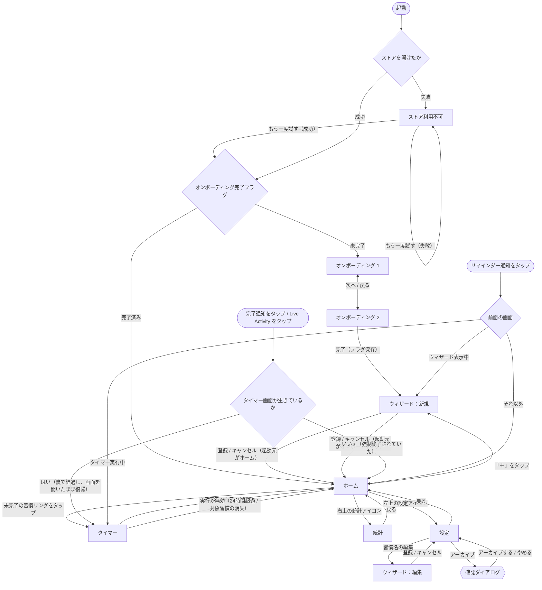
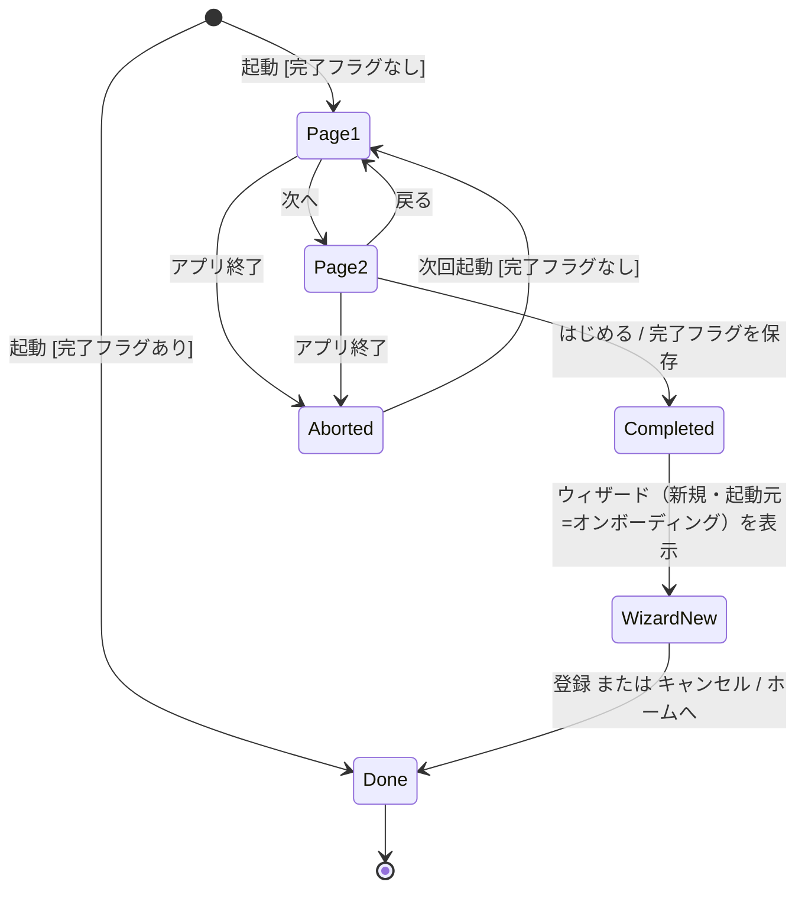
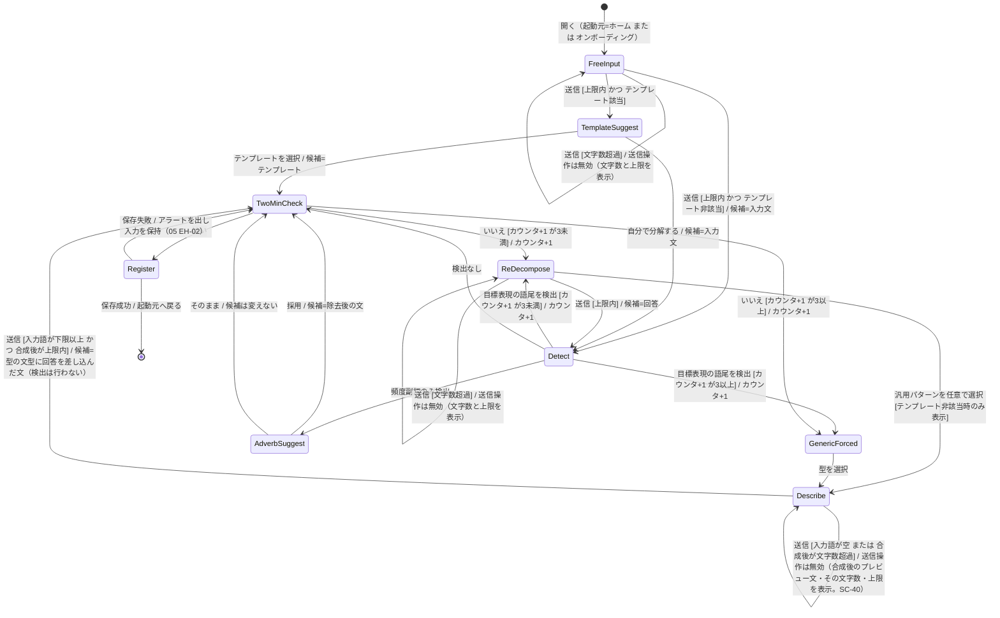
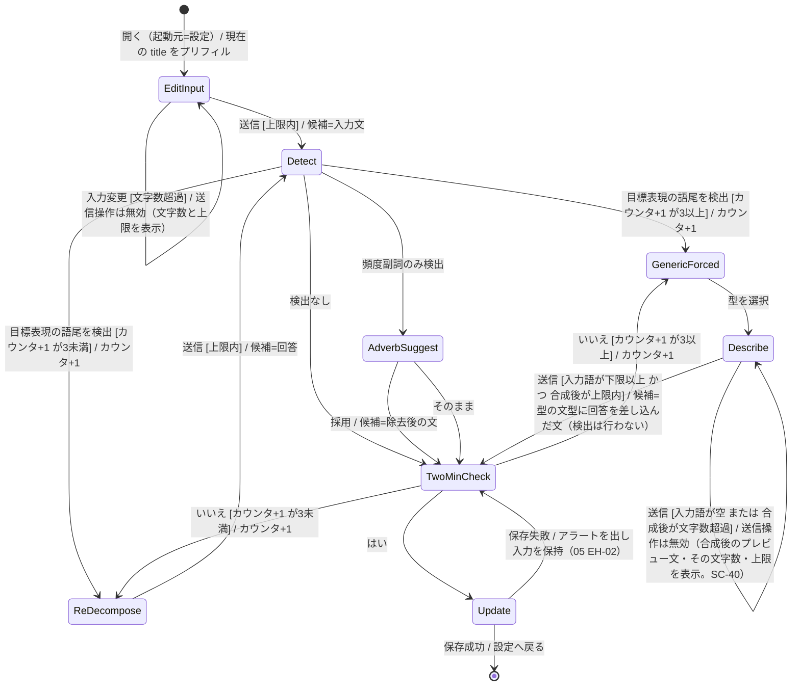

# 02 画面設計 — OneTwenty

| 項目     | 内容 |
| -------- | ---- |
| 入力要件 | [requirements.md](../01_要件定義/requirements.md) v1.20 |
| 前提     | [01_architecture.md](./01_architecture.md)（レイヤー・コンポーネント名・仮定はすべて 01 を正とする） |
| 本書の範囲 | 画面一覧、画面遷移、各画面の状態・表示要素・操作、画面単位の状態遷移（新規登録ウィザード・習慣編集フロー・オンボーディング） |

ViewModel・サービスのインターフェースと、ドメインの状態遷移（タイマー・復元・通知予約・アーカイブ）は [04_modules.md](./04_modules.md) で定義する。本書では画面から見た振る舞いのみを扱う。

---

## 1. 画面一覧と遷移

### SC-01 画面一覧

| # | 画面 | 表示方式 | 主な要件 |
| - | ---- | -------- | -------- |
| 0 | オンボーディング（2ページ） | ルートの差し替え（ホームの代わりに表示） | FR-7.1〜FR-7.6 |
| 1 | ホーム | ルート（`NavigationStack` の根） | FR-2.1 / FR-3.5 / FR-4.1〜FR-4.5.1 |
| 2 | タイマー | フルスクリーン（`fullScreenCover`） | FR-2.1〜FR-2.12 / FR-4.5.1 / FR-5.6 |
| 3 | 登録ウィザード（新規／編集） | フルスクリーン（`fullScreenCover`） | FR-1.x / FR-6.4.x |
| 4 | 統計 | ホームからプッシュ | FR-3.7〜FR-3.12 |
| 5 | 設定 | ホームからプッシュ | FR-6.1〜FR-6.4 / FR-5.8 |
| — | ストア利用不可 | ルートの差し替え（ホーム／オンボーディングの代わりに全画面） | 横断（05 EH-01） |
| — | アーカイブ確認ダイアログ | 設定画面上の確認ダイアログ（`confirmationDialog`） | FR-6.3.1 |

| 項目   | 内容 |
| ------ | ---- |
| 理由   | タイマーとウィザードは「その画面以外への遷移を許さない」（FR-2.12）、「キャンセル導線を全画面の同じ位置に常時表示する」（FR-1.10）ため、システムの下スワイプで閉じられるシートではなく、閉じ方をアプリが完全に制御できるフルスクリーンにする。**タイマーを全画面にすることは FR-4.5.1 の成立条件でもある**：完了フィードバックの表示中にホーム画面の習慣リングを見せないという要件を、この提示方式だけで満たしている（保留機構を持たない。01 AR-04）。**提示方式をシート等に変えると FR-4.5.1 が破れる** |
| 代替案 | **シート（`sheet`）＋ `interactiveDismissDisabled`**：タイマーの下スワイプ中断（FR-2.5.1）とシートの閉じるジェスチャが同じ方向で競合するため却下 |

### SC-02 画面遷移

| 項目     | 内容 |
| -------- | ---- |
| 対応要件 | FR-1.10.2 / FR-2.1 / FR-2.12 / FR-3.11 / FR-6.3 / FR-6.3.1 / FR-7.6 |
| 設計     | 上図のとおり。統計への入口は**ホーム右上のアイコン1つのみ**とし（FR-3.11）、完了表示・通知・オンボーディングからは統計へ遷移させない。**通知・Live Activity のタップは着地先が2通りに分かれる**（SC-32 の各行と1対1で対応）：タイマー画面が生きていれば（裏で120秒が経過し、画面を開いたまま復帰する場合）タイマー画面の完了表示に入り、SC-33 の完了表示の終了（2.5秒）を経てホームへ戻る（FR-2.9 の完了文言はこの経路で表示される）。強制終了されていた場合はタイマー画面を表示せずホームから始まる（FR-2.15）。**リマインダー通知（FR-5.1）のタップは前面の画面を閉じない**：タイマー実行中はタイマー画面を維持（FR-2.12）、ウィザード表示中はウィザードを維持する（途中入力の破棄はキャンセル操作に限る。FR-1.10.1 / SC-40）。統計・設定をプッシュ中の場合もその画面を維持する。通知は「今日まだやっていない」ことを伝えるだけで、画面遷移の契機にしない。設定への入口はホーム左上のアイコンとする（仮定 A-17）。ウィザードは起動元（新規＝ホーム／オンボーディング、編集＝設定）を保持し、登録・キャンセルのどちらでも起動元へ戻る。オンボーディング起動のウィザードもホームへ戻る（FR-1.10.2） |
| 理由     | 統計と設定を同じ右上に並べると、FR-3.11 の「統計への導線は右上の小さなアイコン1つ」と見分けがつかなくなるため、設定は反対側に置く |
| 代替案   | **設定をタブバーにする**：タブを出すと統計・設定が常に目に入り、FR-3.11（統計へ誘導しない）と原則4（長く滞在させない）に反するため却下 |

---

## 2. 共通仕様

### SC-03 全画面共通の表示規則

| 対応要件 | 設計 |
| -------- | ---- |
| NFR-5 / FR-6.1 | テーマ設定（ライト／ダーク／端末に合わせる。初期値は端末に合わせる）を `AppCoordinator` がルートの `preferredColorScheme` に反映する。「端末に合わせる」は `nil` を渡す |
| NFR-4.1 / §5.2 | 色はモノクロームの基調色（システムの `primary` / `secondary` / 背景色）とアクセント1色（`AccentColor` アセット、ライト・ダーク別定義）のみ。テキストと背景の組み合わせは両テーマで 4.5:1 以上になる色のみを使う |
| NFR-4.3 | 文字はすべて Dynamic Type 対応のテキストスタイルで指定し、固定サイズを使わない。AX5 でも省略（`...`）を発生させない（行数制限を付けない）。縦スクロールの扱いは画面ごとに次のとおり。**ホームと統計**＝拡大時のみ許容（NFR-4.3）。**ウィザード・設定・オンボーディング**＝元からスクロール可能なリスト・フォームで構成する。**タイマー**＝スクロールしない（中断ジェスチャと競合するため。寸法で調整する。SC-30） |
| NFR-4.4 | 装飾的なアニメーション（習慣リングが満ちる動き、画面遷移）は、Reduce Motion 有効時に即時切り替えにする。タイマーリングの進行描画と、中断ジェスチャ中の指への追従は Reduce Motion の対象外とする |
| NFR-6 | UI 文言はすべて String Catalog から取得する。コンテンツデータ（テンプレート・検出語・完了文言）は `LanguageResolver` の結果で選ぶ（01 AR-09） |
| FR-3.6 | どの画面でも、連続が途切れたことを示す警告色（赤・橙など）・警告アイコン・煽る文言を使わない。途切れた状態は「連続日数を表示しない」（FR-3.5.4）ことでのみ表現する |
| FR-3.2 / FR-3.4 | どの画面にも、タイマーを使わずに完了を記録する操作（チェックボックス・完了ボタン等）と、メモ・感想の入力欄を置かない |
| NFR-4.2 | 標準コントロール（リスト・フォーム・ボタン・ダイアログ）は既定のラベルに委ね、**独自表示を持つ要素だけ画面側で読み上げを定義する**（ホーム＝SC-24、タイマー＝SC-34、統計＝SC-51、ウィザード＝SC-40）。無効化された操作は、無効である理由が読み上げに含まれること |

| 項目   | 内容 |
| ------ | ---- |
| 理由   | 色・文字・動きの規則を画面ごとに書くと、画面間で扱いが割れる。共通規則として一度だけ定義する |
| 代替案 | なし |

---

## 3. オンボーディング（画面0）

### SC-10 表示要素と操作

| 対応要件 | FR-7.1 / FR-7.2 / FR-7.3 / FR-7.5 / FR-7.6 |
| -------- | ---- |

| ページ | 表示 | 操作 |
| ------ | ---- | ---- |
| 1 | 「チェックインはない」を伝える見出しと本文（TODO 1.2） | 「次へ」ボタン |
| 2 | 「2分やった人だけが記録される」を伝える見出しと本文（TODO 1.2） | 「戻る」ボタン（ページ1へ）、「はじめる」ボタン（完了） |

- **スキップボタンは置かない**（FR-7.2）。ページの左右スワイプによる送りも提供しない（ボタン操作だけで進める。スキップの代わりに連続スワイプで読み飛ばされないようにするため）
- 設定画面にオンボーディングを再表示する項目は置かない（FR-7.5）
- 独自表示を持たないため、VoiceOver は標準コントロールの既定の読み上げに委ねる（NFR-4.2。SC-03）

### SC-11 オンボーディングの状態遷移

| 項目 | 内容 |
| ---- | ---- |
| State | `Page1` / `Page2` / `Completed` / `WizardNew`（ウィザード表示中）/ `Done`（ホーム） |
| Event | 次へ・戻る・はじめる・アプリ終了・起動 |
| Guard | 起動時に `SettingsStore` の完了フラグの有無で分岐 |
| 副作用 | 「はじめる」で完了フラグを保存する（FR-7.4）。フラグ保存は OnboardingViewModel が `SettingsStore` に直接書く（01 §3 の例外） |
| 遷移不能 | `Page1` から `Completed` へ直接は遷移できない（スキップなし。FR-7.2）。`Done` から `Page1` へは戻れない（FR-7.5） |
| キャンセル / 復帰 | オンボーディングにキャンセルはない。ページ1・2の途中でアプリを終了すると、フラグは未保存のため次回起動でページ1から再表示する（FR-7.4）。ウィザードをキャンセルしてもフラグは保存済みなのでオンボーディングには戻らない（FR-1.10.2） |
| 理由 | 完了フラグを「はじめる」の時点で保存すれば、2画面目まで読んだことが保証される（FR-7.4 の意図） |
| 代替案 | **1画面目の表示時点で保存する**：1画面目だけ見て離脱したユーザーに差別化点の後半が伝わらないため却下（要件 FR-7.4 注記） |

---

## 4. ホーム（画面1）

### SC-20 表示要素

| 要素 | 内容 | 対応要件 |
| ---- | ---- | -------- |
| 習慣リング | アクティブな習慣（`archivedAt == nil`）を `order` 順に**登録件数分だけ**表示する。表示日にその習慣の Session があれば「満ちた」状態（アクセント色で塗りつぶし）、なければ空の状態（アクセント色の細い輪郭） | FR-4.3.1 / FR-4.1 / §5.2 |
| 習慣名 | 習慣リングの下に習慣名を全文表示する（省略しない。改行で折り返す） | NFR-4.3 / FR-1.4.3 |
| 連続日数 | 習慣リングの脇に「N日」を表示する。**0 の場合は何も表示しない**（「0日」とも出さない）。算出規則は 04 MD-23 | FR-3.5 / FR-3.5.1〜FR-3.5.4 |
| 「＋」プレースホルダ | 未使用の枠（3 − アクティブ件数）ごとに1つ表示する。空のリングとは形を変える（輪郭なしの「＋」記号のみ）。アクティブが3件なら表示しない | FR-4.3.1 / FR-1.9 |
| 「習慣を追加」ラベル | アクティブ0件のときだけ、「＋」の下に表示する（仮定 A-18） | §5 注記 / FR-5.4.1 |
| 全完了の1行文言 | アクティブ1件以上かつ全習慣が表示日に完了したとき、リング群の下に1行だけ表示する（TODO 1.5）。統計への誘導・次回通知時刻は表示しない | FR-4.3 |
| 統計アイコン | 右上に小さなアイコン1つ | FR-3.11 |
| 設定アイコン | 左上に小さなアイコン1つ | 仮定 A-17 |

### SC-21 ホームの状態

| 状態 | 条件 | 表示 |
| ---- | ---- | ---- |
| 空 | アクティブ0件 | 「＋」3つと「習慣を追加」。全完了文言は出さない |
| 通常 | アクティブ1件以上、未完了が1件以上 | 習慣リング＋未使用枠の「＋」 |
| 全完了 | アクティブ1件以上、全件完了 | すべての習慣リングが満ちた状態＋全完了の1行文言 |

### SC-22 操作

| 操作 | 条件 | 結果 | 対応要件 |
| ---- | ---- | ---- | -------- |
| 未完了の習慣リングをタップ | — | **確認なしで即座に**タイマー画面を開き、同時にタイマーを開始する（`SessionService.start`）。ホームからの操作は1タップ。**通知許可が未決定の場合は OS の許可ダイアログが重なるが、応答を待たずにタイマーは進む**（FR-5.6 / 04 MD-10 ④ / 仮定 A-12） | FR-2.1 / NFR-1 / FR-2.6 / FR-5.6 |
| 完了済みの習慣リングをタップ | 表示日に Session がある | **何も起きない**。エラーも表示しない。開始可否の最終判定は実際の現在日で行う（04 MD-40） | FR-4.2 |
| 「＋」をタップ | アクティブ3件未満 | ウィザード（新規・起動元=ホーム）を開く | FR-4.3.1 / FR-1.2 |
| 統計アイコン | — | 統計画面へプッシュ | FR-3.11 |
| 設定アイコン | — | 設定画面へプッシュ | 仮定 A-17 |

### SC-23 表示日の切り替え

| 項目     | 内容 |
| -------- | ---- |
| 対応要件 | FR-4.4 / FR-4.5 / FR-4.5.1 |
| 設計     | ホームは `AppCoordinator` の表示日（`displayDay`）だけを使って完了状態を描く。表示日は ①シーンのアクティブ化 ②フォアグラウンド滞在中の日付変更通知（`.NSCalendarDayChanged`）の2つの契機でのみ更新される（01 AR-04）。**保留の仕組みは持たない**（01 AR-04。要件 v1.20 で明文化）。FR-4.5.1 が避けようとした「完了した瞬間にリングが満ちて即座に未完了へ戻る表示」は、完了フィードバックがタイマー画面に出てホームが覆われるため（SC-33）構造的に発生しない。フィードバックが終わってホームへ戻った時点では、FR-4.5 の規則どおり当日基準で描く |
| 理由     | 保留を設けても、有効な間はホームがタイマー画面に覆われていて一度も表示に影響しない。一方、表示日ごと保留すると**前日に完了していた別の習慣が当日も完了済みと判定され、開始できなくなる**不具合を生む（FR-4.4 に反する） |
| 代替案   | **表示日そのものを保留する**：上記の不具合に加え、タイマー画面を出していないとき（強制終了からの復帰で日跨ぎ完了を記録した場合）は解除の契機が来ず、保留が残り続けるため却下。**完了フィードバックをホームで見せる形に変える**：FR-4.5.1 の文言には忠実になるが、FR-4.3（全完了時の1行文言）と同じ場所に2種類の文言が重なるため却下 |

### SC-24 アクセシビリティ

| 対応要件 | 設計 |
| -------- | ---- |
| NFR-4.2 / NFR-4.2.1 | 習慣リングは習慣名・連続日数・状態をまとめた1つの要素にし、「{習慣名}、連続{N}日、未完了」の形式で読み上げる。連続日数が0なら「連続{N}日、」を**省く**。状態語（完了／未完了）は常に含める |
| FR-4.3.2 / NFR-4.2 | 未完了の習慣リングにはボタンのトレイトを付ける。**完了済みの習慣リングからはボタンのトレイトを外し**（`.isButton` を付けない）、読み上げは「{習慣名}、連続{N}日、完了」とする。視覚的にも輪郭を変えず塗りつぶすことで押せない状態を示す |
| NFR-4.2.2 | 「＋」は「習慣を追加、ボタン」と読み上げる |
| NFR-4.2 | 統計アイコンは「統計」、設定アイコンは「設定」のラベルを付ける |
| NFR-4.3 | Dynamic Type 拡大時はリング群を縦並びに切り替え、縦スクロールで全習慣に到達できるようにする。英語60文字の習慣名3件・AX5 を基準に確認する（§11.2） |
| NFR-4.4 | 習慣リングが満ちるアニメーションは、Reduce Motion 有効時は即時に塗りつぶす |

| 項目   | 内容 |
| ------ | ---- |
| 理由   | 習慣リングを1要素にまとめることで、VoiceOver のフォーカス移動が習慣数と一致し、読み上げの順序が崩れない |
| 代替案 | **リング・習慣名・連続日数を別要素にする**：同じ習慣の情報が3回に分かれて読まれ、どれがボタンか分かりにくいため却下 |

---

## 5. タイマー（画面2）

### SC-30 表示要素

| 要素 | 内容 | 対応要件 |
| ---- | ---- | -------- |
| タイマーリング | 残り時間の割合を円形プログレスで描く。アクセント色1色。画面のリフレッシュレートに合わせて描き直す（`TimelineView(.animation)`。描き直しの契機としてのみ使い、経過時間は毎回 `TimerEngine` が `startedAt` との差分から算出する） | FR-2.4 / NFR-8 / TR-1 |
| 残り秒数 | リング中央に残り秒数の数字（120 → 0）を表示する | FR-2.4 / FR-2.2 |
| 完了文言 | 完了時はリングを完了状態にし、文言を**リングの下**に表示する（リング内には入れない）。毎回変わる短い一言（04 MD-16） | FR-2.9 |

- **一時停止・延長・スキップ・時間変更の操作は置かない**（FR-2.2 / FR-2.3）
- 閉じるボタン・戻るボタン・ナビゲーションバーを置かない。この画面の出口は次の3種のみで、いずれも行き先はホームである（FR-2.12。他の画面へ遷移する手段は持たない）
  - ①**ユーザー操作による出口＝中断だけ**（SC-31）。入力は下方向スワイプと、VoiceOver 有効時のエスケープ操作の2通り（FR-2.5 / FR-2.5.2。後者は SC-34）。どちらも中断として同じ扱い
  - ②**システム契機の出口＝完了表示の終了**（2.5秒。SC-33）
  - ③**システム契機の出口＝実行が無効になったことによる破棄**（開始から24時間超過、または対象習慣の消失。SC-32 の該当行。契機は 04 MD-50 / MD-54 の「裏で破棄された」通知で、完了表示・音・ハプティクスを伴わない）
- 習慣名は表示しない（仮定 A-19 の補足：タイマー中は数字とリングだけにして、2分という区切りに集中させる。要件に表示の規定がないため最小構成とする）

**Dynamic Type 拡大時（AX5 まで）のレイアウト**

| 項目 | 方針 | 対応要件 |
| ---- | ---- | -------- |
| 縦スクロール | **使わない**。下方向スワイプの中断ジェスチャ（SC-31）と競合するため。代わりに要素の寸法で調整する | FR-2.5.1 / NFR-4.3 |
| 残り秒数 | リング中央のまま。文字サイズは Dynamic Type に追従する。リングの直径に収まらない場合は**最大50%まで縮小**する（`minimumScaleFactor: 0.5`）。**切り詰め（`...`）はしない** | FR-2.4 / NFR-4.3 |
| 完了文言 | リングの下に置き、**行数を制限せず折り返す**。文言の領域を確保するため、必要に応じてリングの直径を縮める。**切り詰めも縮小もしない**（文字サイズは Dynamic Type に追従する）。文言は**日本語20文字・英語40文字以内**とデータ側で保証されているため（03 DM-11）、想定される最長でも下限の直径に収まる | FR-2.9 / NFR-4.3 |
| リングの直径 | 画面幅と、残り秒数・完了文言に必要な高さから決める可変値とする。上限は画面幅の一定割合。**下限も設ける**：これ以上は縮めない値を定め、下限に達してもなお収まらない場合に限り、残り秒数と同じ扱い（最大50%までの縮小）を完了文言にも認める。**基準は「最長の完了文言（日20 / 英40文字）× AX5 × 最小幅端末で、切り詰めも縮小もなく収まること」**とし、この条件を満たす下限値を実機で確定する（06 T-71。要件 §11.3 / NFR-4.3） | FR-2.4 / NFR-4.3 |

タイマー画面は SC-03 の「縦スクロールはホームと統計のみ」の例外にあたらない（そもそもスクロールしない画面である）。AX5 での確認は §11.2 の NFR-4.3 に含まれる。

### SC-31 中断ジェスチャ

| 項目     | 内容 |
| -------- | ---- |
| 対応要件 | FR-2.5 / FR-2.5.1 / FR-2.6 / FR-2.12 |
| 設計     | ①**開始位置の判定**：ドラッグの開始点が safe area 上端から 80pt 以内なら、そのドラッグ全体を無視する（通知センターとの干渉回避）②**追従**：開始位置が有効なドラッグの下方向の移動量 `dy`（0以上）に合わせて、タイマーリングと数字を下へ移動させ、不透明度を `1 − 0.6 × min(dy / 120, 1)` に下げる ③**確定**：指を離した時点で `dy ≥ 120pt` なら中断を確定し（`SessionService.abort`）、確認なしでホームへ戻る ④**取り消し**：`dy < 120pt` で離したら元の位置・不透明度に戻す（Reduce Motion 有効時は即時に戻す）⑤上方向・横方向の移動は無視する |
| 理由     | 閾値に達する前から不透明度で「離せば中断される」ことを予告し、誤爆を防ぐ。確認ダイアログを挟まない（FR-2.5）代わりに、閾値と予告で意図しない中断を減らす |
| 代替案   | **閾値を超えた瞬間に中断する**：離す前に取り消す機会がなくなるため却下 |

中断後、同じ習慣をホームから再びタップすれば0秒から何度でも始められる（FR-2.6）。中断した Session は保存しない（FR-3.3）。

### SC-32 タイマー画面の状態

画面から見た状態。タイマーそのものの状態遷移は 04 MD-10、起動時の復元は 04 MD-11 で定義する。

| 状態 | 表示 | 受け付ける操作 |
| ---- | ---- | -------------- |
| 実行中 | リング＋残り秒数 | 中断のみ（下方向スワイプ、および VoiceOver 有効時のエスケープ操作。SC-34 / FR-2.5.2） |
| ドラッグ中 | リングと数字が指に追従し、不透明度が下がる | 指を離す |
| 完了（フォアグラウンド） | 完了文言。サウンドとハプティクスは `SessionService` が同時に鳴らす（01 AR-14） | なし |
| 完了（裏で経過した後の復帰） | 完了文言のみ。**サウンド・ハプティクスは鳴らさない**（仮定 A-11） | なし |
| 完了（強制終了後に120秒以上経過して復帰） | **タイマー画面を表示しない**。起動はホームから始まり、完了は記録済みとして反映される。完了文言・サウンド・ハプティクスは出さない（FR-2.15 / 仮定 A-11） | — |
| 破棄（強制終了後に120秒未満で復帰） | タイマー画面は表示しない（起動はホームから始まる） | — |
| 破棄（タイマー画面を開いたまま復帰し、実行が無効になっていた） | **完了文言を出さずにホームへ戻る**（SC-30 の出口③）。開始から24時間以上が経過した場合（FR-2.15.1）と、対象の習慣がアーカイブ・削除されていた場合（05 EH-09 ②）に起こる。サウンド・ハプティクスは鳴らさない。**契機は `AppCoordinator` からの「裏で破棄された」通知**で、これを受けた `TimerViewModel` は `phase = .terminated` になり、`AppCoordinator` が画面を閉じる（04 MD-50 / MD-54） | — |

### SC-33 完了後の自動復帰

| 項目     | 内容 |
| -------- | ---- |
| 対応要件 | FR-2.7 / FR-2.9 / FR-4.3 / FR-4.5.1 |
| 設計     | 完了文言を**2.5秒**表示した後、自動でタイマー画面を閉じてホームへ戻る（仮定 A-19）。この2.5秒の終了を「**完了表示の終了**」とし、`TimerViewModel` が引数なしで `AppCoordinator` に通知する（フォアグラウンド完了では 01 AR-14 の「フィードバック終了」と同じ時点。音・ハプティクスを鳴らさない「裏で完了した」経路でも同じ契機で閉じる。02 SC-32）。**完了そのものの通知（習慣ID・帰属日・完了文言・保存の成否）はこれとは別に、完了表示に入る時点で行う**（04 MD-50 / MD-54）。ホームに戻ると、**表示日が完了の帰属日と同じ場合**は該当の習慣リングが満ちた状態になっている。**日跨ぎ完了の場合**は表示日が当日に切り替わっているため、その習慣は当日未完了として表示される（FR-4.5 / FR-4.4。01 AR-04） |
| 理由     | 完了音は短い終止音（FR-2.8）で2.5秒より短く、完了文言が最も長く続くフィードバックになる。自動で閉じることで、ユーザーは完了後に何も操作しなくてよい |
| 代替案   | **タップで閉じる**：完了後に操作を1つ要求することになり、「終わりを告げる」（FR-2.8）体験と合わないため却下 |

### SC-34 アクセシビリティ

| 対応要件 | 設計 |
| -------- | ---- |
| NFR-4.2 | タイマーリングと残り秒数を1要素にまとめ、「残り{N}秒」と読み上げる。値の更新は10秒ごとに読み上げを更新する（毎秒更新すると読み上げが終わらないため） |
| NFR-4.2 / FR-2.5 / **FR-2.5.2** / FR-2.12 | VoiceOver ではドラッグ操作が難しいため、中断の代替として**エスケープ操作（2本指の Z 字スクラブ）で中断**できるようにする（`accessibilityAction(.escape)`）。既存の中断操作の代替入力であり、新しい機能ではない。**FR-2.12（実行中は下方向スワイプ以外の遷移を行えない）の明示的な例外**として要件に定められている（FR-2.5.2。要件 v1.20）。中断後の扱い（記録せず破棄）は下方向スワイプと同じ |
| NFR-4.4 | タイマーリングの進行描画と中断ジェスチャの追従は Reduce Motion でも維持する（直接操作のフィードバック）。ドラッグの取り消し時に元へ戻る動きのみ即時にする |
| NFR-4.3 | AX5 でのレイアウトは SC-30 の方針に従う（スクロールせず、リングの直径と文字の縮小率で調整する） |
| NFR-8 | ProMotion 搭載機で120fps描画するために `CADisableMinimumFrameDurationOnPhone`（01 AR-11）が必要 |

---

## 6. 登録ウィザード（画面3）

### SC-40 ウィザードの画面構成（新規・編集共通）

| 要素 | 内容 | 対応要件 |
| ---- | ---- | -------- |
| キャンセルボタン | **全ステップの同じ位置（左上）に常時表示**する。押すと確認なしで起動元へ戻る | FR-1.10 / FR-1.10.2 |
| 戻るボタン | 最初のステップ以外で表示する（右上ではなく、キャンセルと区別できる位置：画面下部の左） | FR-1.10.3 |
| 質問文 | 1ステップにつき質問1つ | FR-1.3 |
| 入力欄・選択肢 | ステップごとに異なる（SC-41） | — |
| 文字数表示 | 自由入力のステップで「現在の文字数 / 上限」を常時表示する（上限は日本語30・英語60。01 仮定 A-5）。**「具体の記述」ステップ（`Describe`）では、入力した語ではなく合成後の文を対象に数える**（判定と表示をそろえる。SC-41）。あわせて**合成後のプレビュー文そのものを画面に表示**し、超過時は「どの文が何文字で、上限がいくつか」が分かる形にする。入力語だけを数えると、表示は上限内なのに送信が無効という理由の分からない状態になり、`GenericForced` の後は他に進む手段がない（FR-1.3.1 の打ち切り後の着地点のため）。**有効な入力の下限はトリム後1文字以上とする**（04 MD-13 の `.empty`）。`Describe` では合成後の文の上限に加えて**入力語そのものが下限を満たすこと**を送信の条件にする：型の文型は常に非空なので、合成後の判定だけでは空入力を検出できない（入力が空でも「を用意する」という文が通ってしまう） | FR-1.4 / FR-1.4.1 / FR-6.4.2.1 |

- **1問1画面**で進行する。1画面に複数の質問を並べない（FR-1.3）
- 途中入力・分解状態は画面を閉じた時点ですべて破棄する（FR-1.10.1）。永続化しない（01 AR-03）

**読み上げ（NFR-4.2 / FR-6.4.2.1）**：入力欄の `accessibilityValue` に「現在の文字数 / 上限」を含め、上限超過中は `accessibilityHint` に「上限は{limit}文字です。{count}文字まで減らすと送信できます」を設定する。`Describe` では合成後のプレビュー文を `accessibilityValue` に含め、**送信操作が無効な理由（入力が空／合成後が上限超過）を読み上げる**（SC-03 の「無効化された操作は理由が読み上げに含まれること」）。キャンセル・戻るは標準ボタンのため追加指定はしない。

### SC-41 ウィザードのステップ

| ステップ | 質問 | 入力 | 対応要件 |
| -------- | ---- | ---- | -------- |
| 自由入力 | 「やりたいことは？」（新規）／ 現在の習慣名をプリフィル（編集） | テキスト | FR-1.1 / FR-6.4.1 |
| テンプレート提示 | 「よく選ばれている始め方」＋テンプレート一覧＋「自分で分解する」 | 選択 | FR-1.6 |
| 頻度副詞の代替案 | 「『{語}』はアプリが管理します。『{除去後の文}』でどうですか？」 | 採用／そのまま | FR-1.5.1.2 |
| 2分確認 | 「それは今から2分で終わりますか？」（対象の文を併記） | はい／いいえ | FR-1.3 / FR-1.5.2 |
| 再分解 | 「その最初の1アクションは何ですか？」（目標表現を検出した場合は「それは目標です。最初の1アクションは何ですか？」） | テキスト（テンプレート非該当なら汎用パターン3種も任意の選択肢として並べる） | FR-1.3 / FR-1.5.1.3 / FR-1.7 |
| 汎用パターン（強制） | 「次のどれから始めますか？」＋①道具を用意する ②その場所に行く ③最小単位を1つやる | 選択（必須） | FR-1.3.1 / FR-1.7 / FR-1.7.1 |
| 具体の記述 | 選んだ型の後に続ける具体（例：型①を選んだ場合「何を用意しますか？」）。入力した語は**型ごとの文型に差し込んで1文に合成する**（下記）。送信すると**検出を通さず2分確認へ進む** | テキスト | FR-1.7.1 / FR-1.4 |

文言はいずれも String Catalog で管理する（TODO 1.3）。

**汎用パターンの合成規則（FR-1.7.1 / FR-1.4）**

汎用パターンは「型」と「具体」に分かれるため、そのままでは候補が名詞句になり FR-1.4 の「1文」を満たさない。型ごとに文型を String Catalog に持ち、入力を差し込んで1文を作る。

| 型 | String Catalog のキー | 日本語の文型 | 英語の文型 |
| -- | --------------------- | ------------ | ---------- |
| ① 道具を用意する | `wizard.generic.prepare.format` | `%@を用意する` | `Get out your %@` |
| ② その場所に行く | `wizard.generic.go.format` | `%@に行く` | `Go to %@` |
| ③ 最小単位を1つやる | `wizard.generic.doOne.format` | `%@を1つやる` | `Do one %@` |

- 合成は **`WizardViewModel` が行う**（String Catalog を読むため。ドメイン層は文言を扱わない。04 MD-12 / MD-55）。状態機械には**合成後の文**を `submitText` として渡す
- **文字数の判定（FR-1.4.1）も画面の文字数表示も、合成後の文に対して行う**。入力した語単体では判定も表示もしない。合成後のプレビュー文を画面に出す（SC-40）
- **合成後の文には目標表現・頻度副詞の検出（FR-1.5.1）をかけない。**`Describe` の送信は `Detect` を通さず `TwoMinCheck` へ直行する（SC-42 / SC-43）。汎用パターンの型は既に行動の形（用意する／行く／1つやる）であり、`GenericForced` は FR-1.3.1 の「3回目のNoで打ち切り」の着地点なので、ここを終端にする。検出をかけると、たとえば型③＋「読書を続ける」＝「読書を続けるを1つやる」が「続ける」に一致して型選択へ戻され、再分解カウンタは既に上限のため**同じ型選択画面が理由の説明もなく再提示されるだけの循環**になる（FR-6.4.5 が編集フローで避けたのと同じ行き止まり）。したがってこの区間のハード拒否は文字数超過のみとする
- 上表の文型は暫定であり、確定は TODO 1.3 と同じ扱いとする（06 T-81）

### SC-42 新規登録フローの状態遷移

| 項目 | 内容 |
| ---- | ---- |
| State | `FreeInput` / `TemplateSuggest` / `Detect`（判定のみ・表示なし）/ `AdverbSuggest` / `TwoMinCheck` / `ReDecompose` / `GenericForced` / `Describe` / `Register` |
| Event | 送信・選択・はい・いいえ・採用・そのまま・戻る・キャンセル |
| Guard | 文字数（**下限＝トリム後1文字以上、上限＝FR-1.4.1** / FR-1.4.2）、テンプレート該当（`TemplateMatcher`）、検出結果（`PhraseDetector`。目標表現が頻度副詞より優先）、**再分解カウンタ** |
| 副作用 | `Register` で `HabitService.register(title: 候補, originalIntent: 自由入力の文)` を呼ぶ。**成功したときだけ画面を閉じる**（閉じる主体は `AppCoordinator`。04 MD-50）。保存に失敗した場合はアラートを出して `TwoMinCheck` に留まり、入力と分解状態を保持したまま再試行できる（05 EH-02）。**`limitReached` の場合だけは例外で、アラートの OK でウィザードを閉じて起動元へ戻る**（再試行しても成功しえないため。05 EH-08）。通知許可が未決定なら、成功後に許可要求を行う（FR-5.6 / 04 MD-41）。登録件数が上限に達していれば登録されない（FR-1.9。ウィザードを開く前に「＋」が消えているため通常は到達しない。05 EH-08） |
| 遷移不能 | `FreeInput` の前には戻れない（FR-1.10.3）。`GenericForced` では「自由に再分解する」選択肢を出さない（FR-1.3.1 の強制）。**`Describe` から `Detect` へは進まない**（合成後の文に検出をかけない。SC-41）。`TwoMinCheck` を経ずに `Register` へは進めない（FR-1.2 / FR-1.5.2） |
| キャンセル | 全状態から、確認なしで起動元へ戻る。途中入力とカウンタはすべて破棄する（FR-1.10 / FR-1.10.1 / FR-1.10.2） |
| 戻る | 直前のステップへ戻り、そのステップより後の入力を破棄する。**再分解カウンタは減らさない**（FR-1.10.3 / FR-1.10.4）。カウンタが3に達した後に戻り、再び「いいえ」または目標表現の検出に進むと、カウンタ+1 が3以上なので `GenericForced` に入る |
| 再試行 | 文字数超過は同じステップにとどまり、入力を直して再送信できる（FR-1.5.1 のハード拒否） |

**再分解カウンタの定義**（仮定 A-20）：「再分解に入った回数」を数える。増えるのは `TwoMinCheck` の「いいえ」と、目標表現の語尾の検出（FR-1.5.1.3）の2つ。カウンタ+1 の結果が3以上になった時点で、`ReDecompose` ではなく `GenericForced` に入る（FR-1.3.1 の「3回目のNoで打ち切り」）。

**上限到達後に残る唯一の反復経路**：`GenericForced → Describe → TwoMinCheck` で「いいえ」を選ぶと、カウンタは既に上限のため再び `GenericForced` に入る。これは**ユーザーが「2分で終わらない」と自ら答えた結果**であり、戻り先は意味のある選択肢（型3種）を持つ画面なので、行き止まりとは扱わない（FR-1.5.2 はソフト確認であり、「はい」を選べばいつでも `Register` に進める）。自動判定によって説明なく戻される経路は、`Describe` に検出をかけないことで無くしている（SC-41）。

**テンプレートと汎用パターンの関係**（仮定 A-21）：FR-1.7 の「テンプレートに該当しない入力に対して汎用パターン3種を選択肢として提示する」は、`ReDecompose` で**任意の**選択肢として並べることで満たす。FR-1.3.1 の上限到達後は `GenericForced` で**必須**になる。これにより、FR-1.3 の「2分確認を起点にする」と FR-1.7 の両方が成立する。

**登録前の確認**：`TwoMinCheck` は FR-1.3 の起点の質問と FR-1.5.2 のソフト確認を兼ねる。登録は必ず最終候補に対する `TwoMinCheck` の「はい」を経るため、FR-1.5.2 の「登録前に必ず1回挟む」を満たす。同じ質問を同じ文に対して2回続けては聞かない。

**originalIntent**：`FreeInput` で送信した文を常に `originalIntent` とする。テンプレートを直接選んだ場合も同じ（FR-1.8）。

| 項目 | 内容 |
| ---- | ---- |
| 理由 | 検出（`Detect`）を「候補が確定するたびに通る1つの合流点」にしたことで、自由入力・再分解・具体の記述のどこから来ても同じ規則（FR-1.5.1）が適用される |
| 代替案 | **自由入力の直後に目標表現を検出する**：自由入力は「やりたいこと」なので大半が目標表現になり、テンプレート提示の前にカウンタを消費してしまうため、テンプレート該当の判定を先に行う順序にした |

### SC-43 習慣編集フローの状態遷移

| 項目 | 内容 |
| ---- | ---- |
| State | `EditInput` / `Detect` / `AdverbSuggest` / `TwoMinCheck` / `ReDecompose` / `GenericForced` / `Describe` / `Update` |
| 新規フローとの違い | ①開始が `EditInput`（現在の `title` をプリフィル。FR-6.4.1）②**`TemplateSuggest` がない**（FR-6.4.3）③`ReDecompose` に汎用パターンの任意の選択肢を出さない（FR-6.4.3）④`GenericForced` には上限到達時のみ入る（FR-6.4.5）⑤終点が `Update`（`title` の書き換え） |
| Guard | `EditInput` では、プリフィル値が現在の表示言語の上限を超えていても画面は通常どおり開き、文字数と上限を併記して**上限以内になるまで送信を無効**にする（FR-6.4.2.1 / FR-1.4.3）。他は新規フローと同じ |
| 副作用 | `Update` で `HabitService.rename(habitID, title: 候補)` を呼ぶ。**成功したときだけ画面を閉じる**（閉じる主体は `AppCoordinator`。04 MD-50。保存失敗時は `TwoMinCheck` に留まる。05 EH-02）。`originalIntent` は書き換えない（FR-1.8 / FR-6.4.1）。同じ Habit のまま更新するので、履歴と連続日数は引き継がれる（FR-6.4） |
| 遷移不能 | `EditInput` の前には戻れない。**`Describe` から `Detect` へは進まない**（合成後の文に検出をかけない。SC-41）。`TwoMinCheck` を経ずに `Update` へは進めない（FR-6.4.2 の段階③） |
| キャンセル | 全状態から確認なしで設定画面の習慣管理セクションへ戻る。`title` と `originalIntent` は変更しない（FR-1.10.5 / FR-1.10.2） |
| 戻る・カウンタ | 新規フローと同じ（FR-1.10.3 / FR-1.10.4） |

**`TwoMinCheck` の「いいえ」の扱い**（仮定 A-22）：FR-1.5.2 は「いいえなら再分解に戻る」、FR-6.4.3 は「編集では**通常は**再分解ループを行わない」と定める。「通常は」は例外を認める書き方であり、「いいえ」は「この文は2分で終わらない＝分解が必要」という意思表示で、FR-6.4.4 が再分解を認める理由（分解が必要になるため）と同じ状況にあたる。したがって編集でも「いいえ」で `ReDecompose` に入り、カウンタに算入する。上限到達時は FR-6.4.5 のとおり汎用パターンに合流する。

| 項目 | 内容 |
| ---- | ---- |
| 理由 | 編集対象は分解済みの文であり、テンプレートや任意の汎用パターンを出すと分解のやり直しを促してしまう（FR-6.4.3 注記）。一方、分解が必要な状況（目標表現・いいえ）に入った後は新規フローと同じ救済にそろえ、行き止まりを作らない（FR-6.4.5） |
| 代替案 | **「いいえ」で `EditInput` に戻す**：FR-1.5.2 の「再分解に戻る」と食い違い、何度「いいえ」を選んでも汎用パターンの救済に到達しないため却下 |

---

## 7. 統計（画面4）

### SC-50 表示要素

| 要素 | 内容 | 対応要件 |
| ---- | ---- | -------- |
| ヒートマップ | **1枚のみ**。直近12週間（84日、表示日を含む）を **13列×7行**のグリッドに曜日を揃えて配置する。列が週（左が古く右が新しい）、行が曜日（週の始まりは端末の暦設定に従う）。**84日に含まれないセル**（最古の列のうち範囲より前の日、最新の列のうち表示日より後の未到来の日）は**何も描かない空白**とし、枠線も置かない。セルは約18pt 四方（仮定 A-26） | FR-3.8 / FR-3.8.1 |
| セルの濃淡 | 84日に含まれる日のセルだけを描く。濃淡はその日の達成率 r（04 MD-24）で決める。**分母0（その日に有効な習慣がない）の日は空欄**（背景と同じ色、輪郭のみ）。r=0 は基調色の薄い塗り。r>0 はアクセント色を不透明度 `0.25 + 0.75 × r` で塗る。1色の濃淡のみで表現し、別の色を使わない | FR-3.8.1 / §5.2 |
| 現在の連続日数 | アプリ全体の値。**0 でも「0」を表示する** | FR-3.9 / FR-3.9.1 |
| 最長連続日数 | アプリ全体の値。0 でも表示する | FR-3.9 / FR-3.9.1 |
| 通算完了回数 | アプリ全体の値。0 でも表示する | FR-3.9 / FR-3.9.1 |

- 数値は上記3つ**のみ**。習慣ごとの値は置かない（FR-3.9。習慣ごとの連続日数はホームのみ。FR-3.5）
- 月送り・年送り・期間切り替えの UI を置かない（FR-3.8）
- ヒートマップのセルは**タップ・ロングプレス・ツールチップのいずれにも反応しない**（FR-3.9.2）
- 標準の文字サイズでは**スクロールなしで1画面に収める**（FR-3.7）。基準は最小幅の対応機種と6.1インチ（§11.3）。Dynamic Type 拡大時のみ縦スクロールを許容する（NFR-4.3）

### SC-51 アクセシビリティ

| 対応要件 | 設計 |
| -------- | ---- |
| NFR-4.2 | ヒートマップ全体を1つの要素にまとめ、「直近12週間の記録、{N}日完了」と読み上げる（Nは1件以上完了した日数）。セル単位では読み上げない（FR-3.9.2 でセルは操作対象ではないため） |
| NFR-4.2 | 3つの数値はラベルと値をまとめて読み上げる（例：「現在の連続日数、5日」） |

| 項目   | 内容 |
| ------ | ---- |
| 理由   | 84セルを1つずつ読み上げると画面の読み上げが終わらず、統計画面を「一望できる1画面」とした FR-3.8 の意図と逆行する |
| 代替案 | **セルごとに日付と達成率を読み上げる**：上記の理由で却下 |

---

## 8. 設定（画面5）

### SC-60 構成

| セクション | 項目 | 内容 | 対応要件 |
| ---------- | ---- | ---- | -------- |
| ユーザー設定 | 通知時刻 | 時・分のピッカー。初期値 8:00 | FR-5.1 / FR-6.1 |
| ユーザー設定 | 通知のオン/オフ | トグル。初期値オン。**対象はリマインダーのみ**である旨を補足文で示す | FR-5.5 / FR-6.1 |
| ユーザー設定 | テーマ | ライト／ダーク／端末に合わせる の3択。初期値は端末に合わせる | FR-6.1 |
| 習慣管理 | 習慣一覧 | アクティブな習慣を `order` 順に並べる。アーカイブ済みは表示しない（復元しないため） | FR-6.3 |
| 習慣管理 | 並び替え | 一覧の並べ替え操作（ドラッグ） | FR-6.3 |
| 習慣管理 | 習慣名の編集 | 各行の「名前を変更」→ ウィザード（編集）を開く | FR-6.4 |
| 習慣管理 | アーカイブ | 各行の「アーカイブ」→ 確認ダイアログ（SC-62） | FR-6.3 / FR-6.3.1 |

- ユーザー設定は上記**3項目のみ**。サウンドのオン/オフ（FR-6.2）、アクセント色の変更（FR-6.1）、オンボーディングの再表示（FR-7.5）、削除、復元（FR-6.3）の項目は置かない
- 独自表示を持たないため、VoiceOver は標準コントロールの既定の読み上げに委ねる（NFR-4.2。SC-03）

### SC-61 通知許可状態による表示

| OS の許可状態 | 通知時刻・オン/オフ | 追加の表示 | 対応要件 |
| ------------- | ------------------- | ---------- | -------- |
| 未決定 | 通常表示（操作可能） | なし | FR-5.8.1 |
| 許可 | 通常表示（操作可能） | なし | FR-5.8.2 |
| 拒否 | **無効表示**（操作不可） | 「iOSの設定で通知を許可してください」の一文と、設定アプリを開くボタン（`UIApplication.openNotificationSettingsURLString`） | FR-5.8.3 |

- 許可状態は画面の表示時と、アプリがフォアグラウンドに復帰したとき（01 AR-04 の「通知許可状態の再取得」）に取得し直す。拒否から許可に変わっていれば通常表示に戻る（FR-5.8.4）

### SC-62 アーカイブ確認ダイアログ

| 項目     | 内容 |
| -------- | ---- |
| 対応要件 | FR-6.3 / FR-6.3.1 |
| 設計     | 確認文に「**元に戻せないこと**」と「**記録は残るがホーム画面には戻らないこと**」の2点を含める（文言は TODO 1.6）。ボタンは「アーカイブする」（破壊的操作の表示）と「やめる」の2つ。「アーカイブする」で `HabitService.archive(habitID)` を呼び、一覧から消える。Undo は提供しない |
| 理由     | 復元を廃止した結果、アーカイブはアプリ唯一の取り消し不能な操作である（要件 FR-6.3.1 注記） |
| 代替案   | なし（要件で確定） |

---

本書で置いた仮定（A-17〜A-22）は [01_architecture.md](./01_architecture.md) の仮定一覧に記載している。
