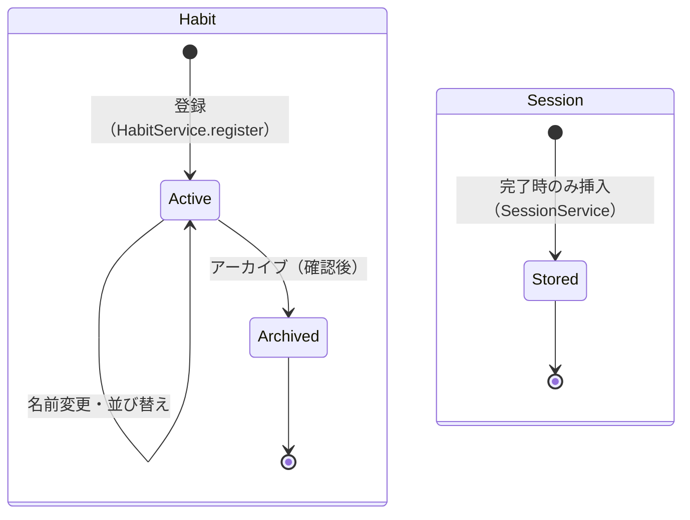

# 03 データモデル設計 — OneTwenty

| 項目       | 内容 |
| ---------- | ---- |
| 入力要件   | [requirements.md](../01_要件定義/requirements.md) v1.20 §6 データモデル |
| 前提       | [01_architecture.md](./01_architecture.md) AR-03（状態の置き場所）/ AR-09（コンテンツデータの配置） |
| 本書の範囲 | 永続化するエンティティ、UserDefaults のキー、同梱データの形式、ドメイン用の値型、整合性、ライフサイクル、マイグレーション |

**本書が定義元になるもの**：エンティティ（`Habit` / `Session`）、値型（`HabitSnapshot` / `SessionSnapshot` / `RunningSessionMarker`）、UserDefaults のキー、同梱 JSON の形式。他の設計書はこれらを再定義せず、本書を参照する。

---

## 1. 永続化方式

### DM-01 SwiftData の構成

| 項目     | 内容 |
| -------- | ---- |
| 対応要件 | §7 技術要件（SwiftData）/ TR-3 / TR-4 / §10（iCloud 同期を対象外） |
| 設計     | `ModelContainer` をアプリ起動時に1つだけ作る。スキーマは `Habit` と `Session` の2エンティティ（`SchemaV1`。DM-12）。`ModelConfiguration` は**既定の保存場所**（アプリの Application Support）を使い、**CloudKit 連携を無効**（`cloudKitDatabase: .none`）にする。テストでは同じスキーマでインメモリの構成（`isStoredInMemoryOnly: true`）を使う |
| 理由     | 要件がデータモデルを SwiftData の2エンティティで定義している。既定の保存場所は端末の iCloud バックアップに含まれるため、機種変更時の復元を OS に任せられる（要件 §10） |
| 代替案   | **App Group の共有コンテナに置く**：v1.1 のウィジェットでストアを移す処理が不要になるが、v1.0 では使わない設定を持ち込むため却下（01 AR-06）。**`isExcludedFromBackup` を付ける**：機種変更で履歴が消えるため却下 |

---

## 2. エンティティ

### DM-02 Habit

| プロパティ | 型 | Optional | 初期値・設定時点 | 制約 | 対応要件 |
| ---------- | -- | -------- | ---------------- | ---- | -------- |
| `id` | `UUID` | 非Optional | 登録時に生成 | **一意**（`@Attribute(.unique)`） | §6 |
| `title` | `String` | 非Optional | 登録時・編集時に設定 | **モデルでは長さを制約しない**。文字数上限は新規入力の検証でのみ適用する | FR-1.4 / FR-1.4.3 / FR-6.4 |
| `originalIntent` | `String` | 非Optional | 登録時に自由入力の文を設定。**以後変更しない**（編集でも書き換えない） | 不変 | FR-1.8 / FR-6.4.1 |
| `createdAt` | `Date` | 非Optional | 登録時の現在時刻 | 不変 | FR-3.5.3 / FR-3.8.1 |
| `order` | `Int` | 非Optional | 登録時にアクティブ件数（末尾） | アクティブな習慣の間で 0 から連番。アーカイブ時に `-1` にし、以後参照しない | §6 / FR-6.3 |
| `archivedAt` | `Date?` | Optional | `nil`（アクティブ） | **一度設定したら変更しない**（`nil` に戻さない） | FR-6.3 / FR-3.12 / FR-1.9 |
| `sessions` | `[Session]` | 非Optional（空配列） | 空 | `@Relationship(deleteRule: .cascade, inverse: \Session.habit)` | §6 |

| 項目   | 内容 |
| ------ | ---- |
| 理由   | 要件 §6 の定義をそのまま採用し、`id` の一意性と `order` の無効値を補った。`title` に長さ制約を付けないのは、端末の言語変更で上限を超えた既存の値を無効にしないため（FR-1.4.3） |
| 代替案 | **アーカイブ時に `order` を保持したままにする**：アクティブ習慣の並び替えで重複や欠番が生じやすいため、無効値 `-1` を入れて明示的に除外する |

### DM-03 Session

| プロパティ | 型 | Optional | 設定時点 | 制約 | 対応要件 |
| ---------- | -- | -------- | -------- | ---- | -------- |
| `id` | `UUID` | 非Optional | **実行中マーカーの `sessionID` をそのまま使う**（DM-10） | **一意**（`@Attribute(.unique)`） | FR-2.15 |
| `startedAt` | `Date` | 非Optional | タイマー開始時刻 | 集計の日付キーはこの値のローカル日付（DM-06） | FR-3.10 |
| `completedAt` | `Date` | **非Optional** | `startedAt + 120秒`（強制終了からの復元でも同じ。01 仮定 A-16） | 完了した Session のみ保存するため Optional にしない | FR-3.3 / FR-3.1 |
| `habit` | `Habit?` | Optional | 保存時に設定 | `Habit.sessions` の逆参照 | §6 |

| インデックス | `startedAt`（`#Index<Session>([\.startedAt])`） |
| ------------ | ---- |
| 理由 | 統計・ホームは「期間内の Session」を取得する。`startedAt` の範囲検索を速くし、NFR-9（Session 1,000件で200ms以内）の余裕を確保する |

| 項目   | 内容 |
| ------ | ---- |
| 理由   | `id` をマーカーの `sessionID` と同じにすることで、復元処理がアクティブ化のたびに走っても同じ Session を二重に保存しない（DM-05）。`elapsedSeconds` は持たない（完了 Session の経過は常に120秒。要件 §6） |
| 代替案 | **保存時に新しい UUID を振る**：アクティブ化が短時間に2回起きたとき、同じ実行が2件の Session になりうるため却下 |

### DM-04 リレーションと削除ルール

| 関係 | 多重度 | 削除ルール | 実際の発動 |
| ---- | ------ | ---------- | ---------- |
| `Habit.sessions` → `Session` | 1対多 | `.cascade` | **発動しない**。Habit の物理削除を提供しない（FR-6.3） |
| `Session.habit` → `Habit` | 多対1 | `.nullify`（既定） | 発動しない（同上） |

- 物理削除を行う API を Repository に**用意しない**（MD-30）。`.cascade` の指定は要件 §6 のとおり残すが、到達経路がない

### DM-05 一意性と冪等性

| 項目     | 内容 |
| -------- | ---- |
| 対応要件 | FR-2.15 / FR-4.2 / FR-3.3 |
| 設計     | ①`Habit.id` と `Session.id` を一意にする ②③の判定は**いずれも `SessionRepository.insertIfAbsent` が行う**（MD-31）。同じ `id` の Session があれば挿入しない（②）。同じ習慣で、`startedAt` が**渡された日の境界の範囲**に入る Session があれば、`id` が違っても挿入しない（③。1習慣1日1回。FR-4.2）。**日付キーに対応する境界（その日の 0:00 以上・翌日 0:00 未満）は呼び出し側（`SessionService`）が算出して引数で渡す**：Repository は判定ロジックもカレンダーも持たない方針のため（01 §2 / 04 MD-31）。呼び出し側が持つのは境界の算出だけで、重複の判定そのものは持たない |
| 理由     | 復元処理（01 AR-04）は通知センターを閉じるたびにも走る。何度実行しても結果が変わらないようにする |
| 代替案   | なし |

---

## 3. 日付と派生値

### DM-06 日付の扱い

| 項目     | 内容 |
| -------- | ---- |
| 対応要件 | FR-3.10 / FR-3.12 / FR-4.4 / FR-3.5.3 / FR-3.8.1 |
| 設計     | ①保存するのはすべて時刻（`Date`。タイムゾーンを持たない瞬間）②「日」は保存せず、集計のたびに**その時点の端末のカレンダーとタイムゾーン**で `DayKey`（年・月・日）に変換する（MD-02）③Session の日付は `startedAt` から求める（`completedAt` は使わない）④習慣の「有効期間」は `createdAt` の日から `archivedAt` の日まで（両端を含む。01 仮定 A-10） |
| 理由     | 日付の切り替わりはローカルタイムゾーンの0時（FR-4.4）。日を保存するとタイムゾーンを変えたときに保存値と表示が食い違う。この方式の帰結として、タイムゾーン変更時だけは過去の日付が移る。FR-3.12 はこれを唯一の例外として認めている（要件 v1.20。05 EH-10） |
| 代替案   | **`DayKey` を Session に保存する**：タイムゾーン変更で過去の日付が保存値と計算値の2通りになるため却下 |

端末のタイムゾーンを変更した場合、過去の Session の日付キーも新しいタイムゾーンで計算し直される（01 仮定 A-23）。

### DM-07 保存しない派生値

| 派生値 | 算出元 | 算出を担う型 | 対応要件 |
| ------ | ------ | ------------ | -------- |
| 表示日における各習慣の完了状態 | Session（習慣・日付キー） | `DailyStatusResolver`（MD-20） | FR-4.1 / FR-4.2 |
| 全習慣完了か | アクティブ習慣＋Session | `DailyStatusResolver` | FR-4.3 / FR-5.4 |
| 習慣ごとの現在の連続日数 | 習慣の Session の日付集合＋`createdAt` | `StreakCalculator`（MD-23） | FR-3.5〜FR-3.5.4 |
| 全体の現在の連続日数・最長連続日数 | 全 Session の日付集合 | `StreakCalculator` | FR-3.9 |
| 通算完了回数 | 全 Session の件数（アーカイブ済み習慣の分も含む） | `StreakCalculator` | FR-3.9 |
| ヒートマップの日別達成率 | 全 Habit の有効期間＋Session | `HeatmapCalculator`（MD-24） | FR-3.8.1 |
| アクティブ件数・空き枠 | Habit（`archivedAt == nil`） | `HabitRepository` の取得結果 | FR-1.9 / FR-4.3.1 |

| 項目   | 内容 |
| ------ | ---- |
| 理由   | 要件 §6 が派生値の永続化を禁じている。保存すると Session と食い違う可能性が生まれ、テストも「保存値の更新漏れ」を検証する必要が出る。すべて Session から毎回算出すれば、算出関数を純粋関数としてテストできる（01 AR-02） |
| 代替案 | **連続日数をキャッシュする**：NFR-9 は Session 1,000件で200ms以内であり、線形の算出で十分に満たせるため不要 |

---

## 4. 整合性とライフサイクル

### DM-08 不変条件

| ID | 不変条件 | 守る責務 | 対応要件 |
| -- | -------- | -------- | -------- |
| I-1 | アクティブな習慣は3件以下 | `HabitService.register`（MD-41） | FR-1.9 |
| I-2 | アクティブな習慣の `order` は 0 から欠番なしの連番 | `HabitService`（登録・並び替え・アーカイブのたびに振り直す） | §6 / FR-6.3 |
| I-3 | `archivedAt` は一度設定したら変わらない | `HabitRepository` に「`archivedAt` を `nil` に戻す」API を用意しない | FR-3.12 / FR-6.3 |
| I-4 | 1つの習慣につき、1つの日付キーの Session は最大1件 | **保存時の最終的な担保は `SessionRepository.insertIfAbsent`**（DM-05 ③）。`SessionService` の開始時の判定（MD-10 の Guard）は、同じ日に2回目を**開始させない**ための前段であり、保存の重複判定そのものは行わない | FR-4.2 |
| I-5 | `Session.completedAt == startedAt + 120秒` | `SessionService`（保存時に常にこの式で設定） | FR-3.1 / FR-2.2 |
| I-6 | 中断した実行は Session として存在しない | `SessionService.abort` は保存しない | FR-3.3 |
| I-7 | Habit と Session は物理削除されない | Repository に削除 API を用意しない | FR-6.3 |

### DM-09 ライフサイクル

- **Habit**：`Active` → `Archived` の一方向のみ。`Archived` から `Active` へ戻る経路はない（FR-6.3）。状態遷移の詳細（Guard・副作用）は MD-21 で定義する
- **Session**：挿入のみ。更新・削除は行わない。中断した実行は挿入しない（FR-3.3）

---

## 5. UserDefaults

### DM-10 キーと既定値

キーには接頭辞 `onetwenty.` を付ける。保存先は**標準の `UserDefaults`**。

| キー | 型 | 既定値 | 書き込み担当（01 §3） | 対応要件 |
| ---- | -- | ------ | --------------------- | -------- |
| `onetwenty.settings.reminderHour` | `Int`（0〜23） | `8` | `ReminderService` | FR-5.1 |
| `onetwenty.settings.reminderMinute` | `Int`（0〜59） | `0` | `ReminderService` | FR-5.1 |
| `onetwenty.settings.reminderEnabled` | `Bool` | `true` | `ReminderService` | FR-5.5 |
| `onetwenty.settings.theme` | `String`（`system` / `light` / `dark`） | `system` | SettingsViewModel（例外） | FR-6.1 |
| `onetwenty.onboarding.completed` | `Bool` | `false` | OnboardingViewModel（例外） | FR-7.4 / FR-7.5 |
| `onetwenty.running.session` | `Data`（`RunningSessionMarker` の JSON） | なし（キー自体が存在しない） | `SessionService` | FR-2.15 |
| `onetwenty.pending.completions` | `Data`（`RunningSessionMarker` の配列の JSON） | 空配列 | `SessionService` | FR-2.15 / 05 EH-02b |

`RunningSessionMarker`（値型・`Codable`）：

| プロパティ | 型 | 内容 |
| ---------- | -- | ---- |
| `sessionID` | `UUID` | 実行の識別子。完了時に `Session.id` になる。Live Activity の属性にも同じ値を入れる（01 AR-12） |
| `habitID` | `UUID` | 対象の習慣 |
| `startedAt` | `Date` | 開始時刻 |

**実行中マーカーと保存待ちを分ける理由**：`onetwenty.running.session` は「いま走っているタイマー」を表し、最大1件しか存在しない。完了時に Session の保存へ進むが、保存に失敗した場合はその実行を `onetwenty.pending.completions` へ移してから実行中マーカーを消す（05 EH-02b）。同じキーに置いたままにすると、保存待ちが残っている間は「実行中」と区別がつかず、**別の習慣のタイマーも開始できなくなる**（FR-4.1 が認める1日3件の実行が止まる）。

| 項目   | 内容 |
| ------ | ---- |
| 理由   | 通知時刻を時・分の2つの整数で持つと、タイムゾーンや日付を含まない「毎日この時刻」を表せる。実行中マーカーは1件しか存在しないため、単一キーに JSON で持つ。保存待ちは複数溜まりうるため配列で持つ |
| 代替案 | **通知時刻を `Date` で持つ**：日付部分とタイムゾーンが付いてしまい、「毎日8:00」の解釈がずれるため却下 |

---

## 6. 同梱データ（読み取り専用）

### DM-11 JSON の形式

配置とファイル名は 01 AR-09 のとおり（`<名前>.<ja|en>.json`）。読み込みは `ContentLoader`（MD-46）、言語の選択は `LanguageResolver`（MD-03）が行う（NFR-6.1）。

**templates.\<lang\>.json**（FR-1.6 / FR-1.7）

| フィールド | 型 | 内容 |
| ---------- | -- | ---- |
| `categories` | 配列 | 頻出カテゴリ |
| `categories[].id` | 文字列 | カテゴリID（例：`exercise`） |
| `categories[].keywords` | 文字列の配列 | 自由入力との照合に使う語（部分一致。01 仮定 A-7） |
| `categories[].templates` | 文字列の配列 | 分解済みのテンプレート（そのまま `title` 候補になる） |

データの制約：テンプレートの総数は**日英それぞれ20以上**（FR-1.6。リリース可否の下限）。各テンプレートは①その言語の文字数上限以内（FR-1.4.1）②検出語リストのどの語も含まない、を満たす（06 のテストで検証）。

**detection-terms.\<lang\>.json**（FR-1.5.1.1 / FR-1.5.1.4）

| フィールド | 型 | 内容 |
| ---------- | -- | ---- |
| `frequencyAdverbs` | 文字列の配列 | 頻度副詞（例：毎日、必ず / every day, daily）。英語は大文字小文字を区別せずに照合する |
| `goalSuffixes` | 文字列の配列 | 目標表現の語尾。**英語は全活用形を列挙する**（keep / keeps / keeping / kept 等。FR-1.5.1.4） |

データの原典は [detection-terms.md](../01_要件定義/detection-terms.md)。JSON はそこから変換する（TODO 10）。閉じたリストであり、ここにない語は検出しない（FR-1.5.1.1）。

**completion-messages.\<lang\>.json**（FR-2.9）

| フィールド | 型 | 内容 |
| ---------- | -- | ---- |
| `messages` | 文字列の配列 | 完了時の短い一言（日英それぞれ20〜30本。賞賛表現を含めない。TODO 1） |

データの制約：本数は**日英それぞれ20以上**（TODO 1）。各文言は**日本語20文字・英語40文字以内**とする（`String.count` で数える。FR-1.4.2 と同じ数え方）。この上限は 02 SC-30 のレイアウト前提であり、AX5 × 最小幅端末でタイマー画面が破綻しないこと（NFR-4.3）を、画面側の調整だけに頼らずデータ側でも保証するために置く。テンプレートと同様に 04 MD-46 のデータ検証テストと 06 T-81 の完了条件で検証する（02 SC-30 / 06 T-71）。

| 項目   | 内容 |
| ------ | ---- |
| 理由   | 3種のデータはいずれも言語ごとに内容が別物で、NFR-6.1 により明示的に言語を選ぶ必要がある。JSON にすることで、コードを変えずに中身を差し替えられ、テストでも内容を検証できる |
| 代替案 | **String Catalog に入れる**：テンプレートや検出語は「配列」と「カテゴリとの対応」を持つため表現しにくく、NFR-6.1 の「自動フォールバックに任せない」とも合わないため却下 |

---

## 7. ドメイン用の値型

### DM-13 スナップショット

Repository は `@Model` をそのまま返さず、次の値型（`Sendable`）に変換して返す（01 §2 Repository層の責務）。ドメイン層・ViewModel はこの値型だけを扱う。

| 型 | プロパティ | 元のエンティティ |
| -- | ---------- | ---------------- |
| `HabitSnapshot` | `id` / `title` / `originalIntent` / `createdAt` / `order` / `archivedAt` | `Habit` |
| `SessionSnapshot` | `id` / `habitID` / `startedAt` / `completedAt` | `Session` |

| 項目   | 内容 |
| ------ | ---- |
| 対応要件 | TR-2 / TR-3 |
| 理由   | ドメイン層を SwiftData に依存させない（TR-2）。`@Model` はメインアクターに縛られ、テストで生成にコンテナが必要になる |
| 代替案 | **ドメイン層が `@Model` を直接受け取る**：TR-2 に反するため却下 |

---

## 8. マイグレーション

### DM-12 方針

| 項目     | 内容 |
| -------- | ---- |
| 対応要件 | §7 / §10（Deployment Target を iOS 26 とした理由：SwiftData のマイグレーション） |
| 設計     | v1.0 から `VersionedSchema`（`SchemaV1`）と `SchemaMigrationPlan`（段階なし）を用意し、`ModelContainer` に渡す。将来スキーマを変える場合は `SchemaV2` と移行段階を追加する。v1.0 の時点で移行処理は存在しない |
| 理由     | 最初のリリースからバージョン付きスキーマにしておかないと、2回目のスキーマ変更で「バージョンなし → V2」の移行を後付けすることになる |
| 代替案   | **バージョンなしで出し、必要になったら導入する**：上記の理由で却下 |
