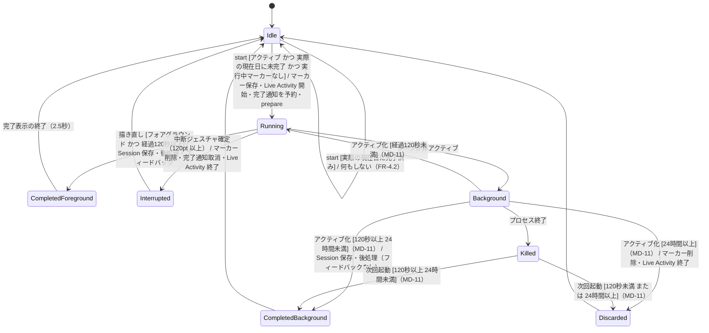
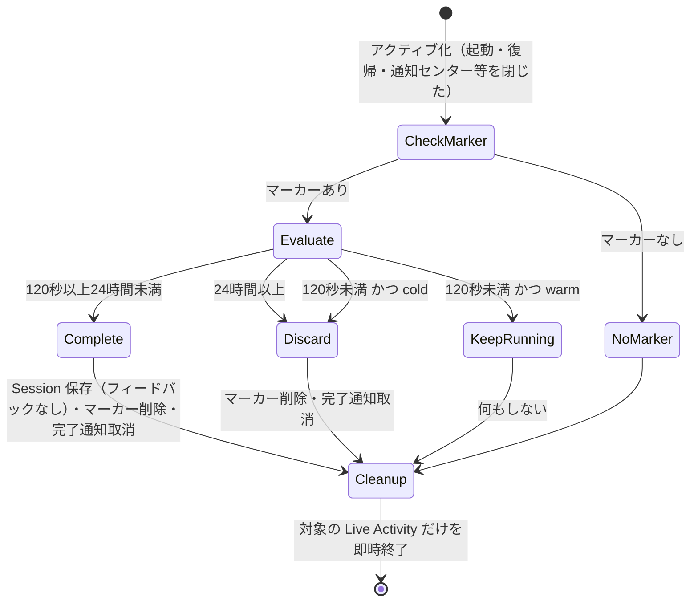
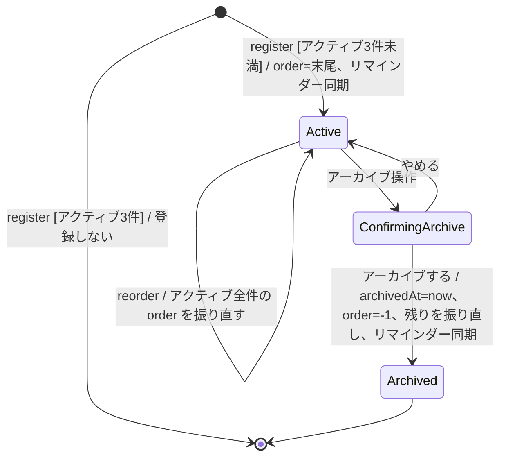
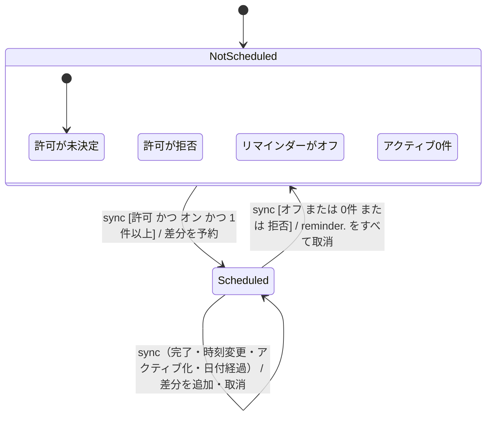

# 04 モジュール設計 — OneTwenty

| 項目       | 内容 |
| ---------- | ---- |
| 入力要件   | [requirements.md](../01_要件定義/requirements.md) v1.21 |
| 前提       | [01_architecture.md](./01_architecture.md)（レイヤー・配置）/ [02_screens.md](./02_screens.md)（画面の振る舞い）/ [03_data_model.md](./03_data_model.md)（エンティティ・値型・キー） |
| 本書の範囲 | 型・プロトコル・ViewModel・Repository・サービスの責務とインターフェース。ドメインの状態遷移（2分タイマー・起動時の復元・通知予約・習慣の通常/アーカイブ） |

- インターフェースはメソッド名と入出力の型のみを示す。実装は書かない
- 値型（`HabitSnapshot` / `SessionSnapshot` / `RunningSessionMarker`）の定義元は 03 DM-10 / DM-13
- ウィザードの状態遷移図は 02 SC-42（新規）/ SC-43（編集）が定義元。本書の MD-12 はそれを実装する型の設計のみを扱う

各コンポーネントは次の7項目で記述する：**責務 / 所有する状態 / 入力 / 出力 / 依存先 / 依存元 / テスト方法**。

---

## 1. ドメイン層（共通）

### MD-01 WallClock

| 項目 | 内容 |
| ---- | ---- |
| 対応要件 | TR-2（01 仮定 A-3：型名を `WallClock` とする） |
| 責務 | 現在時刻と、日付計算に使うカレンダー（暦・タイムゾーン）を返す |
| 所有する状態 | なし（本番）/ 任意に設定・進められる時刻とカレンダー（テスト用） |
| インターフェース | `protocol WallClock { var now: Date { get }; var calendar: Calendar { get } }`。本番実装 `SystemClock`（`calendar` は `Calendar.current` を返す。端末の暦・タイムゾーン設定に追従する。FR-4.4 / 02 SC-50 の「週の始まりは端末の暦設定に従う」）、テスト実装 `TestClock`（`now` を直接設定・`advance(by:)` で進め、`calendar` も任意に差し替えられる） |
| 依存先 / 依存元 | なし / 時刻**またはカレンダー**を必要とするすべてのサービス・ViewModel。**`Calendar.current` を各所で直接参照しない**：ドメイン層の純粋な型（`DayKey`・`StreakCalculator`・`HeatmapCalculator`・`ReminderPlanner`・`DailyStatusResolver`）は `calendar` を引数で受け取り、**Repository 層は日付の境界を引数で受け取る**（MD-31）。その値の出所を本型に一本化する（タイムゾーン変更・週の始まりの違いをテストで再現できるようにするため。05 EH-10 / 03 DM-06） |
| テスト方法 | `TestClock` そのものが他のテストの道具になる |
| 理由 | 120秒・24時間・日付境界を実時間を待たずに検証するため。TR-2 が注入可能にすることを求めている |

### MD-02 DayKey

| 項目 | 内容 |
| ---- | ---- |
| 対応要件 | FR-3.10 / FR-4.4 / FR-3.5.3 / FR-3.8.1 |
| 責務 | 時刻を「端末のカレンダーとタイムゾーンにおける日付」に変換し、日付の比較・加減算を提供する |
| インターフェース | `struct DayKey: Hashable, Comparable, Sendable`（年・月・日）。`init(_ date: Date, calendar: Calendar)` / `adding(days:calendar:) -> DayKey` / `startOfDay(calendar:) -> Date` / `days(from:to:)` |
| 依存先 / 依存元 | Foundation の `Calendar` / 集計・日付判定を行うすべての型 |
| テスト方法 | 23:59:59 と 0:00:00 が別の日になること、夏時間の切り替え日を含む暦で加減算が崩れないこと、タイムゾーンを指定した `Calendar` で同じ時刻が別の日になること |
| 理由 | 日付の切り替わりはローカルタイムゾーンの0時（FR-4.4）。日付の扱いを1つの型に集めて、境界の誤りを1か所でテストする |

### MD-03 LanguageResolver

| 項目 | 内容 |
| ---- | ---- |
| 対応要件 | NFR-6.1 / FR-1.4.1 / FR-1.5.1.1 / FR-1.6 / NFR-6（01 仮定 A-5） |
| 責務 | 「表示言語が日本語なら日本語、それ以外は英語」を判定し、言語に依存する値を返す |
| インターフェース | `enum ContentLanguage { case ja, en }`。`static func resolve(preferredLocalization: String?) -> ContentLanguage`（先頭が `ja` なら `.ja`、それ以外と `nil` は `.en`）。`var titleLimit: Int`（`.ja` → 30、`.en` → 60） |
| 入力 | 本番は `Bundle.main.preferredLocalizations.first` |
| 依存先 / 依存元 | なし / `TitleValidator`・`ContentLoader`・`WizardViewModel` |
| テスト方法 | `"ja"` / `"ja-JP"` → `.ja`。`"en"` / `"en-GB"` → `.en`。**`"fr"` と `nil` → `.en`**（NFR-6.1 の「それ以外は英語」の分岐。§7 テスト対象「言語別の切り替え」） |
| 理由 | 言語による分岐を1か所に集め、上限・検出語・テンプレートの3つが同じ規則で切り替わることを保証する |

---

## 2. ドメイン層（タイマーと復元）

### MD-10 TimerEngine と2分タイマーの状態遷移

**TimerEngine（純粋な計算）**

| 項目 | 内容 |
| ---- | ---- |
| 対応要件 | TR-1 / TR-2 / FR-2.2 / FR-2.10 / FR-3.1 |
| 責務 | `startedAt` と現在時刻から経過・残り・進捗・完了を算出する。**tick の積算を持たない** |
| インターフェース | `static let duration: TimeInterval = 120`。`static func progress(startedAt: Date, now: Date) -> TimerProgress`。`TimerProgress` は `elapsed`（0以上に丸める）/ `remaining`（0〜120）/ `fraction`（0〜1）/ `isFinished`（`elapsed >= 120`）/ `endsAt`（`startedAt + 120`） |
| 所有する状態 | なし（毎回の呼び出しで計算する） |
| 依存先 / 依存元 | なし / `TimerViewModel`・`SessionService`・`SessionRecoveryResolver` |
| テスト方法 | 0秒・119.999秒・120秒・121秒の `isFinished`。現在時刻が `startedAt` より前（端末の時刻を巻き戻した）なら `elapsed = 0`（05 EH-10）。任意の時刻に飛ばしても（バックグラウンドからの復帰を想定）差分だけで正しい値になる |
| 理由 | TR-1 が禁止する tick の積算を構造的に不可能にする。タイマー画面の描き直し（02 SC-30 の `TimelineView`）は計算の契機にすぎない |

**2分タイマーの状態遷移**（1回の実行＝`RunningSessionMarker` 1つの一生）

| 項目 | 内容 |
| ---- | ---- |
| 対応要件 | FR-2.1 / FR-2.2 / FR-2.3 / FR-2.5 / FR-2.6 / FR-2.7 / FR-2.10 / FR-2.12 / FR-2.13 / FR-2.15 / FR-2.15.1 / FR-3.3 / FR-4.2 |
| State | `Idle` / `Running` / `Background` / `Killed` / `CompletedForeground` / `CompletedBackground` / `Interrupted` / `Discarded` |
| Event | start（習慣リングのタップ）/ 描き直し（`TimelineView` の各フレーム）/ 中断ジェスチャ確定 / シーンの非アクティブ化・アクティブ化 / プロセス終了 / 次回起動 |
| Guard | start：習慣がアクティブ、**実際の現在日**（`DayKey(WallClock.now)`。ホームの `displayDay` ではない）に Session がない（FR-4.2 / FR-3.10）、**実行中マーカーがない**（保存待ちは別に保持するため、他の習慣の開始を妨げない。05 EH-02b）、その習慣・その日の保存待ちがない。完了：`TimerEngine.progress(...).isFinished`。復帰時の分岐は MD-11 |
| 副作用 | 下表 |
| 遷移不能 | 一時停止・延長・スキップ・時間変更の遷移は存在しない（FR-2.3 / FR-2.2）。`Running` から中断ジェスチャ以外で `Idle` へ戻る経路はない（FR-2.12） |
| キャンセル / 再試行 | 中断（`Interrupted`）は Session を保存せず（FR-3.3）、`Idle` に戻るので同じ習慣を0秒から何度でも始められる（FR-2.6） |

| 遷移 | 副作用（実行するのは `SessionService`。MD-40） |
| ---- | ---- |
| `Idle → Running` | ①`RunningSessionMarker`（新しい `sessionID`・習慣ID・`startedAt = now`）を保存 ②Live Activity を開始（失敗しても継続。05 EH-04）③許可済みなら `timer.<sessionID>` を `endsAt` に予約（リマインダーのオン/オフに関係なく。FR-2.13 / FR-2.14.1）④通知許可が「未決定」なら許可要求を開始する（**タイマーの開始は待たない**。FR-2.1 / FR-5.6 / 01 仮定 A-12）。要求の結果が「許可」で、その時点でマーカーの `sessionID` が同じまま（実行が続いている）なら `timer.<sessionID>` を予約する。あわせて `ReminderService.sync()` を呼ぶ ⑤**`FeedbackPlayer.prepare()` を呼ぶ**（完了時の再生が遅れないよう、音声ファイルをここで読み込む。MD-45） |
| `Running → CompletedForeground` | ①Session を `insertIfAbsent`（`id = sessionID`、`completedAt = startedAt + 120`、`sameDayRange` = `DayKey(startedAt)` の日の境界を `WallClock.calendar` で算出して渡す。MD-31）②マーカー削除（**保存に失敗した場合は、その実行を保存待ちへ移してからマーカーを削除する**。05 EH-02b / 03 DM-10）③`timer.<sessionID>` を取消 ④Live Activity を即時終了 ⑤**`FeedbackPlayer` で音とハプティクス**（01 AR-14。**終了時刻から1秒以内に完了を検出した場合のみ**鳴らす。裏から戻った直後の描き直しで完了を検出した場合は `CompletedBackground` と同じく鳴らさない。描き直しはシーンがアクティブな間だけ行う）⑥`ReminderService.sync()`（全完了なら当日分のリマインダーが外れる。TR-5） |
| `Background/Killed → CompletedBackground` | 上の①〜④と⑥。**⑤は行わない**（フォアグラウンド外。FR-2.7 / 01 仮定 A-11）。完了通知は OS が既に届けている（FR-2.13） |
| `Running → Interrupted` | マーカー削除、`timer.<sessionID>` 取消、Live Activity を即時終了。**Session は保存しない**（FR-2.5 / FR-3.3） |
| `Background/Killed → Discarded` | マーカー削除、`timer.<sessionID>` 取消（残っていれば）、Live Activity を即時終了。Session は保存しない（FR-2.15 / FR-2.15.1）。**タイマー画面を表示中だった場合は、`AppCoordinator` が `TimerViewModel` に「裏で破棄された」を伝えたうえで画面を閉じる**（完了表示は出さない。MD-50 / MD-54） |

`Running` の間に `CompletedForeground` の判定（描き直し）とアクティブ化時の復元判定（MD-11）が同時に起きても、どちらも「マーカーが存在するときだけ処理する」ため、2回目は何もしない（03 DM-05 の冪等性と合わせて二重保存を防ぐ）。

### MD-11 SessionRecoveryResolver と起動時の復元の状態遷移

| 項目 | 内容 |
| ---- | ---- |
| 対応要件 | FR-2.15 / FR-2.15.1 / FR-2.10 / FR-2.11.2（01 AR-04 / AR-12 ⑤、仮定 A-8） |
| 責務 | アクティブ化のたびに、実行中マーカー・残存 Live Activity・現在時刻・起動の種類から、①マーカーの扱い ②終了させる Live Activity の集合、を**1回の呼び出しで**判定する |
| インターフェース | `static func resolve(marker: RunningSessionMarker?, activities: [ActivitySnapshot], now: Date, launch: LaunchKind) -> RecoveryDecision` |
| 入力 | `LaunchKind`：`.cold`（プロセス起動後の最初のアクティブ化）/ `.warm`（2回目以降）。`ActivitySnapshot`：`activityID` / `sessionID` / `endsAt` |
| 出力 | `RecoveryDecision`：`markerAction`（`.none` / `.keepRunning` / `.complete(marker)` / `.discard(marker)`）と `activitiesToEnd: Set<String>` |
| 所有する状態 | なし |
| 依存先 / 依存元 | `TimerEngine` / `SessionService.recoverOnActivation`（MD-40）が判定と実行の両方を行う。`AppCoordinator` は本型を直接呼ばない |
| テスト方法 | 下表の全行と、Live Activity の掃除の全パターン（下記）。時刻は `TestClock` で与える |

**マーカーの判定**

| マーカー | 経過（`now − startedAt`、負は0） | 起動の種類 | 判定 | 根拠 |
| -------- | -------------------------------- | ---------- | ---- | ---- |
| なし | — | — | `.none` | — |
| あり | 24時間以上 | どちらでも | `.discard` | FR-2.15.1 / 仮定 A-8 |
| あり | 120秒以上24時間未満 | どちらでも | `.complete` | FR-2.15 / FR-2.10 |
| あり | 120秒未満 | `.cold` | `.discard` | FR-2.15（強制終了からの復帰で120秒未満） |
| あり | 120秒未満 | `.warm` | `.keepRunning` | FR-2.10（裏に回っただけ。計測を継続） |

**Live Activity の掃除**（01 AR-12 ⑤）：判定後のマーカー（`.keepRunning` のときだけ残り、それ以外は消える）と `sessionID` が一致しない Activity、または `endsAt ≤ now` の Activity を `activitiesToEnd` に入れる。

| 残存 Activity | 判定後のマーカー | 終了させるか |
| ------------- | ---------------- | ------------ |
| 実行中のもの（`sessionID` 一致、`endsAt > now`） | 残る（`.keepRunning`） | **終了させない**（通知センターを閉じた直後など） |
| 完了・破棄したもの | 消える | 終了させる |
| 過去の取り残し（`sessionID` 不一致） | どちらでも | 終了させる |
| マーカーと一致するが `endsAt ≤ now` | — | 終了させる（この場合マーカーは `.complete` / `.discard` で消えている） |

| 項目 | 内容 |
| ---- | ---- |
| State | `CheckMarker` / `NoMarker` / `Evaluate` / `Complete` / `Discard` / `KeepRunning` / `Cleanup` |
| Event | シーンのアクティブ化（01 AR-04 の処理「`recoverOnActivation` の呼び出し」） |
| 遷移不能 | 1回の判定で `Complete` と `Discard` の両方になることはない。`KeepRunning` の Activity を終了させる経路はない |
| 再試行 | 判定と実行は冪等（03 DM-05）。途中でアプリが終了しても、次のアクティブ化で同じ判定をやり直せる（マーカーを消すのは Session を保存した後） |
| 理由 | マーカーの判定と Activity の掃除を別々に行うと、マーカーを消した後の状態を掃除側が知らずに実行中の Activity を消しうる。1回の呼び出しで両方を返すことで順序の誤りを構造的に防ぐ |

強制終了からの復帰で120秒未満の場合、Live Activity はカウントを続けていたのに記録は破棄される。これは端末のメモリ解放による終了でも同じで、要件 FR-2.15 注記が受け入れている挙動である（05 EH-09）。

### MD-16 CompletionMessagePicker

| 項目 | 内容 |
| ---- | ---- |
| 対応要件 | FR-2.9 |
| 責務 | 完了文言の一覧から1つを選ぶ。**直前と同じ文言は選ばない** |
| インターフェース | `static func pick(from messages: [String], excluding previous: String?, using rng: inout some RandomNumberGenerator) -> String?` |
| 所有する状態 | なし。**直前の文言は `AppCoordinator` が `lastCompletionMessage: String?` として持つ**（プロセス内のみ。01 仮定 A-24）。`TimerViewModel` は提示のたびに生成・破棄されるため（MD-50）、そこに置くと `excluding previous` が常に `nil` になり FR-2.9 の「毎回変わる」が機能しない |
| 依存先 / 依存元 | なし / `TimerViewModel`（直前の文言は `AppCoordinator` から受け取り、選んだ文言を `AppCoordinator` へ返す。MD-50 / MD-54） |
| テスト方法 | シード固定の乱数で、連続して呼んでも直前と同じにならないこと。一覧が1件ならその1件を返すこと。空なら `nil`（呼び出し側が既定の文言を使う。05 EH-06）。**保持経路そのものの検証は MD-54（2回続けて完了すると文言が変わること）で行う** |

---

## 3. ドメイン層（ウィザード）

### MD-12 WizardStateMachine

| 項目 | 内容 |
| ---- | ---- |
| 対応要件 | FR-1.1〜FR-1.10.5 / FR-6.4.1〜FR-6.4.5（状態遷移図は 02 SC-42 / SC-43） |
| 責務 | 02 SC-42（新規）と SC-43（編集）の状態遷移を実装する。現在のステップ、ステップの履歴、再分解カウンタ、現在の候補、自由入力の文、テンプレート該当の有無を保持する。**汎用パターン（`GenericForced`）で型を選んだ後の送信は、検出（`PhraseDetector`）を通さず2分確認へ進める**（02 SC-41。3回目のNoの着地点を終端にするため） |
| 所有する状態 | `mode`（`.new(origin: .home / .onboarding)` / `.edit(habitID, currentTitle)`）、`step`、`history`（戻る用のステップの積み上げ）、`redecomposeCount`（**戻っても減らさない**。FR-1.10.4）、`candidate`、`originalIntent`、`templateCategory`（該当したカテゴリ、なければ `nil`） |
| 入力（イベント） | `submitText(String)` / `selectTemplate(String)` / `decomposeMyself` / `answerTwoMinute(Bool)` / `acceptSuggestion` / `keepOriginal` / `chooseGenericType(GenericPattern)` / `back` / `cancel` |
| 出力 | 次のステップと、実行すべき効果 `WizardEffect`：`.none` / `.register(title, originalIntent)` / `.rename(habitID, title)` / `.close`。**`.register` / `.rename` を出しても状態機械は `TwoMinCheck` に留まる**（保存の成否を知らないため）。画面を閉じるのは、効果の成功を確認した `WizardViewModel` の責務とする。**`limitReached` で失敗した場合は、`WizardViewModel` がアラートの OK を受けて `.close` に相当する操作を状態機械に伝え、起動元へ戻る**（05 EH-08 / MD-55）。閉じる先は `mode` から決まる（FR-1.10.2）。**文字数超過は効果を持たない**（送信操作が無効になるだけ。05 EH-07 / MD-13 ⑤） |
| 依存先 | `TitleValidator`（MD-13）・`PhraseDetector`（MD-14）・`TemplateMatcher`（MD-15）。検出語とテンプレートは読み込み済みの値として初期化時に受け取る |
| 依存元 | `WizardViewModel`（MD-55） |
| テスト方法 | 02 SC-42 / SC-43 の全遷移。特に①2分確認「いいえ」と目標表現の検出が同じカウンタに算入されること（FR-1.5.1.3）②カウンタ+1 が3以上で `GenericForced` に入ること（FR-1.3.1）③戻ってもカウンタが減らず、上限到達後に戻って再び進むと `GenericForced` に入ること（FR-1.10.4）④最初のステップで `back` しても何も起きないこと（FR-1.10.3）⑤`cancel` はどのステップからでも `.close` を返し、`register` / `rename` を返さないこと（FR-1.10 / FR-1.10.5）⑥テンプレート選択時も `originalIntent` が自由入力の文になること（FR-1.8）⑦編集では `TemplateSuggest` に入らず（FR-6.4.3）、目標表現の検出と「いいえ」で再分解に入り（FR-6.4.4 / 01 仮定 A-22）、上限到達で `GenericForced` に入ること（FR-6.4.5）⑧「毎日新聞を1ページ読む」が拒否されず、頻度副詞の代替案「新聞を1ページ読む」が示されること |
| 理由 | ウィザードの規則（カウンタ・戻る・2分岐・編集との差）はすべて状態と入力で決まる。純粋な型にすることで、画面なしで全経路を検証できる |
| 代替案 | **新規と編集で別の型にする**：戻る・キャンセル・カウンタ・検出の合流点（`Detect`）が共通で、重複実装になるため、`mode` で分岐する1つの型にする |

### MD-13 TitleValidator

| 項目 | 内容 |
| ---- | ---- |
| 対応要件 | FR-1.4 / FR-1.4.1 / FR-1.4.2 / FR-1.4.3 / FR-1.5.1 |
| 責務 | 入力文の文字数を検証する。**ハード拒否はこれだけ**（FR-1.5.1） |
| インターフェース | `static func validate(_ text: String, language: ContentLanguage) -> TitleValidation`。`TitleValidation` は **`struct { let count: Int; let limit: Int; let state: State }`**（`State` は `.ok` / `.empty`（前後の空白を除いて0文字）/ `.tooLong`）。**`count` と `limit` はどの結果でも必ず持つ**：上限以内のときも画面は「12 / 30」を表示するため（FR-6.4.2.1。02 SC-40 は自由入力ステップで常時表示、`Describe` では合成後の文を対象に表示すると定めている）。列挙型で `.tooLong` だけが値を持つ形にすると、`.ok` のとき ViewModel が自分で数えることになり、規則⑤が防ごうとした表示と判定の食い違いが復活する |
| 規則 | ①前後の空白を除いた文字列の **`String.count`（グラフェムクラスタ数）**で数える（FR-1.4.2）②上限は `language.titleLimit`（日本語30・英語60。FR-1.4.1）③入力欄は単一行とし改行を入力できない（FR-1.4「1文」。品詞判定はしない）④**ウィザード（新規・編集）の中でのみ呼ぶ**。入力のたびに呼んで文字数表示と送信操作の可否を更新し、送信時にも同じ関数で判定する。ウィザードの外（ホーム・統計・通知・Live Activity での `title` の表示や集計）では**一切呼ばない**（保存済みの値を遡って無効にしない。FR-1.4.3） ⑤画面に出す「現在の文字数」も、検証と同じ数え方（前後の空白を除いた `String.count`）にするため、**必ず本型の結果を使う**。ViewModel 側で別に数えない（表示と判定の食い違いを防ぐ） |
| 依存先 / 依存元 | `LanguageResolver` / `WizardStateMachine`・`WizardViewModel`（文字数表示） |
| テスト方法 | 日本語 29/30/31 文字、英語 59/60/61 文字の境界。絵文字（例：家族の絵文字、肌の色付き）と結合文字（濁点の結合形）を1文字と数えること。空白のみは `.empty` |

### MD-14 PhraseDetector

| 項目 | 内容 |
| ---- | ---- |
| 対応要件 | FR-1.5.1 / FR-1.5.1.1 / FR-1.5.1.2 / FR-1.5.1.3 / FR-1.5.1.4 |
| 責務 | 検出語リストとの照合で、目標表現の語尾と頻度副詞を検出する。頻度副詞なら除去後の文を作る |
| インターフェース | `static func detect(_ text: String, terms: DetectionTerms) -> Detection`。結果は `.goalSuffix(term)` / `.frequencyAdverb(term, stripped: String)` / `.none` |
| 規則 | ①**リストにある語だけ**を探す（FR-1.5.1.1。日英共通のロジック。大文字小文字を区別しない）。照合は部分一致を基本とし、**英数字で始まる（終わる）語は、その側が単語の区切りのときだけ一致とする**（"entry to" の "try to" や "housekeeping" の "keep" を拾わない。日本語の語は端が英数字でないため、文中のどこでも一致する。FR-1.5.1.4）。照合の処理は `TermSearch` に置き、MD-15 と共有する②英語の活用形はリスト側に全形が入っている前提で、語形変化の処理をしない（FR-1.5.1.4）③両方見つかった場合は**目標表現を優先**する（再分解が必要なため）④頻度副詞は最初に一致した1語を除去し、連続する空白を1つにまとめ前後を削る。除去後が空になる場合は `.none` とする（空の代替案を出さない） |
| 依存先 / 依存元 | なし（`DetectionTerms` は 03 DM-11 の値）/ `WizardStateMachine` |
| テスト方法 | リストの各語で検出されること、リスト外の語で検出されないこと（FR-1.5.1.1）、`keep` / `keeps` / `keeping` / `kept` がすべて検出されること（FR-1.5.1.4）、「毎日新聞を1ページ読む」→ 頻度副詞「毎日」、除去後「新聞を1ページ読む」（FR-1.5.1.2）、目標表現と頻度副詞を両方含む文で目標表現が返ること、「毎日」だけの入力で `.none`、**英語の語が別の単語の一部として現れても検出しないこと**（"Add an entry to my journal" など。FR-1.5.1.4） |

### MD-15 TemplateMatcher

| 項目 | 内容 |
| ---- | ---- |
| 対応要件 | FR-1.6 / FR-1.7（01 仮定 A-7） |
| 責務 | 自由入力に該当するテンプレートのカテゴリを返す |
| インターフェース | `static func match(_ text: String, categories: [TemplateCategory]) -> TemplateCategory?`。データの並び順で最初に、いずれかのキーワードを部分一致で含むカテゴリを返す（大文字小文字を区別しない。**英数字で始まるキーワードは単語の先頭からだけ一致**：`read` は `reading` に一致し、`bread` には一致しない。`TermSearch`） |
| 依存先 / 依存元 | なし / `WizardStateMachine` |
| テスト方法 | キーワードを含む入力で該当カテゴリ、含まない入力で `nil`（汎用パターンが任意の選択肢になる。02 SC-41） |

---

## 4. ドメイン層（日次・集計・通知計画）

### MD-20 DailyStatusResolver

| 項目 | 内容 |
| ---- | ---- |
| 対応要件 | FR-4.1 / FR-4.2 / FR-4.3 / FR-4.4 / FR-5.4 / FR-3.10 |
| 責務 | 指定した日における各アクティブ習慣の完了状態と、全完了かどうかを返す |
| インターフェース | `static func status(activeHabits: [HabitSnapshot], sessions: [SessionSnapshot], pending: [RunningSessionMarker], day: DayKey, calendar: Calendar) -> DailyStatus`。`DailyStatus` は `completedHabitIDs: Set<UUID>` / `activeCount: Int` / `allCompleted: Bool`（`activeCount > 0` かつ全件完了） |
| 規則 | 習慣は、`DayKey(startedAt) == day` の Session **または同じ日の保存待ち（`pending`）** があれば完了とする（FR-3.10）。アクティブ0件は `allCompleted = false`（全完了の文言を出さない。02 SC-21） |
| 保存待ちを含める理由 | 保存待ちは「2分を走り切ったが保存に失敗した実行」であり、`SessionService.start` は同じ習慣・同じ日を `alreadyCompletedToday` で拒否する（05 EH-02b）。これを完了に数えないと、ホームでは未完了（＝押せるボタン）として描かれるのにタップしても何も起きない状態になる。判定を1か所に保つため、上書きではなく**入力として渡す**（MD-53 は例外や上書きを持たない） |
| 依存先 / 依存元 | `DayKey` / `HomeViewModel`・`SessionService`（開始の判定）・`ReminderService`（当日全完了の判定）。呼び出し側は保存待ちの一覧を取得して渡す（`HomeViewModel` は `SessionService.pendingCompletions()`、`ReminderService` は `PendingCompletionsReading`。MD-33 / MD-42 / MD-53） |
| テスト方法 | 23:59 開始の Session が開始日の完了になること（FR-3.10）、翌日の表示日では未完了に戻ること（FR-4.4）、0件で `allCompleted == false`、3件中3件で `true`、**Session はないが保存待ちがある習慣が完了として数えられ、`allCompleted` にも算入されること**（05 EH-02b / FR-4.3） |

### MD-23 StreakCalculator

| 項目 | 内容 |
| ---- | ---- |
| 対応要件 | FR-3.5 / FR-3.5.1 / FR-3.5.2 / FR-3.5.3 / FR-3.9（01 仮定 A-9） |
| 責務 | 連続日数・最長連続日数・通算完了回数を算出する |
| インターフェース | `static func habitStreak(sessionDays: Set<DayKey>, createdDay: DayKey, today: DayKey, calendar:) -> Int` / `static func currentStreak(completedDays: Set<DayKey>, today: DayKey, calendar:) -> Int` / `static func longestStreak(completedDays: Set<DayKey>, calendar:) -> Int` / `static func totalCompletions(sessions: [SessionSnapshot]) -> Int` |
| 規則（習慣ごと） | ①その習慣の Session がある日の集合を対象にする（FR-3.5.1）②**起点**：`today` に Session があれば `today`、なければ `today − 1`（当日未完了なら前日までの連続を維持。FR-3.5.2）③起点から1日ずつさかのぼり、集合に含まれる間だけ数える ④`createdDay` より前の日は数えない（FR-3.5.3） |
| 規則（全体） | 対象は「1件以上完了した日」の集合（アーカイブ済み習慣の Session も含む。FR-3.9）。現在の連続は習慣ごとと同じ起点規則（仮定 A-9）。最長は集合内の連続区間の最大長。通算は Session の件数 |
| 表示との関係 | 本型は0を含む整数を返す。**0を隠すのはホーム**（FR-3.5.4。MD-53）、**0を出すのは統計**（FR-3.9.1。MD-56） |
| 依存先 / 依存元 | `DayKey` / `HomeViewModel`・`StatsViewModel` |
| テスト方法 | 3日連続＋当日未完了で3、当日完了で4、前日未完了で0（FR-3.5.2）、登録日より前に日付が並んでいても数えないこと（FR-3.5.3）、登録当日未完了で0、最長が途中の区間を正しく取ること、通算がアーカイブ済み習慣の分も含むこと |

### MD-24 HeatmapCalculator

| 項目 | 内容 |
| ---- | ---- |
| 対応要件 | FR-3.8 / FR-3.8.1 / FR-3.12（01 仮定 A-10） |
| 責務 | 直近84日の日別達成率を算出する |
| インターフェース | `static func cells(today: DayKey, habits: [HabitSnapshot], sessions: [SessionSnapshot], calendar:) -> [HeatmapCell]`。`HeatmapCell` は `day: DayKey` / `ratio: Double?`。古い日から新しい日の順に**ちょうど84件**（`today − 83` 〜 `today`）。**グリッドへの配置（13列×7行・曜日揃え・範囲外セルの空白）は View 側の責務**（02 SC-50）で、本型は日付の並びだけを返す |
| 規則 | 各日 d について、**分母**＝`createdAt` の日 ≤ d ≤ `archivedAt` の日（アーカイブなしは上限なし）を満たす習慣の数（アーカイブ済み習慣を含む）。**分子**＝分母に含まれる習慣のうち、d の Session を持つ習慣の数。分母0なら `ratio = nil`（空欄） |
| 依存先 / 依存元 | `DayKey` / `StatsViewModel` |
| テスト方法 | 件数が84であること、先頭が `today − 83`・末尾が `today` であること、登録0件の日が `nil`、アーカイブ当日を分母に含むこと、**アーカイブ後に過去の日の分母が変わらないこと**（FR-3.12。`archivedAt` が変わらない前提）、1件登録で1件完了の日が 1.0 になること |
| 性能 | Session 1,000件で200ms以内（NFR-9）。Session を日付キーで一度だけ振り分け、84日を1回ずつ走査する（線形） |

### MD-21 習慣の通常 / アーカイブ状態

| 項目 | 内容 |
| ---- | ---- |
| 対応要件 | FR-1.9 / FR-6.3 / FR-6.3.1 / FR-6.4 / FR-3.12 / FR-5.4.1 / FR-5.6 |
| 責務の所在 | 遷移の実行は `HabitService`（MD-41）、3件制限の判定は `HabitService` 内の純粋な関数 `HabitSlotPolicy.canRegister(activeCount:) -> Bool`（`activeCount < 3`） |

| 項目 | 内容 |
| ---- | ---- |
| State | `Active` / `ConfirmingArchive`（02 SC-62 の確認ダイアログ表示中。画面側の状態）/ `Archived` |
| Event | register / rename / reorder / アーカイブ操作 / やめる / アーカイブする |
| Guard | register：アクティブ3件未満（FR-1.9）。rename：02 SC-43 の `TwoMinCheck` で「はい」 |
| 副作用 | register：`order = アクティブ件数`、`ReminderService.sync()`（0→1件なら予約開始。FR-5.4.1）、通知許可が「未決定」なら、**説明の後に別の呼び出し `requestNotificationAuthorization()` で**要求してから `sync()`（FR-5.6。MD-41 / MD-55）。archive：`archivedAt = now`、`order = -1`、残りのアクティブ習慣を0から振り直す、`ReminderService.sync()`（0件になれば全取消。FR-5.4.1）。rename：`title` のみ更新、`originalIntent` と Session はそのまま（FR-6.4 / FR-1.8） |
| 遷移不能 | **`Archived` から出る遷移は存在しない**（削除・復元なし。FR-6.3 / FR-3.12）。タイマー実行中はタイマー画面が全画面を占め設定画面を操作できないため、実行中の習慣をアーカイブする経路はない（FR-2.12） |
| キャンセル | アーカイブは確認ダイアログの「やめる」で取り消せる（実行前のみ）。実行後の Undo はない（FR-6.3.1） |
| テスト方法 | 3件で register が拒否されること、アーカイブで枠が空き register できること（FR-6.3）、`order` が欠番なく振り直されること、アーカイブ後に `archivedAt` を変更する API が存在しないこと、全件アーカイブでリマインダーの全取消が呼ばれること |

### MD-22 ReminderPlanner と通知予約状態

**ReminderPlanner（純粋な計算）**

| 項目 | 内容 |
| ---- | ---- |
| 対応要件 | TR-5 / FR-5.1 / FR-5.4 / FR-5.4.1 / FR-5.5 / FR-5.7 / FR-5.8.1〜FR-5.8.3 |
| 責務 | 予約すべきリマインダーの日付と時刻の一覧を算出する |
| インターフェース | `static func plan(now: Date, calendar: Calendar, time: ReminderTime, enabled: Bool, authorization: NotificationAuthorization, activeHabitCount: Int, todayAllCompleted: Bool) -> [PlannedReminder]`。`PlannedReminder` は `day: DayKey` / `fireDate: Date` / `identifier: String` |
| 規則 | ①`enabled == false`、許可が「許可」以外、`activeHabitCount == 0` のいずれかなら**空**（FR-5.5 / FR-5.8.1 / FR-5.8.3 / FR-5.4.1）②それ以外（許可済み・オン・1件以上。FR-5.8.2）は `today` から59日後までの60日について、その日の指定時刻（初期 8:00）の `fireDate` を作る ③`fireDate ≤ now` の日は除く ④`todayAllCompleted` なら `today` を除く（FR-5.4）⑤identifier は `reminder.<yyyy-MM-dd>.<HHmm>`（時刻を含めることで、時刻変更時に差分だけで入れ替わる） |
| 依存先 / 依存元 | `DayKey` / `ReminderService` |
| テスト方法 | 許可済み・オン・1件以上で最大60件、7:59 実行で当日を含み 8:01 実行で含まない、当日全完了で当日を含まない、オフ・未決定・拒否・0件で空、identifier が `reminder.` で始まること |

`PlannedReminder` の件数は最大60で、完了通知（実行中に最大1件）と合わせても iOS の保留通知上限64件に収まる（TR-5）。

**通知予約状態の遷移**（リマインダー全体の状態）

| 項目 | 内容 |
| ---- | ---- |
| State | `NotScheduled`（内訳：`AwaitingPermission` / `Denied` / `Disabled` / `NoHabits`）/ `Scheduled`（1件以上予約済み） |
| Event（`sync()` の呼び出し元） | 習慣数の変化（`HabitService`）・当日の完了（`SessionService`）・時刻変更とオン/オフ（`ReminderService` 自身）・アクティブ化時の許可状態の再取得と補充（`AppCoordinator`。FR-5.8.4 / TR-5） |
| Guard | `ReminderPlanner.plan` の規則①をそのまま使う |
| 副作用 | `ReminderService.sync()`：①**許可状態を `NotificationClient.authorizationStatus()` で毎回取得**し、`authorization` をその結果で更新する ②その値を `plan` に渡して計画を算出 ③保留中の `reminder.` の identifier を取得 ④**計画にない `reminder.` を取消**、計画にあって保留中にないものを追加。`timer.` には触れない（01 AR-13 / TR-5）。**キャッシュした `authorization` を計画に使わない**：`SessionService` / `HabitService` が許可を要求した直後に `sync()` を呼ぶ経路（MD-40 副作用④ / MD-41）があり、キャッシュだと `.notDetermined` のまま計画が空になって、FR-5.8.1 の「許可を取得した時点で60日分を予約する」が次のアクティブ化まで遅れる |
| 遷移不能 | `sync()` 以外で予約状態が変わる経路を作らない。`removeAllPendingNotificationRequests()` を使う経路は存在しない |
| 再試行 | 予約の追加に失敗した日は、次の `sync()`（アクティブ化時）で差分として再び追加される（05 EH-03） |

既知の制約：60日を超えてアプリを起動しないと予約が尽き、リマインダーは止まる（要件 TR-5。受け入れ済み）。

---

## 5. Repository層

すべて `@MainActor`。SwiftData 実装は `ModelContext`（メインコンテキスト）を初期化時に受け取る。**カレンダーやクロックは受け取らない**：日付に関わる値（日付キー・日の境界）は呼び出し側が算出して引数で渡す（MD-01 の「カレンダーの出所を一本化する」規則の適用範囲。MD-31）。テストは 03 DM-01 のインメモリ構成か、プロトコルに準拠したフェイクを使う。

### MD-30 HabitRepository

| 項目 | 内容 |
| ---- | ---- |
| 対応要件 | TR-3 / FR-1.9 / FR-6.3 / FR-6.4 / FR-3.12 |
| インターフェース | `activeHabits() -> [HabitSnapshot]`（`archivedAt == nil`、`order` 昇順）/ `allHabits() -> [HabitSnapshot]`（ヒートマップの分母用）/ `habit(id:) -> HabitSnapshot?` / `insert(_:) throws` / `updateTitle(id:title:) throws` / `updateOrders(_ orders: [UUID: Int]) throws` / `archive(id:at:) throws`（`archivedAt` と `order = -1` の書き込みに加え、**残りのアクティブな習慣の `order` を 0 から詰め直すところまでを1回の保存で行う**。別々に保存すると、詰め直しだけ失敗したときに「アーカイブ済みなのに失敗と表示される」状態になるため。05 EH-02） |
| 用意しない API | 物理削除、`archivedAt` を `nil` に戻す操作（03 DM-08 I-3 / I-7） |
| 依存元 | 読み取り：各 ViewModel・サービス。書き込み：`HabitService` のみ（01 §3） |
| テスト方法 | インメモリの `ModelContainer` で、`activeHabits` がアーカイブ済みを含まず `order` 順であること、`archive` 後に `allHabits` には残ること |

### MD-31 SessionRepository

| 項目 | 内容 |
| ---- | ---- |
| 対応要件 | TR-3 / FR-3.3 / FR-3.10 / FR-4.2 / NFR-9 |
| インターフェース | `sessions(from: Date, to: Date) -> [SessionSnapshot]`（`startedAt` の範囲。インデックスを使う）/ `allSessions() -> [SessionSnapshot]` / **`insertIfAbsent(_ session: SessionSnapshot, sameDayRange: Range<Date>) throws -> Bool`**（同じ `id`、または**渡された範囲に `startedAt` が入る同じ習慣の Session** があれば挿入せず `false`。03 DM-05）。**日付の境界（その日の 0:00 以上・翌日 0:00 未満）は呼び出し側（`SessionService`）が `WallClock.calendar` で算出して渡し、Repository はカレンダーも判定ロジックも持たない**（01 §2 の禁止事項）。`DayKey` そのものではなく範囲を渡すのは、`DayKey` を受け取っても既存 Session の `startedAt` を日付キーに変換するのにカレンダーが必要になるためで、範囲なら `startedAt` のインデックス検索だけで判定できる（NFR-9） |
| 用意しない API | 更新・削除 |
| 依存元 | 読み取り：各 ViewModel・サービス。書き込み：`SessionService` のみ |
| テスト方法 | 同じ `id` の2回目の挿入が `false` になること、**渡された範囲に入る同じ習慣の2件目が挿入されないこと（範囲の両端：0:00 は含み、翌日 0:00 は含まない）**、範囲取得の境界 |

### MD-32 SettingsStore

| 項目 | 内容 |
| ---- | ---- |
| 対応要件 | FR-5.1 / FR-5.5 / FR-6.1 / FR-7.4 / FR-7.5 |
| インターフェース | `reminderTime: ReminderTime`（時・分。既定 8:00）/ `reminderEnabled: Bool`（既定 `true`）/ `theme: AppTheme`（既定 `.system`）/ `onboardingCompleted: Bool`（既定 `false`）。キーは 03 DM-10 |
| 依存元 | 書き込み：通知時刻とオン/オフは `ReminderService`、テーマは `SettingsViewModel`、完了フラグは `OnboardingViewModel`（01 §3） |
| テスト方法 | テスト用の `UserDefaults(suiteName:)` で既定値と読み書き |

### MD-33 RunningSessionStore

| 項目 | 内容 |
| ---- | ---- |
| 対応要件 | FR-2.15（01 仮定 A-6） |
| インターフェース | 実行中：`load() -> RunningSessionMarker?` / `save(_:)` / `clear()`。保存待ち：`pendingCompletions() -> [RunningSessionMarker]` / `addPending(_:)` / `removePending(sessionID:)`。キーは 03 DM-10 |
| 読み取り専用プロトコル | 保存待ちの**読み取りだけ**を切り出した `PendingCompletionsReading`（`pendingCompletions() -> [RunningSessionMarker]` の1メソッド）を別に定義し、本ストアがこれに準拠する。`ReminderService` にはこのプロトコルだけを注入する（MD-42）。**`SessionService` を注入すると初期化時に循環する**（`SessionService` の依存先に `ReminderService` があるため。MD-40）。書き込みは引き続き `SessionService` だけが行う（03 DM-10 の書き込み担当は変わらない） |
| 依存元 | `SessionService`（読み書き）と、**`ReminderService`（`PendingCompletionsReading` 経由の読み取りのみ。MD-42）**。`AppCoordinator` は本ストアに直接アクセスしない（必要な情報は `SessionService` の戻り値で受け取る。01 §2）。`HomeViewModel` も直接は触らず `SessionService.pendingCompletions()` を使う（MD-53） |
| テスト方法 | 保存・読み込み・削除。壊れた JSON は `nil` として扱うこと（05 EH-09）。`PendingCompletionsReading` として渡しても同じ一覧が読めること |

---

## 6. サービス層

### MD-40 SessionService

| 項目 | 内容 |
| ---- | ---- |
| 対応要件 | FR-2.1 / FR-2.5 / FR-2.6 / FR-2.7 / FR-2.13 / FR-2.14.1 / FR-2.15 / FR-2.15.1 / FR-3.3 / FR-4.2 / FR-5.6 / TR-5 |
| 責務 | MD-10 の副作用と、MD-11 の判定結果の実行 |
| 所有する状態 | なし（実行中の状態は `RunningSessionStore` が持つ） |
| 保存待ちの扱い | 完了時に Session の保存へ進み、**失敗したらその実行を保存待ち（`addPending`）へ移してから実行中マーカーを消す**。実行中マーカーが空くので、他の習慣はすぐ開始できる（05 EH-02b / FR-4.1） |
| 保存待ちの再試行 | `flushPendingCompletion()` は保存待ちの各件について保存をやり直し（`sameDayRange` は各件の `startedAt` から算出する。MD-31）、成功したものを取り除く。**1件以上の保存に成功した場合は `ReminderService.sync()` を呼ぶ**（当日全完了になったときに当日分のリマインダーを外すため。FR-5.4 / TR-5）。呼ぶのは①保存失敗の直後（同じ処理内で1回）②`AppCoordinator` がフィードバック終了を受けた時点 ③`start` の冒頭。③の後、その習慣・その日の保存待ちが残っている（または解消して当日完了済みになった）場合、`start` は `alreadyCompletedToday` で拒否する（二重実行の防止。FR-4.2）。**別の習慣の `start` は拒否しない** |
| 「当日」の判定 | 開始可否（FR-4.2）と Session の帰属日は、いずれも **`DayKey(WallClock.now)`** で判定する。ホーム画面の `displayDay`（MD-50）を参照しない。`displayDay` は表示の切り替え契機（FR-4.5）に縛られており、これを開始可否に使うと、切り替え前の古い日で「完了済み」と誤判定して当日の実行を妨げうるため |
| インターフェース | `start(habitID:) async -> StartResult`（`.started(RunningSessionMarker)` / `.rejected(reason)`。理由は `alreadyCompletedToday` / `alreadyRunning` / `habitNotActive`）/ `completeInForeground() async -> CompletionResult?`（実行中マーカーがあり120秒を経過していれば完了処理を行い、`CompletionResult`（`habitID` / `attributedDay` = `DayKey(startedAt)` / `saved: Bool`）を返す（`TimerViewModel` はこれに完了文言を足して `AppCoordinator` へ通知する。通知の定義元は MD-50）。**保存に失敗しても `nil` は返さない**（保存待ちへ移し `saved: false` とする）。完了すべきものがなければ `nil`。呼び出し側は `nil` 以外なら完了表示へ進む。05 EH-02b）/ `abort() async` / **`recoverOnActivation(launch: LaunchKind) async -> RecoveryOutcome`**（`.completed(habitID, attributedDay)` / `.discarded` / `.none`）/ `flushPendingCompletion() async -> Bool`（保存待ちの完了を再試行する。05 EH-02b）/ **`pendingCompletions() -> [RunningSessionMarker]`**（保存待ちの一覧を読み取る。ホームの完了表示に使う。MD-20 / MD-53） |
| `recoverOnActivation` の中身 | ①`RunningSessionStore` からマーカーを読む ②`LiveActivityClient.currentActivities()` で残存 Activity を取得 ③`SessionRecoveryResolver.resolve(...)` で判定（MD-11）④判定に従って記録／破棄。**記録する前に `HabitRepository` で対象習慣がアクティブに存在することを確認し、存在しないかアーカイブ済みなら破棄に切り替える**（05 EH-09 ②。03 DM-08 の不変条件を守る）⑤**`flushPendingCompletion()` を呼び、保存待ちを再試行する。`startedAt` から24時間以上経過した保存待ちは破棄する**（05 EH-02b の契機④。FR-2.15.1 と同じ基準）⑥`activitiesToEnd` の Activity だけを `dismissalPolicy: .immediate` で終了。**OS アダプタへのアクセスをこのメソッド内に閉じ込め、`AppCoordinator`（ViewModel 層）が直接触らないようにする**（01 §2 / AR-04） |
| 依存先 | `SessionRepository`・`HabitRepository`・`RunningSessionStore`・`NotificationClient`・`LiveActivityClient`・`FeedbackPlayer`・`ReminderService`・`WallClock`・`TimerEngine`・`DailyStatusResolver` |
| 依存元 | `HomeViewModel`（start / `pendingCompletions`）・`TimerViewModel`（complete / abort）・`AppCoordinator`（`recoverOnActivation` / `flushPendingCompletion`） |
| テスト方法 | すべての依存をフェイクにして MD-10 の副作用表を検証する。特に①フォアグラウンド完了でのみ `FeedbackPlayer` が呼ばれること（FR-2.7 / 仮定 A-11）②中断で Session が保存されないこと（FR-3.3）③リマインダーがオフでも `timer.` が予約されること（FR-2.14.1）④通知許可が拒否なら `timer.` を予約しないこと ⑤完了済みの習慣で start が拒否されること（FR-4.2）⑥`completeInForeground` と `recoverOnActivation` を続けて呼んでも Session が1件であること ⑦開始時に `FeedbackPlayer.prepare()` が1回呼ばれること ⑧保存失敗の直後に1回やり直すこと、`start` の冒頭で保存待ちを解消し当日完了済みなら開始を拒否すること（05 EH-02b）⑨`recoverOnActivation` が Live Activity の終了まで行い、呼び出し側が `LiveActivityClient` に触れずに済むこと ⑩**保存待ちの解消で当日全完了になったとき、当日分の `reminder.` が取消されること**（FR-5.4 / TR-5） |

### MD-41 HabitService

| 項目 | 内容 |
| ---- | ---- |
| 対応要件 | FR-1.2 / FR-1.8 / FR-1.9 / FR-5.4.1 / FR-5.6 / FR-5.6.1 / FR-6.3 / FR-6.4 |
| 責務 | MD-21 の遷移の実行 |
| インターフェース | `register(title:originalIntent:) async throws`（3件なら `HabitError.limitReached`）/ `rename(habitID:title:) async throws` / `reorder(_ orderedIDs: [UUID]) throws` / `archive(habitID:) async throws` / `needsNotificationAuthorization() async -> Bool` / `requestNotificationAuthorization() async` |
| 規則 | **`register` は許可を要求しない**（保存と `ReminderService.sync()` まで）。iOS の許可ダイアログには使い道を書く欄がないため、許可が「未決定」のときは `WizardViewModel` が先に説明のアラートを出し、「次へ」で `requestNotificationAuthorization()` を呼ぶ（TODO 1.7 / MD-55）。`requestNotificationAuthorization()` は**リマインダーのオン/オフに関係なく**要求し（FR-5.6 / FR-5.6.1。完了通知に許可が要るため）、結果を待ってから `ReminderService.sync()` を呼ぶ。許可が決定済みなら何もしない |
| 依存先 | `HabitRepository`・`NotificationClient`・`ReminderService`・`WallClock` |
| 依存元 | `WizardViewModel`（register / rename）・`SettingsViewModel`（reorder / archive） |
| テスト方法 | MD-21 のテスト項目。加えて、`register` だけでは許可要求が呼ばれないこと、`requestNotificationAuthorization()` で1回だけ呼ばれること、許可が決定済みなら呼ばれないこと、リマインダーがオフでも要求されること（FR-5.6.1） |

### MD-42 ReminderService

| 項目 | 内容 |
| ---- | ---- |
| 対応要件 | TR-5 / FR-5.1 / FR-5.4 / FR-5.4.1 / FR-5.5 / FR-5.7 / FR-5.8.1〜FR-5.8.4 |
| 責務 | MD-22 の `sync()` と、リマインダー設定の変更 |
| 所有する状態 | `authorization: NotificationAuthorization`（最後に取得した許可状態。`SettingsViewModel` が表示に使う）。**更新契機は `refreshAuthorization()` と `sync()` の2つ**で、`sync()` は計画を立てる前に必ず取得し直す（MD-22 の副作用①）。計画の入力に使うのは常にこの取得直後の値であり、キャッシュ値ではない |
| インターフェース | `sync() async` / `setReminderTime(_:) async` / `setReminderEnabled(_:) async` / `refreshAuthorization() async -> NotificationAuthorization` |
| 依存先 | `ReminderPlanner`・`NotificationClient`・`SettingsStore`・`HabitRepository`・`SessionRepository`・`DailyStatusResolver`・**`PendingCompletionsReading`**（保存待ちの読み取り。`DailyStatusResolver.status` の `pending` に渡す。MD-33）・`WallClock` |
| 依存元 | `HabitService`・`SessionService`・`SettingsViewModel`・`AppCoordinator` |
| 通知の内容 | 本文は固定文言「2分だけ」/ `Just two minutes.`（FR-5.2。String Catalog）。**習慣名・残り件数・連続日数を含めない**（FR-5.3）。音は既定の通知音 |
| テスト方法 | フェイクの `NotificationClient` で、計画との差分だけが追加・取消されること、`timer.` の identifier が取消されないこと、0件で `reminder.` がすべて取消されること、時刻変更で古い identifier が消え新しいものが入ること、拒否→許可の変化で予約されること（FR-5.8.4）、**未決定の状態から register / start を経て許可が下りたとき、その直後の `sync()` で60日分が予約されること**（FR-5.8.1。キャッシュを使うと予約されない経路）、**保存待ちが残っている状態でも、その習慣を完了として数えて当日分の `reminder.` が外れること**（05 EH-02b / FR-5.4。保存待ちを読まないと当日全完了と判定されず、やり切っているのに通知が届く） |

### MD-43 NotificationClient

| 項目 | 内容 |
| ---- | ---- |
| 対応要件 | TR-5 / FR-2.13 / FR-2.14 / FR-5.6 / FR-5.8.3（01 AR-13） |
| 責務 | `UNUserNotificationCenter` の薄いラッパー。判定を持たない |
| インターフェース | `authorizationStatus() async -> NotificationAuthorization`（`.notDetermined` / `.authorized` / `.denied`。仮の許可も `.authorized` に含める）/ `requestAuthorization() async -> NotificationAuthorization` / `pendingIdentifiers(prefix: String) async -> [String]` / `add(_ request: LocalNotificationRequest) async throws` / `remove(identifiers: [String])` |
| 完了通知 | identifier `timer.<sessionID>`、トリガーは `endsAt` の時刻指定、本文は経過の事実のみの固定文言（例：「2分経ちました」。TODO 1.1）で、**習慣名・連続日数・残り件数を含めず、「完了した」「記録された」と断定しない**（FR-2.14） |
| フォアグラウンド表示の抑止 | 本番実装は通知センターのデリゲートになり、フォアグラウンド中に届いた `timer.` の通知は表示しない（01 AR-13 ③）。`reminder.` は通常どおり表示する |
| 依存元 | `SessionService`・`HabitService`・`ReminderService` |
| テスト方法 | プロトコルのフェイクで上位を検証する。本番実装は手動確認（06 のフェーズ7） |

### MD-44 LiveActivityClient

| 項目 | 内容 |
| ---- | ---- |
| 対応要件 | FR-2.11 / FR-2.11.0 / FR-2.11.1 / FR-2.11.2 / TR-4（01 AR-12） |
| 責務 | ActivityKit の薄いラッパー |
| インターフェース | `start(sessionID:startedAt:endsAt:) async throws`（`pushType: nil`、`staleDate: endsAt`。ユーザーが Live Activity を無効にしている場合は何もせず戻る）/ `currentActivities() -> [ActivitySnapshot]` / `end(activityIDs: Set<String>) async`（`dismissalPolicy: .immediate`）/ `end(sessionID:) async` |
| 依存元 | `SessionService` のみ（一覧の取得と終了もこの中で行う。MD-40 `recoverOnActivation`） |
| テスト方法 | フェイクで上位を検証。本番は実機で手動確認（Dynamic Island 搭載機と非搭載機。§11.3） |

### MD-45 FeedbackPlayer

| 項目 | 内容 |
| ---- | ---- |
| 対応要件 | FR-2.7 / FR-2.7.1 / FR-2.7.2 / FR-2.8 / FR-6.2（01 AR-14） |
| 責務 | 完了音とハプティクスを**同じ呼び出しで**鳴らす |
| インターフェース | `prepare()`（音声ファイルの事前読み込み。タイマー開始時に呼ぶ）/ `playCompletion()` |
| 規則 | `AVAudioSession` のカテゴリを **`.ambient`** にしてから再生する（サイレントスイッチで無音になる。FR-2.7.1）。音は同梱の短い終止音（FR-2.8。TODO 4）。ハプティクスは `UINotificationFeedbackGenerator` の成功種別（システムハプティクス設定に従い、サイレント時も振動する。FR-2.7.2）。サウンドのオン/オフの設定は参照しない（FR-6.2） |
| 依存元 | `SessionService` のみ |
| テスト方法 | フェイクで「フォアグラウンド完了時に1回呼ばれる」ことを検証。実機でサイレントスイッチのオン/オフを手動確認 |

### MD-46 ContentLoader

| 項目 | 内容 |
| ---- | ---- |
| 対応要件 | NFR-6.1 / FR-1.5.1.1 / FR-1.6 / FR-2.9（01 AR-09、03 DM-11） |
| 責務 | 言語別の同梱 JSON を読み込み、値型に変換する |
| インターフェース | `load(language: ContentLanguage) -> ContentBundle`。`ContentBundle` は `templates: [TemplateCategory]` / `terms: DetectionTerms` / `completionMessages: [String]` |
| 規則 | ファイル名は `<名前>.<ja|en>.json`（`.lproj` の自動選択を使わない）。読み込み失敗時の扱いは 05 EH-06 |
| 依存元 | `AppEnvironment`（起動時に1回読み込み、ウィザードとタイマーに渡す） |
| テスト方法 | 実際の同梱ファイルを読み込み、①日英とも読み込めること ②テンプレートが日英それぞれ20件以上（FR-1.6）③各テンプレートがその言語の文字数上限以内で、検出語を含まないこと ④完了文言が日英それぞれ20件以上で、**各文言が日本語20文字・英語40文字以内であること**（03 DM-11。02 SC-30 のレイアウト前提）⑤英語の目標表現に活用形がそろっていること（FR-1.5.1.4） |

---

## 7. アプリ・ViewModel 層

すべて `@Observable` `@MainActor`。ViewModel はサービスと Repository（読み取りのみ）をイニシャライザで受け取る（TR-3）。

### MD-50 AppCoordinator

| 項目 | 内容 |
| ---- | ---- |
| 対応要件 | FR-4.5 / FR-4.5.1 / FR-2.11.2 / FR-2.15 / FR-5.8.4 / FR-6.1 / FR-7.1 / FR-7.6 / NFR-5 |
| 責務 | 01 AR-04 のとおり、①ルート ②表示日 ③アクティブ化時処理 ④**全画面で提示する画面の状態（`presentedTimer` / `presentedWizard`）と、その提示・終了**、を所有する。あわせて `dataVersion` と `lastCompletionMessage`（直前の完了文言。MD-16）を保持する |
| 所有する状態 | `route`（`.onboarding` / `.home`）/ `displayDay: DayKey` / `hasActivatedSinceLaunch: Bool`（`LaunchKind` の判定用）/ `presentedTimer: TimerViewModel?` / `presentedWizard: WizardPresentation?`（`mode`（新規／編集）と起動元（ホーム／オンボーディング／設定）を伴う）/ `lastCompletionMessage: String?`（MD-16 の直前の文言。プロセス内のみ。01 仮定 A-24）/ `colorScheme`（テーマから導出）。**`.storeUnavailable` は持たない**：ストアを開けない間は `AppCoordinator` 自体を生成しない（下記・MD-51 / 05 EH-01）。**FR-4.5.1 の保留状態も持たない**（01 AR-04） |
| 入力 | シーンのアクティブ化、`.NSCalendarDayChanged`、オンボーディング完了、**タイマー画面の提示依頼**（`HomeViewModel` から。開始に成功したマーカーを伴う。MD-53）、**ウィザードの提示依頼**（`HomeViewModel`・`OnboardingViewModel`・`SettingsViewModel` から。`mode` と起動元を伴う。MD-52 / MD-53 / MD-57）、**ウィザードの終了通知**（`WizardViewModel` から。成功／キャンセル／`limitReached` の別を伴う。MD-55）、**完了の通知**（`TimerViewModel` から。**この型を通知の定義元とする**。ペイロードは `habitID` / `attributedDay`（`DayKey(marker.startedAt)`）/ `message`（表示する完了文言）/ `saved: Bool`。**フォアグラウンド完了と「裏で完了した」の両経路が、この同一の通知1本だけを使う**。文言なしの通知は存在しない）、**完了表示の終了**（同じく `TimerViewModel` から。引数なし。フォアグラウンド完了では 01 AR-14 の「フィードバック終了」と同じ時点）、**中断の通知**（同じく `TimerViewModel` から。`abort()` の完了後）、**習慣データ変更の通知**（`SettingsViewModel` から。並び替え・アーカイブの成功時。MD-57）、テーマ変更 |
| 完了の通知を受けたとき | **通知に含まれる `message` を `lastCompletionMessage` に記録する。これはフォアグラウンド完了と「裏で完了した」（`recoverOnActivation` が `.completed` を返した経路。02 SC-32）の両方で行う**（どちらの経路でも完了文言を表示するため。片方だけだとバックグラウンド完了を挟んだ次の完了で同じ文言が選ばれうる。FR-2.9）。**`saved == true` のときだけ `dataVersion`（下記）を1つ進める**。`saved == false`（保存待ちへ移った場合。05 EH-02b）はまだ Session がないため進めず、**完了表示の終了時の `flushPendingCompletion()` が成功した時点で進める**（次回の `CompletionMessagePicker.pick(excluding:)` に渡すため。FR-2.9 / MD-16）。表示日の変更や保留は行わない |
| 完了表示の終了時の処理 | ①`SessionService.flushPendingCompletion()` を呼ぶ（保存待ちがあればここで解消。05 EH-02b）→ ②`dataVersion` を1つ進める → ③タイマー画面を閉じる。この順序により、ホームに戻った時点では保存済みの状態で描かれる |
| **タイマー画面の提示と終了** | `presentedTimer` を持つのは `AppCoordinator` だけであり、**`presentedTimer = nil`（＝画面を閉じる）を行うのも `AppCoordinator` だけ**とする。`TimerViewModel` は自分で画面を閉じず、通知のみを行う（MD-54）。経路は次の3つ。 ① **完了**：`TimerViewModel` が完了表示の終了を通知 → 上記の①〜③で `presentedTimer = nil`（フォアグラウンド完了・「裏で完了した」のどちらも同じ経路。MD-54） ② **中断**（ドラッグ／エスケープ）：`TimerViewModel` が `SessionService.abort()` の完了を通知 → `dataVersion` は進めず（Session を保存しないため）`presentedTimer = nil` ③ **裏で破棄された**：アクティブ化時処理で `recoverOnActivation` が `.discarded` を返し、かつ `presentedTimer != nil` のとき、`TimerViewModel` に「裏で破棄された」を伝えたうえで `presentedTimer = nil`（完了表示は出さない。FR-2.15.1 / 05 EH-09 ②） 提示は `HomeViewModel` からの依頼で `presentedTimer` を生成し、そのとき `lastCompletionMessage` を渡す（MD-53 / MD-54） |
| `dataVersion`（データ変更の通知） | `Habit` / `Session` が変わったときに1つ進める整数。進める契機は、完了の通知（`saved: true`）・完了表示の終了・`recoverOnActivation` が `.completed` / `.discarded` を返したとき・`HabitService` の登録／名前変更の成功時（ウィザードの終了通知で知る）・**並び替え／アーカイブの成功時（`SettingsViewModel` からの通知で知る。MD-57。`HabitService` は層の向き上この型に依存できないため、呼び出した ViewModel が通知する）**・表示日の更新時。`HomeViewModel`・`StatsViewModel`・**`SettingsViewModel`** はこの値の変化を監視して再読み込みする（MD-53 / MD-56 / MD-57） |
| **ウィザードの提示と終了** | タイマー画面と同じく、`presentedWizard` を持つのも `nil` にするのも `AppCoordinator` だけとする。`WizardViewModel` は自分で画面を閉じず、終了を通知する（MD-55）。閉じる経路は次の3つで、いずれも `presentedWizard = nil` にしたうえで**起動元に応じた遷移**を行う（FR-1.10.2）。 ① **成功**（登録・名前変更）：`dataVersion` を1つ進める。起動元がホーム／オンボーディングならホーム、設定なら設定へ戻る ② **キャンセル**：`dataVersion` は進めず、起動元へ戻る（FR-1.10 / FR-1.10.5） ③ **`limitReached`**（05 EH-08）：アラートの OK を受けて②と同じ扱いで閉じる **起動元をこの状態として持つ理由**：オンボーディングから開いた場合、完了フラグの保存で起動元の画面自体が消えるため（MD-52）、提示元のビューに閉じる責務を持たせられない。3つの提示元で扱いをそろえるために `AppCoordinator` に集約する |
| アクティブ化時の処理 | 01 AR-04 の(1)〜(4)を逐次実行：**`SessionService.recoverOnActivation(launch:)`**（判定・記録／破棄・Live Activity の終了まで含む）→ 表示日の更新（保留しない）→ `ReminderService.refreshAuthorization` → `ReminderService.sync`。タイマー画面を表示中なら、戻り値に応じて `TimerViewModel` に伝える：`.completed` なら「裏で完了した」（フィードバックなしで完了表示。02 SC-32）、**`.discarded` なら「裏で破棄された」**（完了表示を出さずに画面を閉じる。24時間超過や対象習慣の消失で起こる。FR-2.15.1 / 05 EH-09 ②） |
| 表示日の規則 | 契機（アクティブ化・日付変更通知）で `displayDay = DayKey(now)` とする。**`displayDay` を保留しない** |
| FR-4.5.1 の扱い | **保留の仕組みを持たない**（01 AR-04）。完了フィードバックはタイマー画面に出るため、その間ホーム画面は覆われており、「リングが満ちて即座に未完了へ戻る」表示は構造的に発生しない。フィードバックが終わってホームへ戻った時点では、FR-4.5 の規則どおり当日基準で描く（日跨ぎ完了の場合、その習慣は当日未完了として表示される） |
| 生成のタイミングと `LaunchKind` | **`ModelContainer` の生成に成功した後にだけ生成する**。サービス群はイニシャライザで受け取り（04 §7 の注入方針）、Optional や後からの差し込みにしない。生成直後は `hasActivatedSinceLaunch = false` とし、**生成後の最初のアクティブ化を `.cold` として扱う**（再試行でストアが開けた場合も同じ。これにより強制終了直後で120秒未満のマーカーが `.keepRunning` と誤判定されない。FR-2.15 / MD-11） |
| 依存先 | `SessionService`・`ReminderService`（サービス層）、`SettingsStore`（読み取り）、`WallClock`。**OS アダプタとドメインの復元判定には直接依存しない**（`SessionService` に委ねる） |
| 依存元 | `HomeViewModel`（MD-53）・`OnboardingViewModel`（MD-52）・`SettingsViewModel`（MD-57）＝提示依頼・データ変更・**テーマ変更**の通知**と `dataVersion` の参照**、`TimerViewModel`（MD-54）・`WizardViewModel`（MD-55）＝終了の通知、**`StatsViewModel`（MD-56）＝`displayDay` と `dataVersion` の参照のみ**（通知は行わない） |
| 生成と解放 | **提示する ViewModel（`TimerViewModel` / `WizardViewModel`）を生成するのは `AppCoordinator`** とし、`AppEnvironment` から受け取った生成関数（MD-51）を呼んで作る。`presentedWizard` は `mode`・起動元とあわせて `WizardViewModel` を保持する。`presentedTimer` / `presentedWizard` を `nil` にした時点でそれぞれの ViewModel は解放される。**各 ViewModel は `AppCoordinator` を強参照せず、通知はクロージャまたは弱参照で受け取る**（01 §3。参照の循環を作らない） |
| テスト方法 | フェイク一式で、**`saved: false` の完了通知では `dataVersion` を進めず、その後の `flushPendingCompletion()` の成功で進むこと**（05 EH-02b）、①処理順序（復元→掃除→表示日→許可→同期）②実行中の Activity がアクティブ化で終了されないこと ③日付変更通知で表示日が変わること（FR-4.5）④日跨ぎ完了の直後も `displayDay` は当日に切り替わること。**中断の通知で `dataVersion` を進めずに `presentedTimer = nil` になること**（以下4項目の検証は対向の ViewModel が要るため 06 T-42 / T-43 が担保する。06 §1.4 の例外）、**`recoverOnActivation` が `.discarded` を返し、かつタイマー画面を表示中のとき、完了表示を出さずに閉じること**（05 EH-09 ②）、**ウィザードの終了通知（成功／キャンセル／`limitReached`）で `presentedWizard = nil` になり、起動元に応じた遷移が行われること**（FR-1.10.2 / 05 EH-08）、**「裏で完了した」経路でも `lastCompletionMessage` が更新されること**（FR-2.9）。完了表示の終了の通知で `flushPendingCompletion` を呼んでからタイマー画面を閉じること（FR-4.5.1 / 05 EH-02b）⑤オンボーディング完了フラグの有無でルートが決まること（FR-7.1 / FR-7.5） |

### MD-51 AppEnvironment

| 項目 | 内容 |
| ---- | ---- |
| 対応要件 | TR-3 / TR-4 / NFR-7（01 AR-01 / AR-08） |
| 責務 | 具象型の組み立て（コンポジションルート）。`ModelContainer`（03 DM-01）・各 Repository・Store・Client・サービスを1つずつ生成し、ViewModel の生成関数を提供する。通知センターのデリゲートを設定する。コンテンツを1回だけ読み込む |
| 所有する状態 | `rootState`（`.storeUnavailable(error)` / `.ready(AppCoordinator)`）。**アプリのルートビューはこの値を見て、エラー画面（05 EH-01）か `AppCoordinator` の画面かを選ぶ** |
| コンテナ生成の失敗 | `ModelContainer` の生成は**失敗しうる操作として扱い、成否を返す**（`makeContainer() -> Result<ModelContainer, Error>`）。失敗した場合は Repository 以降を組み立てず、`rootState = .storeUnavailable(error)` とする（05 EH-01）。**`AppCoordinator` は生成しない**：`AppCoordinator` は `SessionService` / `ReminderService` をイニシャライザで受け取る設計（04 §7）であり、Repository がない状態では正しく組み立てられないため、エラー画面の提示主体は `AppEnvironment` 側に置く |
| 再試行 | `retryContainer()` を提供する。成功したら①Repository・Store・Client・サービスを組み立て → ②`AppCoordinator` を生成（`hasActivatedSinceLaunch = false`）→ ③`rootState = .ready(coordinator)` → ④`AppCoordinator` がルート判定（オンボーディング／ホーム）を行い、続けて 01 AR-04 の(1)〜(4) のアクティブ化時処理を `.cold` として実行する。失敗したら `.storeUnavailable` に留まる（05 EH-01） |
| 起動時間への配慮 | 起動時に行うのはコンテナの生成・コンテンツ読み込み・ホームの初回描画に必要な取得だけにし、通知の同期・Live Activity の掃除はアクティブ化時処理（非同期）に回す（NFR-7） |
| テスト方法 | テスト用の `AppEnvironment`（インメモリのコンテナ＋フェイク）を用意し、ViewModel のテストで使う |

### MD-52 OnboardingViewModel

| 項目 | 内容 |
| ---- | ---- |
| 対応要件 | FR-7.1〜FR-7.6（状態遷移は 02 SC-11） |
| 状態 / 入力 | `page`（1 / 2）/ `next()`・`back()`・`finish()` |
| 出力 | `finish()` で `SettingsStore.onboardingCompleted = true` を書き込み（01 §3 の例外）、`AppCoordinator` にウィザード（`mode` = 新規・起動元 = オンボーディング）の**提示を依頼する**（提示状態は `AppCoordinator` が持つ。MD-50） |
| 依存先 | `SettingsStore`・`AppCoordinator`（オンボーディング完了とウィザード（新規）の提示依頼の通知先。MD-50） |
| テスト方法 | ページ1で `back()` しても何も起きないこと、`finish()` 前にフラグが立たないこと、`finish()` でフラグが立つこと |

### MD-53 HomeViewModel

| 項目 | 内容 |
| ---- | ---- |
| 対応要件 | FR-2.1 / FR-3.5 / FR-3.5.4 / FR-4.1〜FR-4.3.2 / NFR-1 / NFR-4.2.1 / NFR-4.2.2（画面は 02 SC-20〜SC-24） |
| 状態 | `rows: [HabitRow]`（`id` / `title` / `streakText: String?`（**0なら `nil`**。FR-3.5.4）/ `isCompleted` / `accessibilityLabel`（NFR-4.2.1 の形式）/ `isButton`（未完了のみ `true`。FR-4.3.2））/ `placeholderCount`（3 − アクティブ件数）/ `showsAddLabel`（アクティブ0件）/ `allCompleted` |
| 入力 | `displayDay` と `dataVersion`（`AppCoordinator`。MD-50）、`tap(habitID)`、`tapPlaceholder()` |
| 再読み込み | 画面の表示時と、`displayDay` または `dataVersion` が変わったときに `reload()` を呼び、Repository と `SessionService`（保存待ちの一覧）から取得し直して `rows` を作り直す。完了直後にホームへ戻ったときに完了状態が反映されるのはこの契機による |
| 完了状態の決め方 | `displayDay` における `DailyStatusResolver` の判定のみで決める。**例外や上書きは持たない**（FR-4.5.1 の保留は廃止。01 AR-04）。**保存待ちは上書きではなく `DailyStatusResolver` の入力として渡す**（`SessionService` から取得。MD-20 / 05 EH-02b）。これにより、保存待ちが残っている習慣も完了として描かれ、タップしても `.rejected` になるだけの行が生じない |
| 出力 | `tap`：完了済みなら何もしない（FR-4.2）、未完了なら `SessionService.start` を呼ぶ（FR-2.1）。**戻り値が `.started` のときだけ**タイマー画面の表示を `AppCoordinator` に依頼する。**`.rejected` のときはタイマー画面を開かず、`reload()` で表示を取り直す**（表示と実態がずれていた場合に解消する。`reload()` は Session と**保存待ちの両方**を取り直すため、`alreadyCompletedToday` の原因が保存待ちであっても解消する。MD-20）。理由に応じたエラー表示は行わない（FR-4.2 / 05 EH-13）。`tapPlaceholder`：`AppCoordinator` にウィザード（`mode` = 新規・起動元 = ホーム）の提示を依頼する（MD-50） |
| 依存先 | `HabitRepository`・`SessionRepository`（読み取り）・`DailyStatusResolver`・`StreakCalculator`・`SessionService`・`AppCoordinator`（表示日の受け取りと、タイマー／ウィザードの提示依頼。MD-50） |
| テスト方法 | 連続0日で `streakText == nil` かつ読み上げに「連続」を含まないこと、連続3日で「3日」、完了済みの行が `isButton == false` で読み上げが「完了」を含むこと、アクティブ1件で `placeholderCount == 2`、0件で `showsAddLabel == true` かつ `allCompleted == false`、完了済みの `tap` で `SessionService.start` が呼ばれないこと。**日跨ぎ完了の後にホームへ戻ったとき、当日基準で描かれること（完了した習慣も、前日に完了していた別の習慣も、当日未完了として開始できること）**（FR-4.5.1 / FR-4.4） |

### MD-54 TimerViewModel

| 項目 | 内容 |
| ---- | ---- |
| 対応要件 | FR-2.2〜FR-2.12（FR-2.5.2 を含む）/ FR-4.5.1 / NFR-8（画面は 02 SC-30〜SC-34） |
| 状態 | `phase`（`.running(marker)` / `.completed(message: String)` / **`.terminated`**）/ `dragOffset: CGFloat`。**`.terminated` は中断と「裏で破棄された」で入る終了状態**で、この状態では `tick()` を止め、完了表示も完了の通知も行わない（`AppCoordinator` が `presentedTimer = nil` にするまでの間に `completeInForeground()` を呼ばないようにするため。MD-50 の②③）。**直前の完了文言は持たない**（提示ごとに生成・破棄されるため。`AppCoordinator` の `lastCompletionMessage` を生成時に受け取り、選んだ文言を完了の通知に載せて返す。MD-16 / MD-50） |
| 入力 | 描き直しのたびの `tick()`（`WallClock.now` を読み `TimerEngine.progress` を計算）、ドラッグの変化と終了（開始位置・移動量）、エスケープ操作、`AppCoordinator` からの「裏で完了した」通知、**「裏で破棄された」通知**（受けたら `phase = .terminated` にする。完了表示は出さない。画面を閉じるのは `AppCoordinator`。MD-50）。**「裏で完了した」通知を受けたときも同じ流れをたどる**：文言を選び、完了を通知し（`saved` は既に保存済みのため `true`）、`.completed(message:)` に入り、**2.5秒後に完了表示の終了を通知する**。音とハプティクスは鳴らさないが（FR-2.7 / 01 仮定 A-11）、画面を閉じる契機はフォアグラウンド完了と同じにする（この通知がないと完了表示のまま画面が閉じられず、FR-2.12 により抜け出せなくなる。02 SC-32 / SC-33） |
| 出力 | `tick` で `isFinished` かつ `.running` → `SessionService.completeInForeground()` → **戻り値が `nil` なら何もしない**。`nil` でなければ ①**文言を選ぶ**（`CompletionMessagePicker`。`AppCoordinator` から受け取った直前の文言を `excluding` に渡す）→ ②**完了の通知を1本だけ送る**（`CompletionResult` の3項目に選んだ `message` を足した4項目。通知の定義元は MD-50）→ ③`.completed(message:)` へ → ④2.5秒後に `AppCoordinator` へ**完了表示の終了**を通知（引数なし。フォアグラウンド完了ではこれが 01 AR-14 の「フィードバック終了」と同じ時点にあたる。02 SC-33）。**完了時に送る通知はこの1本のみで、文言なしの通知は送らない**。ドラッグ終了で `dy ≥ 120pt` かつ開始位置が safe area 上端 + 80pt より下 → `SessionService.abort()` → **中断を `AppCoordinator` に通知**（FR-2.5.1）。エスケープ操作（VoiceOver 有効時。FR-2.5.2）→ 同じく中断（02 SC-34）。**本 ViewModel は画面を閉じない**（`presentedTimer` を持つ `AppCoordinator` の責務。MD-50 の「タイマー画面の提示と終了」） |
| 依存先 | `SessionService`・`TimerEngine`・`CompletionMessagePicker`・`ContentBundle`（完了文言の一覧。`AppEnvironment` から渡される。MD-46）・`WallClock`・`AppCoordinator`（完了・中断・完了表示の終了の通知先。MD-50） |
| テスト方法 | `TestClock` を120秒進めて `tick` すると `completeInForeground` が1回だけ呼ばれること、ドラッグ 119pt で中断されず 120pt で中断されること、開始位置が上端から80pt 以内のドラッグで中断されないこと、「裏で完了した」通知では `FeedbackPlayer` が呼ばれないこと（SessionService 側）、2.5秒後に完了表示の終了が通知されること、**「裏で完了した」通知でも `.completed` に入り、2.5秒後に完了表示の終了が通知されること**（02 SC-32 / SC-33）、**2回続けて完了したとき完了文言が前回と変わること**（`lastCompletionMessage` を受け渡す経路の検証。FR-2.9 / MD-16）、**完了時に送る通知が1本だけで、文言の選択より後に行われ、4項目（習慣ID・帰属日・`message`・保存の成否）を載せていること**（FR-2.9 / MD-50）、**「裏で破棄された」通知で `phase = .terminated` になり、完了文言を表示せず、その後の `tick()` で `completeInForeground()` を呼ばないこと。自分では画面を閉じないこと**（MD-50 / 05 EH-09 ②） |

### MD-55 WizardViewModel

| 項目 | 内容 |
| ---- | ---- |
| 対応要件 | FR-1.x / FR-6.4.x（画面は 02 SC-40〜SC-43） |
| 状態 | `WizardStateMachine`（MD-12）、入力中の文字列、文字数表示（`count / limit`）。文字数は入力のたびに `TitleValidator`（MD-13）を呼び、**返ってきた `TitleValidation` の `count` / `limit` をそのまま表示に使う**（`.ok` のときも値を持つ。MD-13）。送信操作の可否も同じ結果の `state` で決める（05 EH-07） |
| 出力 | 状態機械の効果に応じて：`.register` → `HabitService.register`、`.rename` → `HabitService.rename`、`.close` → **キャンセルとして終了を `AppCoordinator` に通知する**（起動元への遷移は `AppCoordinator` が行う。FR-1.10.2）。**画面は自分で閉じず、結果を `AppCoordinator` に通知する**（`presentedWizard` の所有者が閉じる。MD-50 の「ウィザードの提示と終了」）。 ①**成功**：成功を通知する（起動元への遷移は `AppCoordinator` が行う。FR-1.10.2）。**ただし新規登録で通知許可が「未決定」のときは、通知する前に説明のアラート（「通知を2つ使います」＋「次へ」）を出し、「次へ」で `HabitService.requestNotificationAuthorization()` を呼び、その答えを待ってから成功を通知する**（FR-5.6 / TODO 1.7。説明を出している間は他の操作を受け付けない。名前変更では出さない）。 ②**保存失敗**（05 EH-02）：アラートを出すだけで状態機械をそのまま保持し、`TwoMinCheck` から同じ操作をやり直せる（02 SC-42 / SC-43 の保存失敗の遷移）。 ③**`limitReached`**（05 EH-08）：やり直しても成功しえないため、アラートの OK で `.close` 相当の遷移を行い、**`limitReached` として終了を通知する**（FR-1.9。②の規則を適用すると2分確認に留まり続け、キャンセル以外の出口がなくなる）。画面を閉じると状態機械ごと破棄する（FR-1.10.1）。汎用パターンの型と具体の合成（02 SC-41）も本 ViewModel が行い、状態機械には合成後の文を渡す。**`Describe` では合成する前に入力語が下限（トリム後1文字以上。MD-13 の `.empty`）を満たすことを確認する**：型の文型は常に非空なので、合成後の文だけを見ると空入力が通ってしまう（02 SC-40 / SC-42 / SC-43） |
| 依存先 | `WizardStateMachine`・`TitleValidator`・`HabitService`・`ContentBundle`（検出語・テンプレート）・`LanguageResolver`・`AppCoordinator`（成功／キャンセル／`limitReached` の終了の通知先。MD-50） |
| テスト方法 | 状態機械のテストは MD-12 で行う。ここでは効果がサービス呼び出しに正しく変換されること、編集の送信ボタンが上限超過中に無効であること（FR-6.4.2.1）、**保存失敗では終了を通知せず状態機械を保持すること・成功と `limitReached` では対応する終了を `AppCoordinator` に通知すること**、**許可が未決定なら説明を出し、「次へ」の後に許可要求が1回だけ呼ばれてから成功を通知すること・許可が決定済みや名前変更では説明を出さないこと**（05 EH-02 / EH-08。実際に閉じるのは `AppCoordinator`。MD-50） |

### MD-56 StatsViewModel

| 項目 | 内容 |
| ---- | ---- |
| 対応要件 | FR-3.7〜FR-3.9.2 / NFR-9（画面は 02 SC-50 / SC-51） |
| 状態 | `cells: [HeatmapCell]`（84件）/ `currentStreak: Int` / `longestStreak: Int` / `totalCompletions: Int`（**0でも表示用に保持**。FR-3.9.1）/ `accessibilitySummary` |
| 依存先 | `HabitRepository`・`SessionRepository`（読み取り）・`HeatmapCalculator`・`StreakCalculator`・`WallClock`（`calendar` のみ。MD-01）・`AppCoordinator`（`displayDay` と `dataVersion` の受け取り。MD-50） |
| 再読み込み | 画面の表示時と、`AppCoordinator` の `dataVersion` または `displayDay` が変わったときに集計し直す（MD-50） |
| `today` の出所 | `HeatmapCalculator.cells(today:)`（MD-24）と `StreakCalculator.currentStreak(today:)`（MD-23）に渡す `today` は **`AppCoordinator.displayDay`**、`calendar` は **`WallClock.calendar`**（MD-01）とする。`WallClock.now` から別に求めない：02 SC-50 が「直近12週間（84日、**表示日を含む**）」と定めており、フォアグラウンド滞在中に0時を跨いだ場合もホーム（MD-53）と同じ日を基準にしないと、ヒートマップ末尾のセルと連続日数の起点がホームとずれる（FR-4.5） |
| テスト方法 | Session 0件で3つの値がすべて0で保持されること（FR-3.9.1）。性能：Session 1,000件のインメモリデータで集計が200ms以内（NFR-9 の目安。正式な判定は実機計測） |

### MD-57 SettingsViewModel

| 項目 | 内容 |
| ---- | ---- |
| 対応要件 | FR-5.1 / FR-5.5 / FR-5.8.1〜FR-5.8.4 / FR-6.1〜FR-6.4（画面は 02 SC-60〜SC-62） |
| 状態 | 通知時刻・オン/オフ・テーマ・許可状態・アクティブ習慣の一覧・アーカイブ確認中の習慣ID |
| 出力 | 通知時刻・オン/オフの変更は `ReminderService`、テーマは `SettingsStore` に直接書き込み（01 §3 の例外）、**あわせて `AppCoordinator` にテーマ変更を通知する**（`colorScheme` の更新契機。MD-50 / 02 SC-03）、**並び替え・アーカイブは `HabitService` を呼び、成功したら `AppCoordinator` に習慣データ変更を通知する**（`dataVersion` を進めさせ、ホーム・統計の再読み込みを起こすため。MD-50 / MD-53 / MD-56）、名前変更は `AppCoordinator` にウィザード（`mode` = 編集・起動元 = 設定）の提示を依頼する（MD-50）、拒否時の「設定を開く」は設定アプリの URL を開く |
| 再読み込み | 画面の表示時と、`AppCoordinator` の `dataVersion` が変わったときに `HabitRepository` からアクティブ習慣を取り直す（MD-50。設定画面から起動したウィザードでの名前変更（FR-6.4）を反映するため） |
| 依存先 | `HabitService`・`ReminderService`・`SettingsStore`・`HabitRepository`（読み取り）・`AppCoordinator`（ウィザード（編集）の提示依頼、並び替え・アーカイブ成功時の習慣データ変更の通知、**テーマ変更の通知**、および `dataVersion` の参照。MD-50） |
| テスト方法 | 許可が拒否のとき通知時刻とオン/オフが操作不可になること（FR-5.8.3）、アーカイブ確認で「やめる」なら `HabitService.archive` が呼ばれないこと、**並び替え・アーカイブの成功時に `AppCoordinator` へ習慣データ変更が通知されること**（`dataVersion` の更新契機。MD-50）、**テーマを変更すると `AppCoordinator` に通知され `colorScheme` が即座に切り替わること**（FR-6.1 / NFR-5）、**`dataVersion` の変化で一覧を取り直し、名前変更後の `title` が反映されること**（FR-6.4） |

---

## 8. Live Activity 拡張

### MD-60 TimerActivityAttributes と TimerLiveActivity

| 項目 | 内容 |
| ---- | ---- |
| 対応要件 | FR-2.11 / FR-2.11.0 / FR-2.11.1 / FR-2.11.2（01 AR-12） |
| 属性（不変） | `sessionID: UUID` / `endedLabel: String`（終了表示の文言。`LiveActivityClient.start` がアプリ本体の String Catalog の `liveActivity.ended` を渡す。拡張側に文言ファイルを置かずに済ませるため） |
| コンテンツ状態 | `startedAt: Date` / `endsAt: Date` |
| ロック画面・バナー（必須） | `ProgressView(timerInterval: startedAt...endsAt)` と `Text(timerInterval: startedAt...endsAt, countsDown: true)`。アプリが止まっていても OS が 0:00 まで進める。`context.isStale`（`staleDate` 経過）が真なら、残り時間の代わりに「終了」の表示に切り替える |
| Dynamic Island（搭載機のみ） | コンパクト・最小・展開の各表示に同じ残り時間を出す。Dynamic Island 固有の操作や導線は作らない（FR-2.11.0） |
| 表示しないもの | 習慣名（01 仮定 A-25） |
| 見た目 | アプリ内のタイマーリング（FR-2.4）と同一の見た目は再現しない前提で、システムの描画に合わせる（FR-2.11.1） |
| テスト方法 | 実機での手動確認（06 フェーズ7）：開始直後の表示、アプリを閉じたまま120秒後に終了表示へ変わること、次にアプリを開いたとき消えること、非搭載機でロック画面のみで成立すること |
