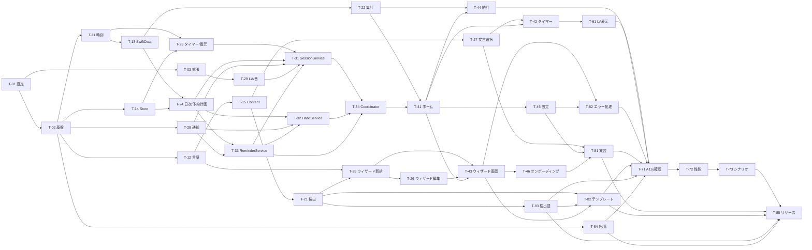

# 06 テスト方針とタスク分解 — OneTwenty

| 項目       | 内容 |
| ---------- | ---- |
| 入力要件   | [requirements.md](../01_要件定義/requirements.md) v1.20（§7 テスト対象 / §11 受け入れ条件） |
| 前提       | [01](./01_architecture.md) / [02](./02_screens.md) / [03](./03_data_model.md) / [04](./04_modules.md) / [05](./05_error_handling.md) |
| 用途       | 本書をチケット起票の元資料とする |

---

## 1. テスト方針

### 1.1 種別と役割

| 種別 | 対象 | 道具 | 判定 |
| ---- | ---- | ---- | ---- |
| ユニットテスト | ドメイン層・サービス層・Repository・ViewModel | Swift Testing。`TestClock`（04 MD-01）と各プロトコルのフェイク | 自動。全タスクの完了条件に含める |
| データ検証テスト | 同梱 JSON（テンプレート・検出語・完了文言） | Swift Testing（実ファイルを読む） | 自動（04 MD-46） |
| 性能計測 | NFR-7 / NFR-8 / NFR-9 | Instruments（要件 §8 の測定条件） | 手動・実機 |
| 手動確認 | OS 連携（通知・Live Activity・**サウンドとハプティクス**）、アクセシビリティ、言語、テーマ | 実機（§11.3 の範囲）。サウンドとハプティクスは T-73 が担当 | 手動 |

### 1.2 時間に依存するロジックの扱い

現在時刻を直接参照せず、`WallClock`（04 MD-01）を注入する。テストでは `TestClock` の時刻を設定・前進させ、次の境界を実時間を待たずに検証する（TR-2）。

| 境界 | 検証内容 | 関連要件 |
| ---- | -------- | -------- |
| 120秒 | 119.999秒で未完了、120秒で完了 | FR-2.2 / FR-3.1 |
| 24時間 | 24時間未満は完了、以上は破棄 | FR-2.15.1 |
| 0時 | 23:59 開始・0:01 完了が開始日に帰属。0時直後に同じ習慣を再実行できる | FR-3.10 / FR-4.4 |
| 時刻の巻き戻し | 経過を0として扱う | 05 EH-10 |
| 夏時間 | 日付の加減算が崩れない | 04 MD-02 |

### 1.3 必ず網羅する観点

| 観点 | 代表的な検証 | 主担当タスク |
| ---- | ------------ | ------------ |
| 正常系 | 登録 → 実行 → 完了 → 記録 | T-31 / T-32 / T-41 |
| 境界値 | 文字数（日30・英60）、3件制限、120秒、84日、60日 | T-12 / T-22 / T-23 / T-24 / T-32 |
| 時刻・日付境界 | 1.2 の全項目 | T-11 / T-23 / T-24 / T-31（0時直後の再実行を実際の現在日で判定）/ T-41（日跨ぎ完了後に当日未完了として開始できる） |
| 強制終了 / 復帰 | cold / warm × 経過時間の全組み合わせ | T-23 |
| バックグラウンド | 裏で120秒経過、復帰時にフィードバックを鳴らさない | T-23 / T-31 |
| 通知許可状態 | 未決定 / 許可 / 拒否、拒否→許可の遷移 | T-31 / T-32 / T-33 / T-34 / T-45 |
| 通知の破棄契機 | 完了・中断での `timer.` 取消、当日全完了での `reminder.` 取消、リマインダーのオフで `timer.` を消さないこと | T-31 / T-33 |
| 空データ | 習慣0件のホーム・統計・リマインダー | T-24 / T-41 / T-44 |
| 最大件数 | 3件登録時の「＋」非表示、4件目の拒否 | T-32 / T-41 |
| 日本語 / 英語 | 上限・検出語・テンプレートの切り替え、`fr` で英語側 | T-12 / T-15 / T-26 |
| Dynamic Type | AX5 で英語60文字×3件 | T-41 / T-42 / T-44（各画面の実装・開発機での目視）/ T-71（§11.3 の2機種での確認） |
| VoiceOver | 連続0日で「連続0日」と読まない、完了リングがボタンにならない | T-41 / T-71 |
| Reduce Motion | 習慣リングの充填と画面遷移のアニメーション無効化（タイマーリングの進行と中断中の追従は対象外。NFR-4.4） | T-34（画面遷移・提示の実装とルート切り替えの検証）/ T-41（習慣リングの充填）/ T-42・T-43（提示・終了が即時であることの検証。§1.4 の例外）/ T-71（2機種での目視確認） |
| ダークモード | 全画面の視認性とコントラスト | T-71 |
| エラー時の復旧 | 保存失敗でも、画面を閉じる時点・次の開始時・次回起動で再保存される。ウィザードの保存失敗で入力が残る | T-31 / T-34（完了表示の終了時に flush してから閉じる順序）/ T-43 / T-62 |

### 1.3.1 要件 §7「テスト対象（Swift Testing）」との対応

要件定義書 §7 の表は、v1.0 で必ず自動テストを持つ対象を列挙している。**下表は §7 の13行と1対1で対応する**（受け入れ条件 §11.1「§7 のテストがすべて通る」の判定根拠になるため、行を増減しない）。各行を担当するタスクは次のとおり。

| 要件 §7 の行 | 主担当タスク |
| ------------ | ------------ |
| TimerEngine | T-23 |
| 日付帰属 | T-11 / T-23 / T-24 / T-31 |
| 分解ウィザード | T-12 / T-21 / T-25 |
| ウィザードの中断 | T-25 / T-26 / T-43 |
| ウィザードの2分岐 | T-21 / T-25 |
| 編集フロー | T-26 / T-32（履歴と連続日数の引き継ぎ。FR-6.4） |
| 言語別の切り替え | T-12 / T-15 / T-26（保存済み `title` への遡及非適用。FR-1.4.3） |
| 通知の予約 | T-24（60日分の計画・当日除外）/ T-28 / T-33 / T-31（当日分の取消、**`timer.` の予約と取消**）/ T-32（0件・全アーカイブ・再登録。FR-5.4.1） |
| 通知の許可状態 | T-24（未決定・拒否で計画が空）/ T-31 / T-32 / T-33 |
| オンボーディング | T-14 / T-34 / T-46 |
| 集計ロジック | T-22 / T-24 / T-41 / T-44 |
| ヒートマップ | T-22 / T-44 |
| バリデーション | T-31（完了後の同日再実行禁止・中断後の再挑戦）/ T-32（3件制限・枠の解放・`order` 再採番） |

### 1.4 タスク共通の完了条件

すべてのタスクは、明示された条件に加えて次を満たす。

> 実装が完了し、対象の単体テストが通ること。既存のテストがすべて通ること。

実装とその単体テストは同じタスクに含める。テストだけを後続タスクに切り出さない。

**例外**：対向のコンポーネントが揃って初めて検証できる項目に限り、対向側のタスクへ移してよい。ただし**移した項目は移し元のタスクにも一覧として残し、どのタスクで担保するかを双方向に辿れるようにする**。現在この例外を使っているのは次の2つで、内訳は各タスクの「§1.4 の例外で移した検証」欄に記す。 ・**T-34** → T-42 / T-43 / T-45（画面の提示・終了の3経路、完了文言の受け渡し、並び替え・アーカイブでの `dataVersion` 更新） ・**T-62** → T-41（保存失敗後にホームで完了表示が保たれること。T-31 / T-34 / T-41 の担保範囲を統合した検証のため）

---

## 2. タスク一覧

見積もりはいずれも半日〜1日。依存タスクが完了していれば着手できる。

### フェーズ1：基盤

#### T-01 プロジェクト設定を要件に合わせる

| 項目 | 内容 |
| ---- | ---- |
| 概要 | Deployment Target を 26.0、Bundle ID を `com.yagishi.onetwenty`、対応デバイスを iPhone のみ、向きを縦固定に変更する。`knownRegions` に `ja` を追加する。`INFOPLIST_KEY_NSSupportsLiveActivities` と `INFOPLIST_KEY_ITSAppUsesNonExemptEncryption` を設定する。`CADisableMinimumFrameDurationOnPhone` に対応するビルド設定が存在するか Xcode で確認し、なければ `Config/OneTwenty-Info.plist` を作って `INFOPLIST_FILE` に指定する。 |
| 対応要件 | §0 / NFR-6 / NFR-8 / §11.4 |
| 参照設計書 | 01 AR-10 / AR-11 / 未解決事項 U-1 |
| 完了条件 | 上記の設定が反映され、ビルドが通ること。`CADisableMinimumFrameDurationOnPhone` の設定方法（ビルド設定かファイルか）を 01 AR-11 に反映すること |
| テスト観点 | ビルドが通る（本タスクに単体テストはない） |
| 依存 | なし |

#### T-02 ディレクトリ構成とテスト基盤を用意する

| 項目 | 内容 |
| ---- | ---- |
| 概要 | 01 §7 のディレクトリを作る。既存の `ContentView.swift` を削除する。Swift Testing のターゲットに `Support/`（`TestClock`、各プロトコルのフェイク、インメモリ `ModelContainer` の生成）を用意する |
| 対応要件 | TR-2 / TR-3 |
| 参照設計書 | 01 §7 / 04 MD-01 |
| 完了条件 | `TestClock` が時刻の設定と前進をでき、そのテストが通ること |
| テスト観点 | `TestClock.advance(by:)` の前後で `now` が変わる |
| 依存 | T-01 |

#### T-03 Live Activity 拡張ターゲットを追加する

| 項目 | 内容 |
| ---- | ---- |
| 概要 | Widget Extension ターゲット `OneTwentyLiveActivity` を追加し、Deployment Target と対応デバイスを本体に合わせる。`Shared/TimerActivityAttributes.swift` を両ターゲットに所属させ、属性とコンテンツ状態だけを定義する（表示は T-61） |
| 対応要件 | FR-2.11 |
| 参照設計書 | 01 AR-06 / AR-12 / 04 MD-60 |
| 完了条件 | 両ターゲットがビルドでき、`TimerActivityAttributes` が両方からコンパイルされること |
| テスト観点 | 属性・コンテンツ状態の `Codable` の往復 |
| 依存 | T-01 |

### フェーズ2：データ

#### T-11 DayKey と WallClock

| 項目 | 内容 |
| ---- | ---- |
| 概要 | `WallClock` / `SystemClock` と `DayKey`（変換・比較・加減算）を実装する |
| 対応要件 | TR-2 / FR-3.10 / FR-4.4 / FR-3.5.3 |
| 参照設計書 | 04 MD-01 / MD-02 |
| 完了条件 | 実装と単体テストが通ること |
| テスト観点 | 23:59:59 と 0:00:00 が別の日。夏時間の切り替え日の加減算。タイムゾーンを変えた `Calendar` で同じ時刻が別の日になる |
| 依存 | T-02 |

#### T-12 LanguageResolver と TitleValidator

| 項目 | 内容 |
| ---- | ---- |
| 概要 | 言語判定（日本語かそれ以外か）と、言語別の文字数検証を実装する |
| 対応要件 | NFR-6.1 / FR-1.4 / FR-1.4.1 / FR-1.4.2 / FR-1.4.3 |
| 参照設計書 | 04 MD-03 / MD-13 |
| 完了条件 | 実装と単体テストが通ること |
| テスト観点 | `ja` / `ja-JP` → 日本語、`en` / `fr` / `nil` → 英語。日本語29/30/31、英語59/60/61。絵文字・結合文字を1文字と数える。空白のみは空扱い |
| 依存 | T-02 |

#### T-13 SwiftData モデルと Repository

| 項目 | 内容 |
| ---- | ---- |
| 概要 | `Habit` / `Session`（`SchemaV1`・インデックス・一意制約）、`HabitSnapshot` / `SessionSnapshot`、`HabitRepository` / `SessionRepository`（プロトコル＋SwiftData 実装）、`ModelContainer` の生成（既定の保存場所・CloudKit 無効。03 DM-01）を実装する。削除 API と `archivedAt` を戻す API は作らない |
| 対応要件 | TR-3 / FR-3.3 / FR-3.10 / FR-4.2 / FR-6.3 / FR-3.12 |
| 参照設計書 | 03 DM-01〜DM-05 / DM-13 / 04 MD-30 / MD-31 |
| 完了条件 | 実装とインメモリ構成での単体テストが通ること |
| テスト観点 | `activeHabits` がアーカイブ済みを除き `order` 順。`insertIfAbsent` が同じ `id` の2回目に `false`。**渡された `sameDayRange` に入る同じ習慣の2件目を挿入しないこと（範囲の両端：0:00 は含み、翌日 0:00 は含まない）**。範囲取得の境界 |
| 依存 | T-11 |

#### T-14 SettingsStore と RunningSessionStore

| 項目 | 内容 |
| ---- | ---- |
| 概要 | UserDefaults の2つのストア（既定値・JSON の読み書き）を実装する |
| 対応要件 | FR-5.1 / FR-5.5 / FR-6.1 / FR-7.4 / FR-2.15 |
| 参照設計書 | 03 DM-10 / 04 MD-32 / MD-33 |
| 完了条件 | 実装と単体テストが通ること |
| テスト観点 | 既定値（8:00・オン・端末に合わせる・未完了）。マーカーの保存・読み込み・削除。**壊れた JSON を `nil` として扱う**（05 EH-09） |
| 依存 | T-02 |

#### T-15 ContentLoader と同梱データの仮データ

| 項目 | 内容 |
| ---- | ---- |
| 概要 | JSON の値型と `ContentLoader` を実装し、日英の仮データ（各数件）を置く。本番データは T-81〜T-83 で差し替える |
| 対応要件 | NFR-6.1 / FR-1.5.1.1 / FR-1.6 / FR-2.9 |
| 参照設計書 | 03 DM-11 / 04 MD-46 / 01 AR-09 |
| 完了条件 | 実装と単体テストが通ること。ファイル名が `<名前>.<ja|en>.json` で、バンドル直下で衝突しないこと |
| テスト観点 | 日英とも読み込める。**表示言語に応じて検出語リストとテンプレートの言語側が選ばれること（`ja` で日本語、`en` / `fr` で英語）**（NFR-6.1。要件 §7「言語別の切り替え」。判定関数への入力を変えるだけで検証でき実機は不要）。欠落・形式不正で空のデータになる（05 EH-06） |
| 依存 | T-12 |

### フェーズ3：ドメインロジック

#### T-21 PhraseDetector と TemplateMatcher

| 項目 | 内容 |
| ---- | ---- |
| 概要 | 検出（目標表現・頻度副詞・除去案）とテンプレート照合を実装する |
| 対応要件 | FR-1.5.1 / FR-1.5.1.1 / FR-1.5.1.2 / FR-1.5.1.3 / FR-1.5.1.4 / FR-1.6 / FR-1.7 |
| 参照設計書 | 04 MD-14 / MD-15 |
| 完了条件 | 実装と単体テストが通ること |
| テスト観点 | リスト内の語を検出し**リスト外を検出しない**。`keep` / `keeps` / `keeping` / `kept` をすべて検出。「毎日新聞を1ページ読む」が拒否されず除去案「新聞を1ページ読む」。目標表現と頻度副詞の両方を含む文で目標表現が優先。「毎日」だけなら検出なし |
| 依存 | T-15 |

#### T-22 StreakCalculator と HeatmapCalculator

| 項目 | 内容 |
| ---- | ---- |
| 概要 | 連続日数（習慣ごと・全体）、最長、通算、84日の達成率を実装する |
| 対応要件 | FR-3.5〜FR-3.5.3 / FR-3.8 / FR-3.8.1 / FR-3.9 / FR-3.12 / NFR-9 |
| 参照設計書 | 04 MD-23 / MD-24 |
| 完了条件 | 実装と単体テストが通ること |
| テスト観点 | 当日未完了で前日までの連続を維持。前日未完了で0。`createdAt` より前を数えない。セルがちょうど84件で末尾が当日。登録0件の日が空欄。アーカイブ当日を分母に含む。アーカイブ後に過去の分母が変わらない。Session 1,000件で集計が200ms以内 |
| 依存 | T-13 |

#### T-23 TimerEngine と SessionRecoveryResolver

| 項目 | 内容 |
| ---- | ---- |
| 概要 | 経過の算出と、復元判定（マーカーの扱い＋終了させる Live Activity の集合）を実装する |
| 対応要件 | TR-1 / FR-2.2 / FR-2.10 / FR-2.15 / FR-2.15.1 / FR-2.11.2 |
| 参照設計書 | 04 MD-10 / MD-11 |
| 完了条件 | 実装と単体テストが通ること |
| テスト観点 | 0 / 119.999 / 120 / 121 秒。時刻の巻き戻しで経過0。復元判定の全組み合わせ（マーカー有無 × cold/warm × 120秒未満/120秒〜24時間/24時間以上）。**実行中の Activity を終了対象に入れない**。`sessionID` 不一致と終了時刻超過の Activity を終了対象に入れる |
| 依存 | T-11 / T-14 |

#### T-24 DailyStatusResolver と ReminderPlanner

| 項目 | 内容 |
| ---- | ---- |
| 概要 | 日次の完了状態・全完了判定と、リマインダーの予約計画を実装する |
| 対応要件 | FR-4.1 / FR-4.2 / FR-4.3 / FR-5.4 / FR-5.4.1 / FR-5.5 / FR-5.7 / FR-5.8.1 / FR-5.8.2 / FR-5.8.3 / TR-5 |
| 参照設計書 | 04 MD-20 / MD-22 |
| 完了条件 | 実装と単体テストが通ること |
| テスト観点 | 23:59 開始が開始日の完了。0件で全完了にならない。計画が最大60件。7:59 で当日を含み 8:01 で含まない。当日全完了で当日を除く。オフ・未決定・拒否・0件で空。identifier が `reminder.<日付>.<時刻>` |
| 依存 | T-13 / T-14 |

#### T-25 WizardStateMachine（新規フロー）

| 項目 | 内容 |
| ---- | ---- |
| 概要 | 02 SC-42 の状態遷移を実装する（カウンタ・戻る・キャンセル・2分岐・テンプレート） |
| 対応要件 | FR-1.1 / FR-1.2 / FR-1.3 / FR-1.3.1 / FR-1.5.2 / FR-1.7.1 / FR-1.8 / FR-1.10 / FR-1.10.1 / FR-1.10.3 / FR-1.10.4 |
| 参照設計書 | 02 SC-42 / 04 MD-12 |
| 完了条件 | 実装と単体テストが通ること |
| テスト観点 | 「いいえ」と目標表現の検出が同じカウンタに算入される。カウンタ3で汎用パターンに入る。**汎用パターンで型を選んだ後の送信は検出を通さず2分確認へ進むこと**（02 SC-41）。戻ってもカウンタが減らず、上限後に戻って進むと汎用パターン。**1問前に戻ると、その問より後の入力が破棄されること**（FR-1.10.3）。最初のステップで戻れない。どのステップからもキャンセルできる。テンプレート選択でも `originalIntent` が自由入力の文。**キャンセル後に次回ウィザードを開くと、前回の入力と分解状態が残らず自由入力から始まること**（FR-1.10.1） |
| 依存 | T-12 / T-21 |

#### T-26 WizardStateMachine（編集フロー）

| 項目 | 内容 |
| ---- | ---- |
| 概要 | 02 SC-43 の状態遷移を実装する（プリフィル・テンプレートなし・上限到達時の合流） |
| 対応要件 | FR-6.4.1 / FR-6.4.2 / FR-6.4.2.1 / FR-6.4.3 / FR-6.4.4 / FR-6.4.5 / FR-1.10.5 / FR-1.4.3 |
| 参照設計書 | 02 SC-43 / 04 MD-12 |
| 完了条件 | 実装と単体テストが通ること |
| テスト観点 | テンプレートと任意の汎用パターンが出ない。目標表現で再分解に入る。「いいえ」でも再分解に入る（仮定 A-22）。上限到達で汎用パターンに合流。上限を超えた既存 `title` でも開き、短くすれば送信できる。キャンセルで `title` と `originalIntent` が変わらない |
| 依存 | T-25 |

#### T-27 CompletionMessagePicker

| 項目 | 内容 |
| ---- | ---- |
| 概要 | 直前と同じにしない文言選択を実装する |
| 対応要件 | FR-2.9 |
| 参照設計書 | 04 MD-16 |
| 完了条件 | 実装と単体テストが通ること |
| テスト観点 | シード固定で連続呼び出しが直前と異なる。1件なら同じ。空なら `nil` |
| 依存 | T-15 |

### フェーズ4：OS アダプタ

#### T-28 NotificationClient

| 項目 | 内容 |
| ---- | ---- |
| 概要 | プロトコルと `UNUserNotificationCenter` 実装、接頭辞での取得・取消、フォアグラウンドでの `timer.` 抑止デリゲートを実装する。`removeAllPendingNotificationRequests()` は使わない |
| 対応要件 | TR-5 / FR-2.13 / FR-2.14 / FR-5.2 / FR-5.3 / FR-5.6 |
| 参照設計書 | 04 MD-43 / 01 AR-13 |
| 完了条件 | 実装と、フェイクを用いた呼び出し側テストの土台が通ること |
| テスト観点 | 接頭辞で絞った取消が対象外の identifier を消さない。通知本文に習慣名・件数・連続日数を含めない |
| 依存 | T-02 |

#### T-29 LiveActivityClient と FeedbackPlayer

| 項目 | 内容 |
| ---- | ---- |
| 概要 | ActivityKit のラッパー（`pushType: nil`・`staleDate`・即時終了・一覧取得）と、`FeedbackPlayer` の `prepare()`（音声ファイルの事前読み込み）・`playCompletion()`（音＋ハプティクスを同じ呼び出しで再生。`.ambient`）を実装する |
| 対応要件 | FR-2.7 / FR-2.7.1 / FR-2.7.2 / FR-2.8 / FR-2.11 / FR-2.11.2 / FR-6.2 |
| 参照設計書 | 04 MD-44 / MD-45 / 01 AR-12 / AR-14 |
| 完了条件 | 実装が完了し、フェイクを用いた呼び出し側テストの土台が通ること |
| テスト観点 | Live Activity が無効でも例外で落ちない（05 EH-04）。音の再生失敗でハプティクスが鳴る（05 EH-05） |
| 依存 | T-03 |

### フェーズ5：アプリケーションサービス

このフェーズ内の着手順は **T-33 → T-31 / T-32 → T-34**（ID 順ではない）。`SessionService` と `HabitService` はどちらも完了・アーカイブの後に `ReminderService.sync()` を呼ぶため、`ReminderService` が先に必要になる（04 MD-40 / MD-41 の依存先。§3 の依存グラフが正）。

#### T-31 SessionService

| 項目 | 内容 |
| ---- | ---- |
| 概要 | 開始・フォアグラウンド完了・中断・復元の実行を実装する（04 MD-10 の副作用表）。復元は `recoverOnActivation`（判定・記録／破棄・Live Activity の終了まで内包）と `flushPendingCompletion`（保存待ちの再試行）として実装する |
| 対応要件 | FR-2.1 / FR-2.5 / FR-2.6 / FR-2.7 / FR-2.13 / FR-2.14.1 / FR-2.15 / FR-3.1 / FR-3.3 / FR-4.2 / FR-5.4 / FR-5.6 |
| 参照設計書 | 04 MD-40 / MD-10 / MD-11 / 05 EH-02b |
| 完了条件 | 実装と単体テストが通ること |
| テスト観点 | 完了済みの習慣で開始が拒否される。**開始可否の判定が `displayDay` ではなく実際の現在日（`DayKey(WallClock.now)`）で行われる**。**開始時に `FeedbackPlayer.prepare()` が1回呼ばれる**。中断で Session を保存しない。**中断した習慣は同じ日に再挑戦でき、経過は0秒から始まること**（FR-2.6。要件 §7 テスト対象「バリデーション」）。**タイマー開始の経路でも通知許可が未決定なら1回だけ要求し、既に要求済みなら二重に要求しないこと**（FR-5.6）。フォアグラウンド完了でのみフィードバックが鳴る。リマインダーがオフでも `timer.` を予約する。許可が拒否なら予約しない。**フォアグラウンド完了で当該 `timer.` が取消されること。中断でも `timer.` が取消され、`reminder.` は取消されないこと**（04 MD-10 副作用表 / FR-2.13 / TR-5）。**保存失敗では、その実行を保存待ちへ移してから実行中マーカーを消すこと**（04 MD-10 副作用② / MD-40 / 05 EH-02b）。`completeInForeground` と `recoverOnActivation` を続けて呼んでも Session が1件。**保存失敗の直後に1回やり直す。`start` の冒頭で保存待ちを解消し、その習慣が当日完了済みになれば開始を拒否する**（05 EH-02b）。**`recoverOnActivation` の中で Live Activity の終了まで行うこと**（`SessionService` 側の責務。01 §2。`AppCoordinator` が OS アダプタを直接呼ばないことの検証は T-34 に一本化する）。**フォアグラウンドで全件完了した時点で当日分の `reminder.` が取消される**（FR-5.4 / TR-5）。**保存待ちが残っていても別の習慣は開始できる**（05 EH-02b / FR-4.1）。アーカイブ済み・存在しない習慣のマーカーは記録せず破棄する（05 EH-09 ②） |
| 依存 | T-23 / T-24 / T-28 / T-29 / T-33（完了時に `ReminderService.sync()` を呼ぶ。04 MD-40 の依存先） |

#### T-32 HabitService

| 項目 | 内容 |
| ---- | ---- |
| 概要 | 登録・名前変更・並び替え・アーカイブと、その後のリマインダー同期・通知許可要求を実装する |
| 対応要件 | FR-1.2 / FR-1.8 / FR-1.9 / FR-5.4.1 / FR-5.6 / FR-5.6.1 / FR-6.3 / FR-6.4 / FR-3.12 |
| 参照設計書 | 04 MD-41 / MD-21 |
| 完了条件 | 実装と単体テストが通ること |
| テスト観点 | 3件で登録が拒否される。アーカイブで枠が空き登録できる。`order` が欠番なく振り直される。全件アーカイブで `reminder.` が全取消。0件から1件で再予約。初回登録で許可要求が1回だけ。リマインダーがオフでも許可要求する。**名前変更の前後で同じ `Habit` が維持され、履歴・連続日数が引き継がれること**（FR-6.4。要件 §7 テスト対象「編集フロー」） |
| 依存 | T-24 / T-28 / T-33（アーカイブ・登録後にリマインダーを同期する。04 MD-41 の依存先） |

#### T-33 ReminderService

| 項目 | 内容 |
| ---- | ---- |
| 概要 | 計画と保留中の差分同期、時刻・オンオフの変更、許可状態の再取得を実装する。**同期のたびに許可状態を取得し直し、保存待ち（`PendingCompletionsReading`）も読んで当日全完了を判定する**（04 MD-42 / MD-22 / MD-33） |
| 対応要件 | TR-5 / FR-5.1 / FR-5.4 / FR-5.5 / FR-5.7 / FR-5.8.1 / FR-5.8.4 |
| 参照設計書 | 04 MD-42 / MD-22 |
| 完了条件 | 実装と単体テストが通ること |
| テスト観点 | 差分だけが追加・取消される。`timer.` に触れない。時刻変更で古い identifier が消え新しいものが入る。拒否→許可で予約される。予約失敗が次回同期で補われる（05 EH-03）。**保存待ちが残っている状態でも、その習慣を完了として数えて当日分の `reminder.` が外れること**（05 EH-02b / FR-5.4。04 MD-42）。**未決定から許可が下りた直後の `sync()` で60日分が予約されること**（キャッシュした許可状態を使わないこと。FR-5.8.1） |
| 依存 | T-24 / T-28 |

#### T-34 AppCoordinator と AppEnvironment

| 項目 | 内容 |
| ---- | ---- |
| 概要 | ルート判定、表示日、**データ更新の通知（`dataVersion`）**、アクティブ化時処理（4段階）、完了表示の終了時の処理、**画面の提示状態（`presentedTimer` / `presentedWizard`）の所有と `lastCompletionMessage` の保持**、テーマの適用、コンポジションルートを実装する（04 MD-50 / MD-51）。**提示・終了の3経路の検証は、対向の ViewModel が揃う T-42（タイマー）・T-43（ウィザード）で行う**（下記テスト観点） |
| 対応要件 | FR-4.4 / FR-4.5 / FR-4.5.1 / FR-5.8.4 / FR-6.1 / FR-7.1 / FR-7.5 / FR-2.11.2 / NFR-4.4 / NFR-5 / NFR-7 |
| 参照設計書 | 01 AR-04 / AR-05 / 04 MD-50 / MD-51 |
| 完了条件 | 実装と単体テストが通ること |
| テスト観点 | 処理順序（`recoverOnActivation`→表示日→許可→同期）。**`AppCoordinator` が OS アダプタを直接呼ばない**。実行中の Activity が終了されない。**完了表示の終了時に `flushPendingCompletion` を呼んでから画面を閉じる順序であること**（05 EH-02b）。日付変更通知で表示日が変わる。**日跨ぎ完了でも表示日は当日に切り替わること**（保留の仕組みは持たない。FR-4.5.1 / 01 AR-04）。**ストア生成に失敗した場合は `AppEnvironment.rootState` が `.storeUnavailable` になり（`AppCoordinator` を生成しないこと）、`retryContainer()` の成功でサービス群と `AppCoordinator` が組み立てられ、ルート判定とアクティブ化時処理に進むこと。そのときの最初のアクティブ化が `.cold` として扱われること**（05 EH-01 / 04 MD-50・MD-51）。完了フラグの有無でルートが決まる。**提示状態（`presentedTimer` / `presentedWizard`）を持つのが `AppCoordinator` だけであること**（04 MD-50。3経路を通した検証は T-42 / T-43）。**Reduce Motion 有効時にルートの切り替え（オンボーディング↔ホーム）がアニメーションなしで即時になること。画面の提示・終了にアニメーションを付けない実装であること**（NFR-4.4。タイマーリングの進行と中断中の追従は対象外。提示を通した検証は T-42 / T-43）。**登録・名前変更（ウィザードの終了通知）・完了の保存・保存待ちの解消のたびに `dataVersion` が1つ進むこと**（04 MD-50。**並び替え・アーカイブは通知元の `SettingsViewModel` が要るため T-45 で検証する**） |
| §1.4 の例外で移した検証 | 次の項目は対向の ViewModel が揃って初めて検証できるため、担保するタスクを移している（04 MD-50 のテスト方法に対応）。 ・タイマー画面の提示と終了の3経路（完了・中断・裏で破棄）、中断で `dataVersion` を進めないこと、「裏で完了した」経路での `lastCompletionMessage` の更新 → **T-42** ・ウィザードの終了3経路（成功・キャンセル・`limitReached`）と起動元に応じた遷移 → **T-43** ・`dataVersion` の更新のうち**並び替え・アーカイブ**の経路（通知元の `SettingsViewModel` が要る） → **T-45** ・Reduce Motion 有効時に提示・終了が即時であること（対向の ViewModel が要る） → **T-42 / T-43** |
| 依存 | T-31 / T-32 / T-33 |

### フェーズ6：UI

#### T-41 ホーム画面

| 項目 | 内容 |
| ---- | ---- |
| 概要 | `HomeViewModel` と `HomeView`（習慣リング・連続日数・「＋」・全完了文言・統計/設定アイコン）を実装する |
| 対応要件 | FR-2.1 / FR-3.5 / FR-3.5.4 / FR-3.6 / FR-3.11 / FR-4.1 / FR-4.2 / FR-4.3 / FR-4.3.1 / FR-4.3.2 / NFR-1 / NFR-4.2 / NFR-4.2.1 / NFR-4.2.2 / NFR-4.3 / NFR-4.4 |
| 補足 | 連続日数の算出に `StreakCalculator`（T-22）を使う |
| 参照設計書 | 02 SC-20〜SC-24 / 04 MD-53 |
| 完了条件 | 実装と ViewModel の単体テストが通ること。**英語60文字×3件・AX5 で内容が省略されず、縦スクロールで全内容に到達できること**（開発機1台での目視。2機種での確認は T-71。NFR-4.3 / 02 SC-03） |
| テスト観点 | 連続0日で連続表示なし・読み上げにも含めない。完了済みの行がボタンにならず読み上げが「完了」。アクティブ1件で「＋」2つ。0件で「習慣を追加」。完了済みのタップで開始が呼ばれない。**アクティブ3件のとき「＋」が0個になること**（FR-4.1）。**Reduce Motion 有効時に習慣リングの充填が即時になること**（NFR-4.4。画面遷移側は T-34 / T-42）。**`dataVersion` の変化で再読み込みされること**（04 MD-50）。**完了記録の保存に失敗しても、ホームに戻った時点では完了表示になっていること**（保存待ちを完了として数える。05 EH-02b / 04 MD-20。§1.4 の例外で T-62 から移した）。**日跨ぎ完了の後にホームへ戻ると当日基準で描かれること（完了した習慣も、前日に完了していた別の習慣も、当日未完了として開始できること）**（FR-4.5.1 / FR-4.4） |
| 依存 | T-22 / T-34 |

#### T-42 タイマー画面

| 項目 | 内容 |
| ---- | ---- |
| 概要 | `TimerViewModel` と `TimerView`（リング・残り秒数・中断ジェスチャ・完了表示と自動復帰）を実装する。完了文言はリングの下に折り返して表示し、AX5 でもスクロールせずに収まるようリングの直径と文字の縮小率で調整する（02 SC-30） |
| 対応要件 | FR-2.2 / FR-2.3 / FR-2.4 / FR-2.5 / FR-2.5.1 / FR-2.5.2 / FR-2.9 / FR-2.12 / NFR-8 / NFR-4.4 |
| 参照設計書 | 02 SC-30〜SC-34 / 04 MD-54 / MD-50（提示と終了の3経路）/ MD-16 |
| 完了条件 | 実装と ViewModel の単体テストが通ること |
| テスト観点 | 120秒で完了処理が1回だけ。119pt で中断せず 120pt で中断。上端80pt 以内の開始で反応しない。**エスケープ操作でも中断が呼ばれること**（FR-2.5.2）。裏で完了した通知でフィードバックを鳴らさない。2.5秒後に完了表示の終了を通知。**「裏で完了した」通知でも2.5秒後に終了が通知され、画面が閉じること**（04 MD-54 / 02 SC-32）。**`TimerViewModel` 自身は画面を閉じず、`AppCoordinator` へ通知するだけであること**（04 MD-50 / MD-54）。**タイマー画面が閉じるのは完了・中断・裏で破棄の3経路のみで、いずれも `AppCoordinator` が `presentedTimer` を `nil` にすること。中断では `dataVersion` を進めないこと。裏で破棄された通知では完了文言を表示しないこと**（04 MD-50 の「タイマー画面の提示と終了」/ 05 EH-09 ②）。**Reduce Motion 有効時にタイマー画面の提示・終了が即時になること**（NFR-4.4。実装は T-34 の提示・終了に従う）。**受け取った直前の文言と同じ完了文言を選ばないこと。2回続けて完了すると文言が変わること。裏で完了した経路でも `lastCompletionMessage` が更新されること**（FR-2.9 / 04 MD-16）。**AX5 で残り秒数と完了文言が切り詰められず、スクロールなしで収まること**（目視。NFR-4.3） |
| 依存 | T-27 / T-41 |

#### T-43 ウィザード画面

| 項目 | 内容 |
| ---- | ---- |
| 概要 | `WizardViewModel` と各ステップの画面（キャンセル・戻る・文字数表示・テンプレート・汎用パターン）を実装する。**ウィザード内で完結するエラー表示（05 EH-07 の文字数表示・EH-08 の上限アラート）もここで実装する**（T-62 は扱わない）。`Describe` ステップでは合成後のプレビュー文とその文字数を表示する（02 SC-40 / SC-41） |
| 対応要件 | FR-1.1 / FR-1.3 / FR-1.7 / FR-1.7.1 / FR-1.9 / FR-1.10 / FR-1.10.1 / FR-1.10.2 / FR-6.4.1 / FR-6.4.2 / FR-6.4.2.1 |
| 参照設計書 | 02 SC-40〜SC-43（**SC-41 の汎用パターンの合成規則を含む**）/ 04 MD-55 / MD-12 / 05 EH-07 / EH-08 |
| 完了条件 | 実装と ViewModel の単体テストが通ること |
| テスト観点 | 効果がサービス呼び出しに変換される。上限超過中は送信不可（ダイアログは出さず文字数表示のみ。05 EH-07）。**汎用パターンは型の文型に回答を差し込んで合成し、合成後の文に文字数のみを適用すること。検出は通さず2分確認へ直行すること**（02 SC-41 / 04 MD-12。状態機械側の遷移そのものの検証は T-25 が担い、ここでは合成と文字数表示を担当する）。キャンセルで起動元へ戻る。**再度開いたときに前回の入力が残っていないこと**（FR-1.10.1）。**保存失敗（05 EH-02）ではウィザードが閉じず、入力と分解状態が残って同じ操作をやり直せること**。**`limitReached`（05 EH-08）ではアラートの OK でウィザードが閉じ、起動元へ戻ること**（04 MD-55 ③）。**Reduce Motion 有効時にウィザードの提示・終了が即時になること**（NFR-4.4。実装は T-34）。**`WizardViewModel` 自身は画面を閉じず、成功／キャンセル／`limitReached` を `AppCoordinator` に通知するだけであること。起動元（ホーム／オンボーディング／設定）に応じた遷移が行われること**（FR-1.10.2 / 04 MD-50 の「ウィザードの提示と終了」） |
| 依存 | T-25 / T-26 / T-41 |

#### T-44 統計画面

| 項目 | 内容 |
| ---- | ---- |
| 概要 | `StatsViewModel` と `StatsView`（12週ヒートマップ・数値3つ）を実装する |
| 対応要件 | FR-3.7 / FR-3.8 / FR-3.8.1 / FR-3.9 / FR-3.9.1 / FR-3.9.2 / NFR-4.3 |
| 参照設計書 | 02 SC-50 / SC-51 / 04 MD-56 |
| 完了条件 | 実装と ViewModel の単体テストが通ること。**AX5 で内容が省略されず、縦スクロールで全内容に到達できること**（標準文字サイズで1画面に収まることはテスト観点側。NFR-4.3 / 02 SC-03） |
| テスト観点 | 0件でも3つの数値が「0」で表示される。セルがタップに反応しない。**`dataVersion` の変化で再読み込みされること**（04 MD-50）。標準文字サイズで1画面に収まること（**開発機1台での目視。要件 §11.3 が求める2機種での確認は T-71 が担う**。FR-3.7） |
| 依存 | T-22 / T-41 |

#### T-45 設定画面とアーカイブ確認

| 項目 | 内容 |
| ---- | ---- |
| 概要 | `SettingsViewModel` と `SettingsView`（2セクション・通知許可状態の表示・並び替え・名前変更・アーカイブ確認）を実装する |
| 対応要件 | FR-5.5 / FR-5.8.1 / FR-5.8.2 / FR-5.8.3 / FR-6.1 / FR-6.2 / FR-6.3 / FR-6.3.1 / FR-6.4 |
| 参照設計書 | 02 SC-60〜SC-62 / 04 MD-57 / MD-50（習慣データ変更の通知）/ 05 EH-11 / EH-12 |
| 完了条件 | 実装と ViewModel の単体テストが通ること |
| テスト観点 | 拒否状態で通知の操作が無効。確認で「やめる」ならアーカイブされない。**テーマ変更が `AppCoordinator` に通知され、即座に反映されること**（FR-6.1 / NFR-5。04 MD-57）。**名前変更の成功後、`dataVersion` の変化で一覧が取り直され、新しい `title` が表示されること**（FR-6.4）。**並び替え・アーカイブの成功時に `AppCoordinator` へ習慣データ変更が通知され、`dataVersion` が1つ進むこと**（04 MD-50 / MD-57。ホーム・統計の再読み込み契機）。**名前変更は `AppCoordinator` にウィザード（編集）の提示を依頼すること**（04 MD-57） |
| 依存 | T-41 |

#### T-46 オンボーディング画面

| 項目 | 内容 |
| ---- | ---- |
| 概要 | `OnboardingViewModel` と2ページの画面、完了後のウィザード直行を実装する |
| 対応要件 | FR-7.1 / FR-7.2 / FR-7.3 / FR-7.4 / FR-7.5 / FR-7.6 |
| 参照設計書 | 02 SC-10 / SC-11 / 04 MD-52 |
| 完了条件 | 実装と ViewModel の単体テストが通ること |
| テスト観点 | スキップがない。ページ1で戻れない。「はじめる」前にフラグが立たない。完了後にウィザードへ直行し、キャンセルでホームに戻る |
| 依存 | T-43 |

### フェーズ7：OS / システム連携の仕上げ

#### T-61 Live Activity の表示

| 項目 | 内容 |
| ---- | ---- |
| 概要 | 拡張ターゲットにロック画面表示と Dynamic Island 表示を実装する。`staleDate` 経過で終了表示に切り替える |
| 対応要件 | FR-2.11 / FR-2.11.0 / FR-2.11.1 / FR-2.11.2 |
| 参照設計書 | 04 MD-60 / 01 AR-12 |
| 完了条件 | 実装が完了し、実機で開始・終了表示・消去が確認できること |
| テスト観点 | アプリを閉じたまま120秒後に終了表示へ変わる。次にアプリを開くと消える。Dynamic Island 非搭載機でロック画面のみで成立する |
| 依存 | T-42 |

#### T-62 エラー処理の実装

| 項目 | 内容 |
| ---- | ---- |
| 概要 | 05 の EH-01・EH-02 の表示と、各失敗時の無表示・自動再試行を実装する。**ウィザード内で完結する表示（EH-07 の文字数表示・EH-08 のアラート）は T-43 が実装する**ため、ここでは扱わない |
| 対応要件 | FR-4.2（横断） |
| 参照設計書 | 05 EH-00〜EH-13 |
| 完了条件 | 実装と単体テストが通ること |
| テスト観点 | ストア生成失敗で全画面エラーと再試行。保存失敗でアラートと状態保持。通知・Live Activity・サウンドの失敗で何も表示しない |
| §1.4 の例外で移した検証 | ・保存失敗後にホームへ戻った時点で完了表示になっていること（T-31 の保存待ち・T-34 の flush 順序・T-41 の再読み込みが揃って初めて検証できる）→ **T-41** |
| 依存 | T-43 / T-45 |

### フェーズ8：結合テスト・手動確認・リリース対応

#### T-71 アクセシビリティと表示の手動確認

| 項目 | 内容 |
| ---- | ---- |
| 概要 | §11.2 の NFR-4.1〜4.4・NFR-5・NFR-6 を実機で確認し、見つかった不具合を修正する |
| 対応要件 | NFR-4.1 / NFR-4.2 / NFR-4.2.1 / NFR-4.2.2 / NFR-4.3 / NFR-4.4 / NFR-5 / NFR-6 / FR-2.5.2 / FR-3.7 |
| 参照設計書 | 02 SC-03 / SC-24 / SC-34 / SC-51 |
| 完了条件 | 英語60文字の習慣名3件・AX5 で全画面に破綻がないこと。VoiceOver で連続0日が読み上げられないこと。**VoiceOver 有効時にエスケープ操作でタイマーを中断できること**（FR-2.5.2。要件 §11.2 NFR-4.2）。Reduce Motion でリングと画面遷移が即時になること。ライト・ダーク、日本語・英語で問題がないこと。**要件 §11.3 の確認範囲を満たすこと：最小幅の対応機種と6.1インチの2機種で、標準文字サイズで統計画面が1画面に収まること（FR-3.7）と AX5 での破綻・欠けがないこと（NFR-4.3）の両方を確認する。タイマー画面は「最長の完了文言（日20 / 英40文字）× AX5 × 最小幅端末」で、切り詰めも縮小もなく収まることを確認し、02 SC-30 のリング直径の下限値をここで確定する**（T-44 の成果物が必要なため依存に入れている。単機での目視は T-44 で済ませ、ここでは2機種の確認に絞る）。iOS 26 対応の最も古い実機と Dynamic Island 搭載機1台の実機確認も含む** |
| テスト観点 | 上記（手動） |
| 依存 | T-44 / T-61 / T-62 / T-81 / T-82 / T-83 / T-84 |

#### T-72 性能計測

| 項目 | 内容 |
| ---- | ---- |
| 概要 | 習慣3件・Session 1,000件を投入し、§8 の測定条件で NFR-7〜9 を計測する。**基準端末は「iOS 26 対応の最も古い実機」とする**（要件 §11.3。性能の下限を確認する端末と一致させる） |
| 対応要件 | NFR-7 / NFR-8 / NFR-9 |
| 参照設計書 | 01 AR-05 / AR-11 / 04 MD-24 / MD-51 |
| 完了条件 | 基準端末で1秒以内・Hitch Time Ratio 5ms/s 未満・200ms 以内（各5回の中央値） |
| テスト観点 | 上記（手動・Instruments） |
| 依存 | T-71 |

#### T-73 シナリオの手動確認

| 項目 | 内容 |
| ---- | ---- |
| 概要 | §11.4 の項目と、通知・強制終了・日跨ぎのシナリオを実機で確認する |
| 対応要件 | FR-2.7.1 / FR-2.7.2 / FR-2.8 / FR-6.2 / FR-2.13 / FR-2.15 / FR-4.4 / FR-5.4.1 / FR-5.8.3 / NFR-2 |
| 参照設計書 | 02 / 04 / 05 |
| 完了条件 | 要件 §11.3 の端末・OS・言語・テーマの範囲で確認する（T-71 と同じ実機を使う）。機内モードで全機能が動く。通知を拒否しても破綻しない。全件アーカイブでリマインダーが届かない。裏で120秒経過して通知が届く。強制終了後の復帰で記録が正しい。日跨ぎで表示が正しく切り替わる。**サイレントスイッチをオフにすると完了音が鳴り、オンにすると鳴らずハプティクスだけが返ること**（FR-2.7.1 / FR-2.7.2）。**完了音が終わりを告げる短い終止音であること**（FR-2.8）。**設定にサウンドのオン/オフがないこと**（FR-6.2） |
| テスト観点 | 上記（手動） |
| 依存 | T-72 |

#### T-81 完了文言・通知文言・画面文言の投入

| 項目 | 内容 |
| ---- | ---- |
| 概要 | TODO 1・1.1・1.2・1.3・1.5・1.6・1.7 の文言を日英で作成し、String Catalog と `completion-messages.<lang>.json` に入れる。**汎用パターンの文型（`wizard.generic.prepare.format` / `go.format` / `doOne.format`）も含める**（02 SC-41） |
| 対応要件 | FR-2.9 / FR-2.14 / FR-4.3 / FR-5.2 / FR-5.3 / FR-5.6 / FR-6.3.1 / FR-7.1 / FR-1.5.1.2 / FR-1.5.1.3 / FR-1.7.1 |
| 参照設計書 | 01 AR-09 / 03 DM-11 |
| 完了条件 | TODO 単位に次をすべて満たすこと。 **TODO 1**（完了文言。FR-2.9）：日英それぞれ20本以上。賞賛表現を含まない。**各文言が日本語20文字・英語40文字以内**（03 DM-11。02 SC-30 のレイアウト前提） **TODO 1.1**（バックグラウンド完了通知。FR-2.14 / FR-5.3）：日英各1本の固定文言で、**習慣名・連続日数・残り件数を含まず**（プレースホルダを持たない）、**「完了した」「記録された」と断定せず経過の事実のみを伝える** **TODO 1.2**（オンボーディング2画面。FR-7）：「チェックインはない」「2分やった人だけが記録される」の2点を含む **TODO 1.3**（提示文言。FR-1.5.1.2 / FR-1.5.1.3）：頻度副詞の代替案と目標表現の再分解誘導の2種。日英両方 **TODO 1.5**（全習慣完了の1行。FR-4.3）：日英各1本。賞賛表現を含まない **TODO 1.6**（アーカイブ確認。FR-6.3.1）：**「元に戻せない」「記録は残るがホーム画面には戻らない」の2点を確認文に含む** **TODO 1.7**（通知許可要求の説明。FR-5.6）：**リマインダーと完了通知の両方に触れる**内容であること（リマインダーのみの説明にしない。FR-2.14.1） **汎用パターンの文型**（02 SC-41 / FR-1.7.1）：日英とも `%@` を1つだけ持ち、差し込み後も上限に収まる長さであること（FR-1.4.1） 共通：未翻訳の文言がないこと |
| テスト観点 | データ検証テストで機械的に検証できるものを自動化する：完了文言の件数と非空、**各完了文言が上限（日20 / 英40）以内であること**（03 DM-11）、**完了通知文言がプレースホルダ（`%@` 等）を含まないこと**（FR-2.14 / FR-5.3）、**汎用パターンの文型が `%@` をちょうど1つ持つこと**、String Catalog に未翻訳の項目がないこと。文意に関わる項目（断定しないこと・2点を含むこと・両方に触れること）は完了条件のレビューで確認する |
| 依存 | T-27 / T-45（TODO 1.6 のアーカイブ確認ダイアログの投入先。02 SC-62） / T-46 |

#### T-82 分解テンプレートの投入と文字数上限の確定

| 項目 | 内容 |
| ---- | ---- |
| 概要 | TODO 2 のテンプレートを日英各20件以上作成し、実測に基づき FR-1.4.1 の上限（暫定 日30 / 英60）を確定する。変更する場合は要件定義書と 04 MD-03 を更新する |
| 対応要件 | FR-1.6 / FR-1.4.1 |
| 参照設計書 | 03 DM-11 / 04 MD-03 / MD-46 |
| 完了条件 | 日英各20件以上。各テンプレートが上限以内で検出語を含まないこと（データ検証テストが通ること）。**実測の結果 FR-1.4.1 の上限を変更する場合は、次のすべてに反映し、再実行したテストが通ること**：要件定義書（FR-1.4.1 のほか、§11.2 NFR-4.3 と §11.3 に埋め込まれた文字数も含む）・**02 SC-40 の文字数表示の上限値**・04 MD-03（`titleLimit`）・T-12 の実装とテスト・T-43 の文字数表示・**T-71 の完了条件（「英語○文字の習慣名3件」を新しい上限値に読み替える）** |
| テスト観点 | 04 MD-46 のテスト |
| 依存 | T-21 / T-83 / T-43（上限を変更した場合の文字数表示の反映先） |

#### T-83 検出語リストの確定

| 項目 | 内容 |
| ---- | ---- |
| 概要 | TODO 10 に従い detection-terms.md を確定し、JSON に変換する。英語の活用形の列挙漏れを確認する |
| 対応要件 | FR-1.5.1.1 / FR-1.5.1.4 |
| 参照設計書 | 03 DM-11 / 04 MD-14 |
| 完了条件 | 日英のリストが確定し、データ検証テストが通ること |
| テスト観点 | 活用形がすべて検出される。「毎日新聞」で誤拒否が起きない |
| 依存 | T-21 |

#### T-84 アクセント色と完了音の投入

| 項目 | 内容 |
| ---- | ---- |
| 概要 | TODO 3・4 のアクセント色（ライト・ダーク）と完了音を作成・設定する |
| 対応要件 | NFR-4.1 / FR-2.8 / §5.2 |
| 参照設計書 | 01 AR-09 / 04 MD-45 |
| 完了条件 | 両テーマでコントラスト比 4.5:1 以上。完了音が短い終止音であること |
| テスト観点 | コントラスト比の測定（手動） |
| 依存 | T-02 |

#### T-85 リリース準備

| 項目 | 内容 |
| ---- | ---- |
| 概要 | プライバシーマニフェスト、App Privacy の申告、ストア表記、スクリーンショットを用意する |
| 対応要件 | TR-4 / NFR-3 / §1 / §11.4 |
| 参照設計書 | 01 §9.6 |
| 完了条件 | §11.4 の**5項目**を満たすこと（①App Privacy の宣言＝本タスク ②ストアキーワードに書籍名を含めない＝本タスク ③Live Activity が Dynamic Island 非搭載機で成立＝T-61 / T-71 で確認済みであることを確認 ④通知拒否時に破綻しない＝T-73 ⑤全アーカイブ後にリマインダーが届かない＝T-73）。Instruments の Network で通信0件 |
| テスト観点 | 上記（手動） |
| 依存 | T-73 / T-81 / T-82 / T-83 / T-84 |

---

## 3. 依存関係の概観

全37タスク。フェーズ1〜3（T-01〜T-27）は UI なしで進められ、要件 §7 の「テスト対象」の大半をこの段階で満たす。
